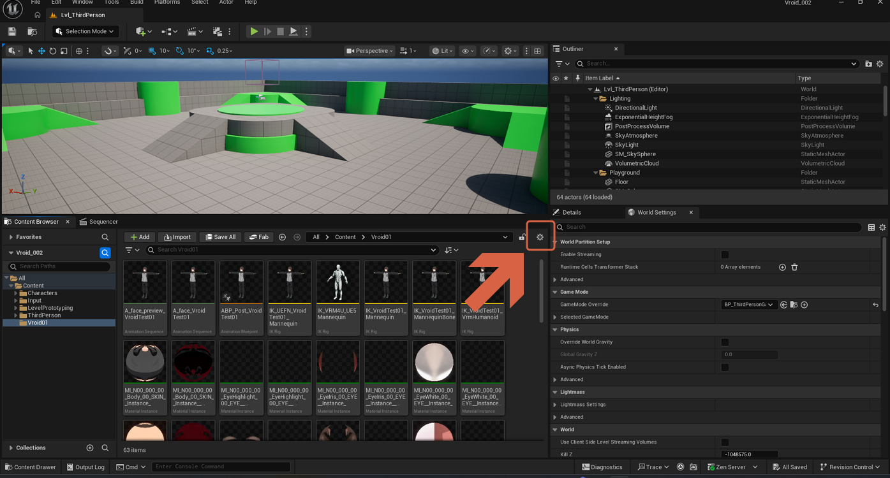
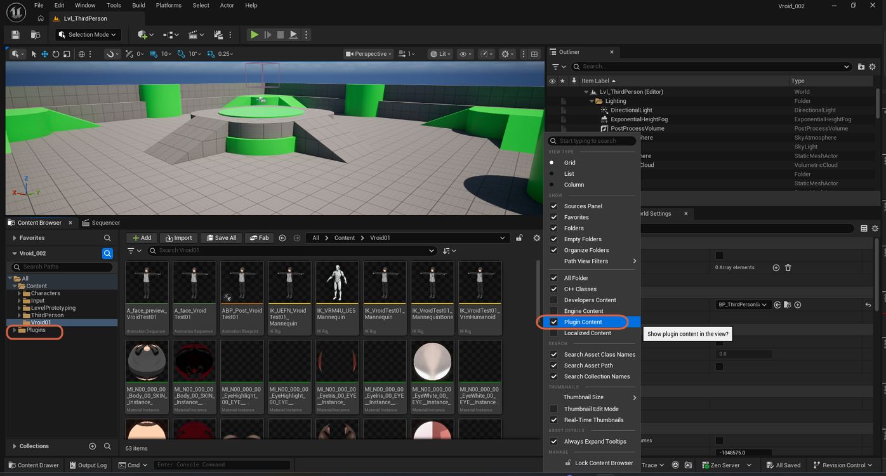

# Displaying Plugin Content in the Content Browser

> **Note:** This document was generated by Claude Code and has not been reviewed by a human. Please use it as a reference only.

Some plugins, such as VRM4U, ship their own **Content** folder with assets you may want to browse or reference directly. The Content Browser hides plugin content by default.

## Step 1: Open View Options

In the Content Browser, click the settings icon in the toolbar to open its view options.

## Step 2: Enable Plugin Content

Under **Show**, check **Plugin Content** ("Show plugin content in the view?").

## Result

A **Plugins** entry appears in the Content Browser's folder tree alongside your project's own **Content** folder, letting you browse assets shipped inside installed plugins.

