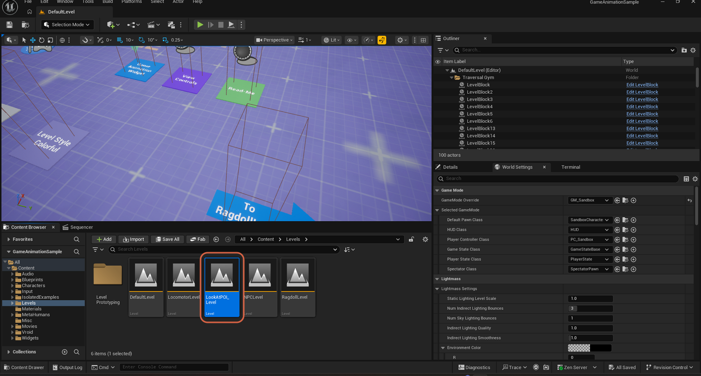
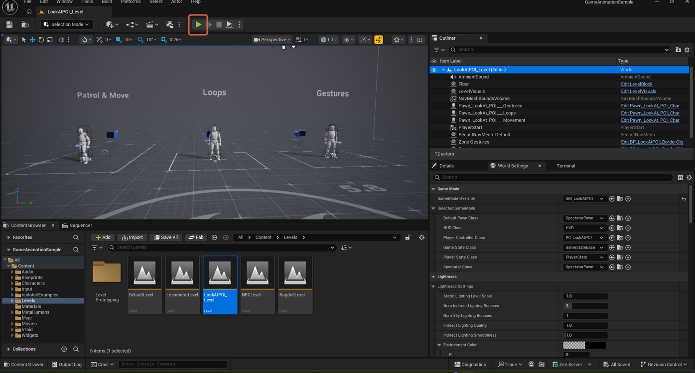
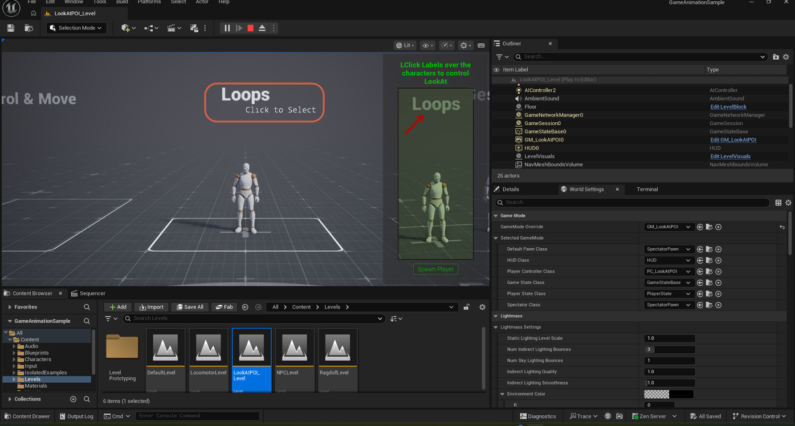
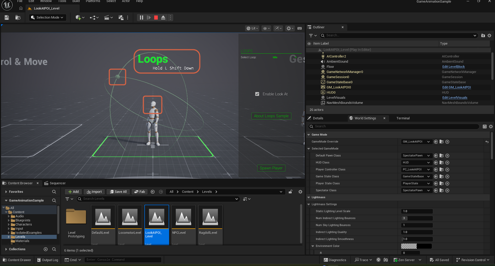
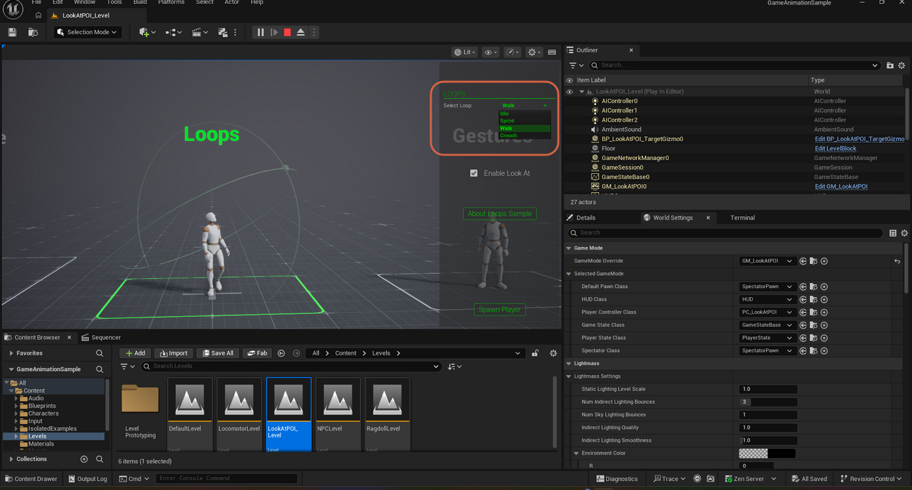
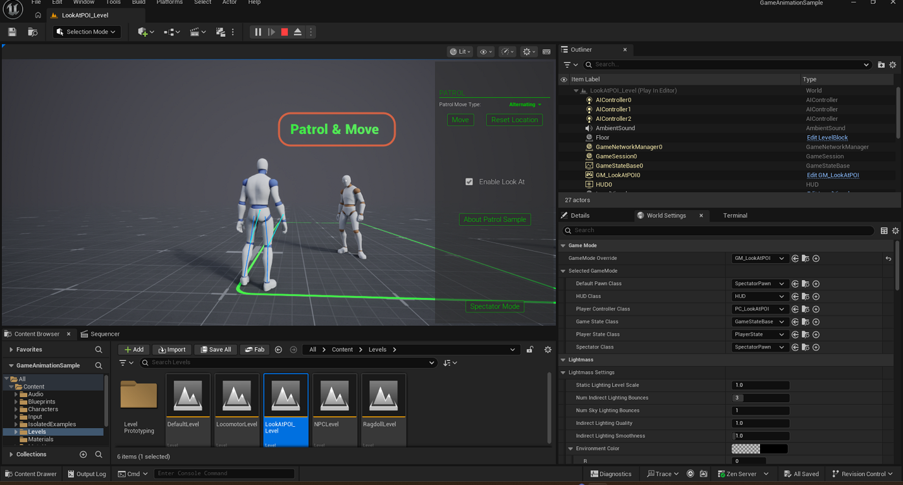
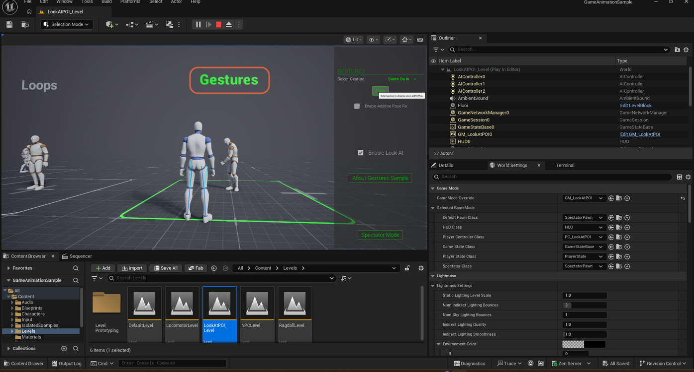

# Exploring the LookAtPOI Level's Look-At Demos in Game Animation Sample

> **Note:** This document was generated by Claude Code and has not been reviewed by a human. Please use it as a reference only.

The Game Animation Sample project includes a standalone `LookAtPOI_Level` that showcases the look-at head/eye-tracking system across three self-contained demos: **Loops**, **Patrol & Move**, and **Gestures**. This is a different, more in-depth way to explore the look-at system than the simple purple-circle demo built into the hub — see [Watching a Target Point](watch-target-point.md) for that simpler version. `LookAtPOI_Level` lives outside the hub as its own level asset and lets you inspect each look-at scenario individually, including live parameter tweaking.

## Step 1: Open the LookAtPOI_Level Asset

In the Content Browser, navigate to **Content** → **Levels** → **Level Prototyping**, and double-click `LookAtPOI_Level` to open it.

> **Note:** This folder holds several standalone demo levels you can open directly, separate from the hub's signposted navigation (see [Moving to the NPC Level](move-to-npc-level.md) and [Moving to the Ragdoll Level](move-to-ragdoll-level.md) for that hub-based approach).

## Step 2: Press Play to See the Demo Overview

Press **Play**. The level places three characters side by side on the floor, each labeled with the demo it represents: **Patrol & Move**, **Loops**, and **Gestures**.

## Step 3: Click a Label to Select a Demo

Once you are playing, an on-screen prompt reads "LClick Labels over the characters to control LookAt." Left-click the label above a character to zoom the camera into that character's demo.

All three demos are loaded and running at the same time — clicking a different label just re-frames the camera onto that character, it does not restart the level or reload the demo you were previously viewing.

## Loops

The Loops demo cycles a character through different idle animation loops while its head and eyes track a moving target as you orbit the camera.

- Rotate the camera by moving the mouse; scale (zoom) with the mouse wheel.
- **Select Loop** dropdown switches which animation loop plays — `Idle`, `Sprint`, `Walk`, or `Crouch`.
- **Enable Look At** checkbox toggles the tracking on and off.
- **About Loops Sample** opens an info panel explaining the demo, including how to live-tweak its solver settings by opening the `DA_LookAtPOI_Loops` data asset and setting `DevMode = True`.

## Patrol & Move

The Patrol & Move demo has an NPC walk a patrol route between points while a nearby character's look-at tracks it as it moves.

- **Patrol Move Type** dropdown selects the movement pattern (observed set to `Alternating`, which walks the NPC back and forth between points).
- **Move** button starts the patrol.
- **Reset Location** button returns the NPC to its starting position.
- **Enable Look At** checkbox toggles the tracking.
- **About Patrol Sample** opens an info panel about the demo.

## Gestures

The Gestures demo plays a selectable gesture animation on a character while a nearby character's look-at tracks it.

- **Select Gesture** dropdown picks which gesture to play (observed set to `Come On In`); a tooltip below it reminds you to select a gesture and hit Play.
- **Enable Additive Pose Fix** checkbox toggles an additive pose correction option.
- **Enable Look At** checkbox toggles the tracking.
- **About Gestures Sample** opens an info panel about the demo.

## Shared Controls

Every demo shares the same **Enable Look At** checkbox and an **About [Demo] Sample** info button. Each demo also has a player-pawn toggle button in its bottom-right corner: it reads **Spawn Player** while you are spectating, and switches to **Spectator Mode** once you have spawned a controllable pawn, letting you switch back to a free spectator camera.

> **Note:** No on-screen prompt was captured for navigating back out to the three-character overview after zooming into a demo — if you do not see one, try scrolling the mouse wheel out or pressing **Spectator Mode** first.
