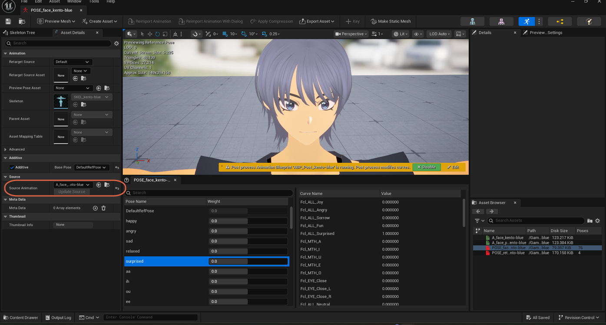
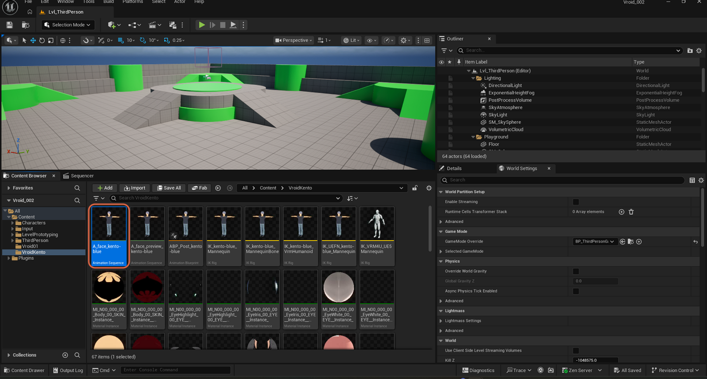
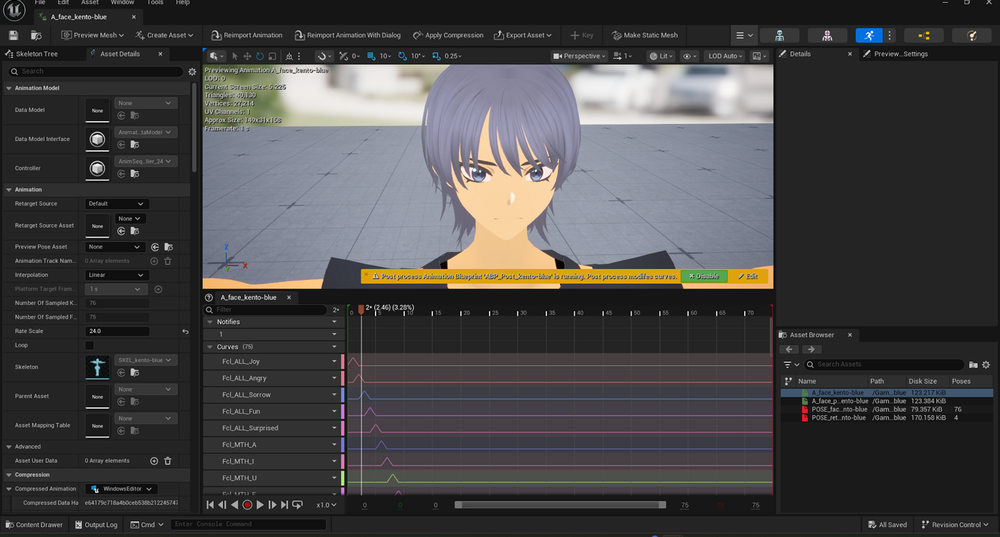

# Finding an Animation Asset

> **Note:** This document was generated by Claude Code and has not been reviewed by a human. Please use it as a reference only.

A character skeleton like `SKEL_kento-blue` accumulates many similarly named assets — `A_face_kento-blue`, `POSE_face_kento-blue`, `POSE_retarget_kento-blue`, and so on. Unreal offers more than one way to track down the specific `Animation Sequence` you need.

## Step 1: Check a Pose Asset's Source Animation Field

If you already have a `Pose Asset` open, such as `POSE_face_kento-blue`, its **Asset Details** panel has a **Source Animation** field under the **Source** category. It names the `Animation Sequence` the pose asset was built from — for example `A_face_kento-blue`.

> **Note:** This screenshot only shows the field's value, not the result of clicking the small browse/target icon next to it. If your version of the editor has one, it should jump straight to that asset in the Content Browser — but that click isn't captured here.

## Step 2: Browse the Content Browser

Open the Content Browser and navigate to the character's asset folder — in this example, `Content` → `VroidKento`. Animation Sequences appear as thumbnails alongside related assets (Pose Assets, IK rigs, mannequins).

> **Note:** The screenshot shows the `Search VroidKento` filter box empty — the asset here was located by browsing the folder's thumbnails, not by typing a name into the filter.

## Step 3: Use the Asset Browser Panel Inside an Editor

Any already-open Animation Sequence, Skeletal Mesh, or Pose Asset editor docks an **Asset Browser** panel (bottom-right by default). It lists other assets that share the same skeleton — here, `A_face_kento-blue`, a preview variant, and two Pose Assets — so you can switch between related assets without leaving the current editor.

> **Note:** As in Step 2, the `Search Assets` box in this panel is also empty in the screenshot. Filtering by name is available in both panels, but neither screenshot demonstrates it being used.

> **Note:** For more on how a Pose Asset's Source Animation relates to its baked pose values, see [Understanding Pose Weights vs. Curve Values](understand-pose-weights-vs-curves.md).
