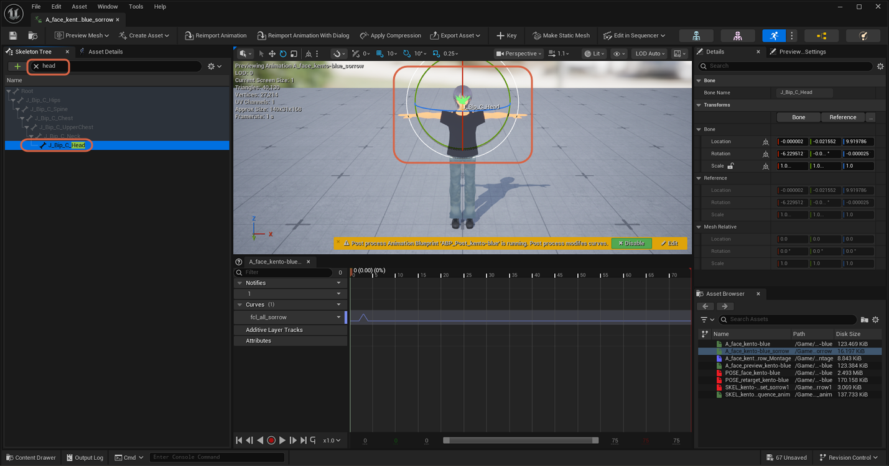
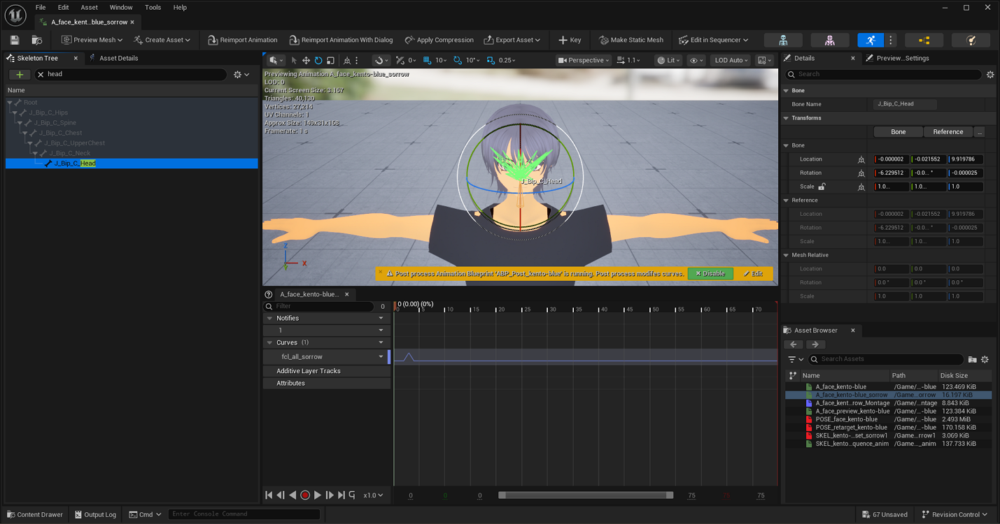
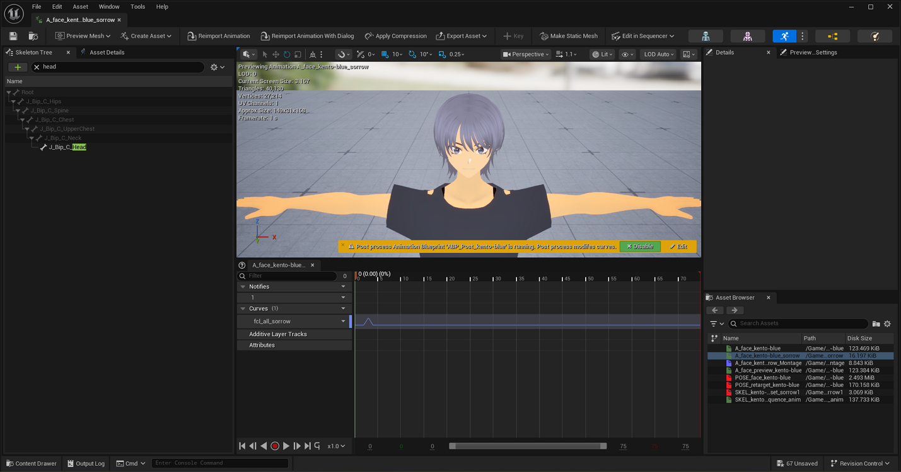
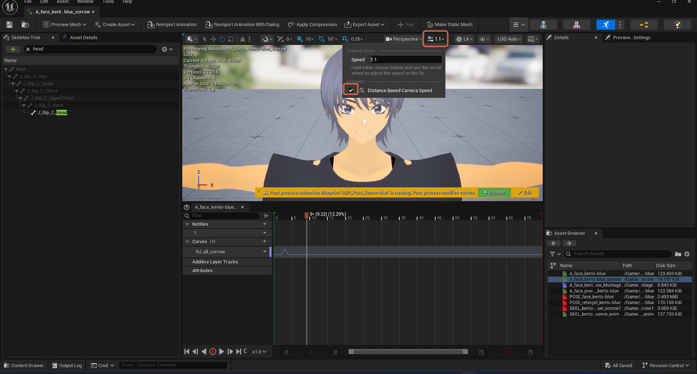

# Focusing the Camera on the Face

> **Note:** This document was generated by Claude Code and has not been reviewed by a human. Please use it as a reference only.

[Focusing on an Object](focus-on-object.md) works on individual bones too, not just whole actors — useful for framing a close-up of the face while reviewing facial animation curves.

## Step 1: Select the Head Bone

In the **Skeleton Tree** search box, type `head` to filter the list down to the head bone, then select `J_Bip_C_Head`.

## Step 2: Focus the Camera on It

Press `F`. The camera frames and orbits around the selected bone instead of the whole character.

## Step 3: Zoom In Further

Scroll the mouse wheel to move in closer for a tight framing of the face.

> **Note:** At this close zoom range, enable **Distance Based Camera Speed** in the viewport's camera speed dropdown (top toolbar) so mouse-driven camera movement scales sensibly instead of feeling too fast or too slow.

