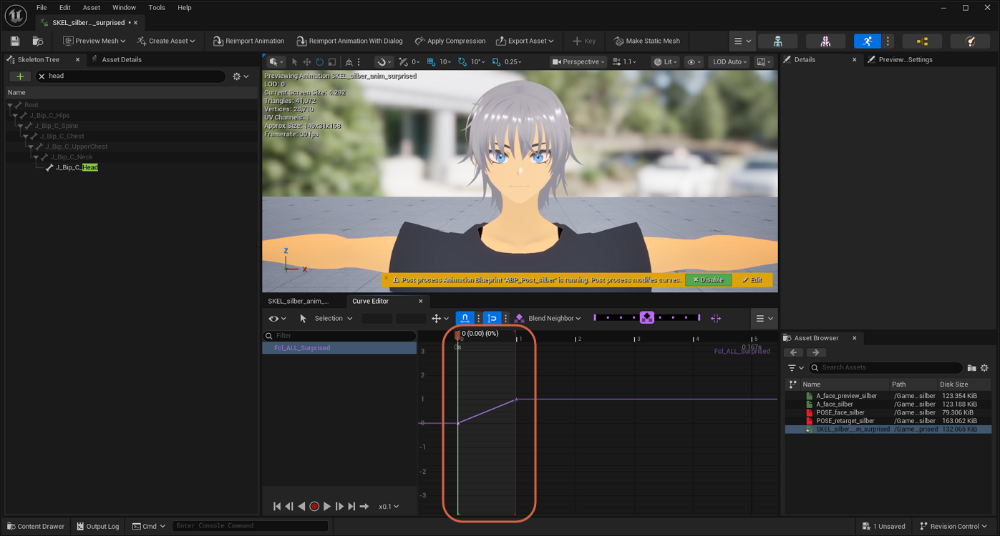
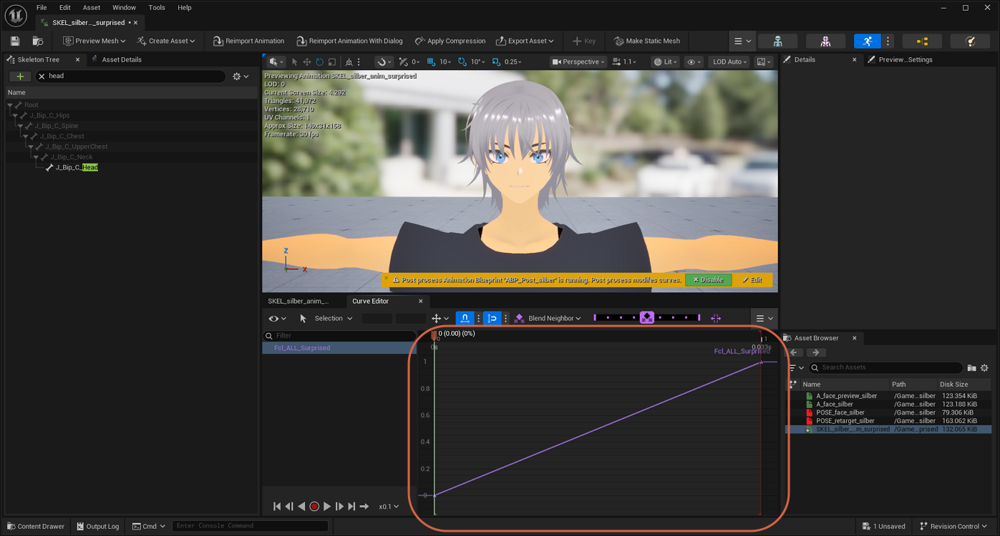
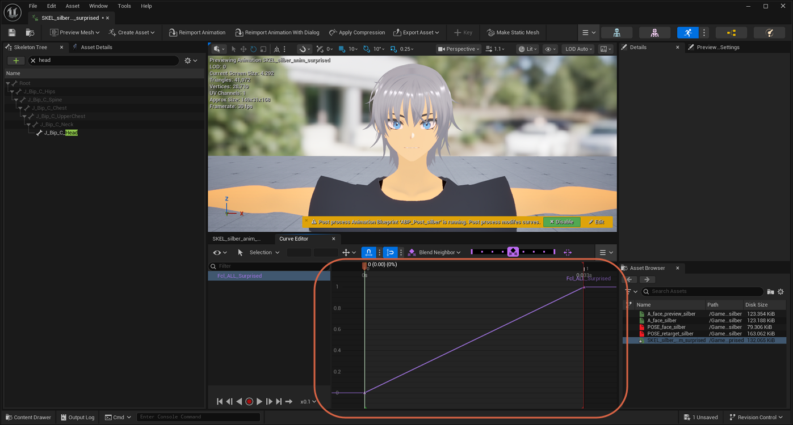

# Focusing the Play Range in the Curve Editor

> **Note:** This document was generated by Claude Code and has not been reviewed by a human. Please use it as a reference only.

The Curve Editor has two framing shortcuts for the current play range, depending on whether you want the curve to fill the view or keep some breathing room around it.

## Before Framing

By default, the curve may only fill part of the visible area, or extend past it.

## Press A to Maximize the Play Range

Press `A` to frame the play range so it fills the entire width of the graph area, with no margin before the start or after the end.

## Press F to Add Space Around the Play Range

Press `F` to frame the play range with a small margin of space before the start position and after the end position.

