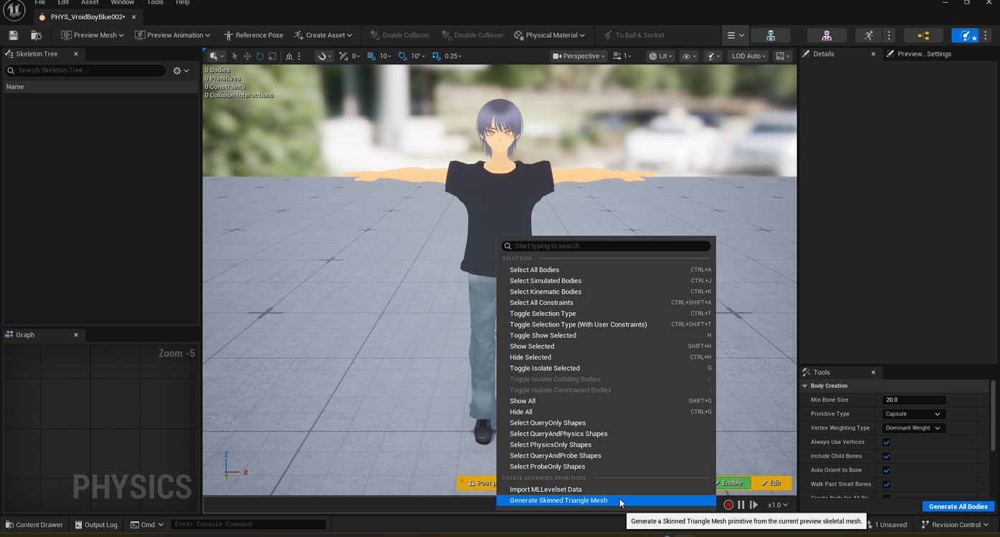

# Generating a Skinned Triangle Mesh Collision Primitive

> **Note:** This document was generated by Claude Code and has not been reviewed by a human. Please use it as a reference only.

A **Skinned Triangle Mesh** primitive follows the exact shape of the character's skinned mesh, instead of approximating it with capsules. Use it where the simple auto-generated bodies from [Creating a Physics Asset](create-physics-asset.md) are too coarse — for example, tight cloth collision against a detailed silhouette — at the cost of more expensive collision checks than a capsule.

## Step 1: Open the Physics Asset Editor

Open the **Physics Asset** editor for your character, either an existing one or a new empty one — see [Creating a Physics Asset](create-physics-asset.md) for how to create one.

## Step 2: Open the Advanced Primitives Menu

Right-click in the viewport to open the context menu.

## Step 3: Generate the Skinned Triangle Mesh

Under **Create Advanced Primitives**, select **Generate Skinned Triangle Mesh** ("Generate a Skinned Triangle Mesh primitive from the current preview skeletal mesh.").

> **Note:** The same menu section has **Import ML Levelset Data**, another advanced collision primitive type not covered here.

A new triangle-mesh body appears in the asset, matching the mesh's surface. You can keep it alongside or in place of the auto-generated capsule bodies from [Creating a Physics Asset](create-physics-asset.md), depending on how much collision accuracy the character needs.
