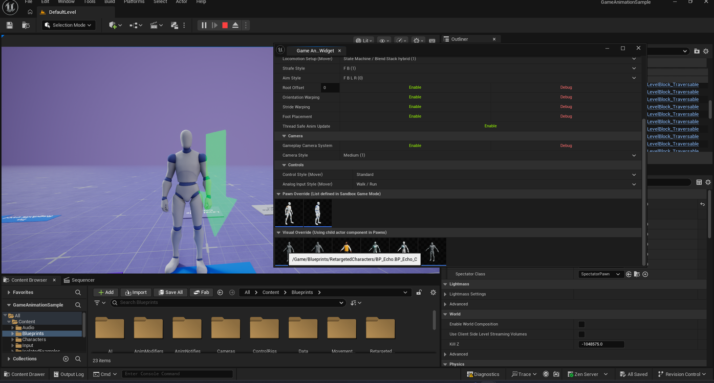

# Getting Back to the Default Character in Game Animation Sample

> **Note:** This document was generated by Claude Code and has not been reviewed by a human. Please use it as a reference only.

This guide is specific to Epic's **Game Animation Sample** project. See [Swapping the Character](swap-character.md) for how to switch to a specific character preset instead.

## Step 1: Open the Game Animation Widget

Play the game and walk your character onto the **Game Animation Widget** plate to open the widget, then scroll to the **Visual Override (Using child actor component in Pawns)** section.

## Step 2: Double-Click Any Character

Double-click any character thumbnail — regardless of which one — to reset your character back to the default, **UEFN Mannequin**.

> **Note:** A single click swaps to that character instead (see [Swapping the Character](swap-character.md)); double-clicking any thumbnail always reverts to the default, no matter which one you double-click.
