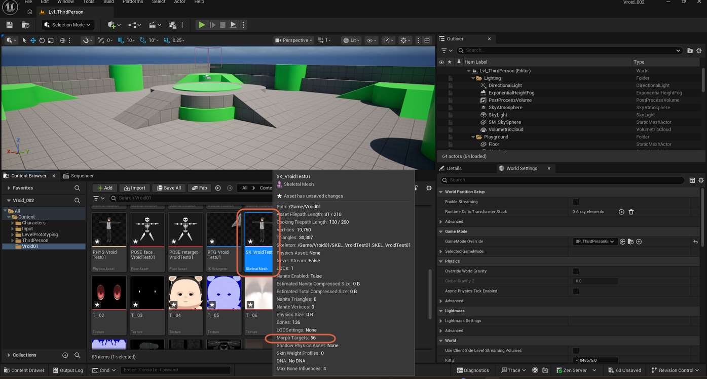

# Importing a VRM Character

> **Note:** This document was generated by Claude Code and has not been reviewed by a human. Please use it as a reference only.

This requires the [VRM4U plugin](install-vrm4u-plugin.md) to already be installed and enabled.

## Step 1: Create a Folder for the Character

In the Content Browser, create a dedicated folder for the character, such as `Content/AnimeCharacter`.

## Step 2: Import the VRM File

Drag and drop your exported `.vrm` file into this folder. Keep the default settings in the import window and click **Import**.

## Step 3: Review the Generated Assets

VRM4U automatically generates:

- A **Skeletal Mesh**
- Pre-configured **Materials & Textures** (cell-shading ready)
- An **IK Retargeter** asset
- **Blendshape** / face animation assets

Select the generated Skeletal Mesh in the Content Browser and check its info tooltip's **Morph Targets** count to confirm the blendshapes came through — see [Checking Morph Target and Pose Counts](check-morph-target-and-pose-counts.md).

> **Note:** To get the character walking and animating using the default mannequin animations, see [Setting Up Animation for a VRM Character](set-up-animation-for-vrm-character.md). If you're using the **Game Animation Sample** project specifically, see [Retargeting a VRM Character to Game Animation Sample](retarget-character-game-animation-sample.md) instead.
