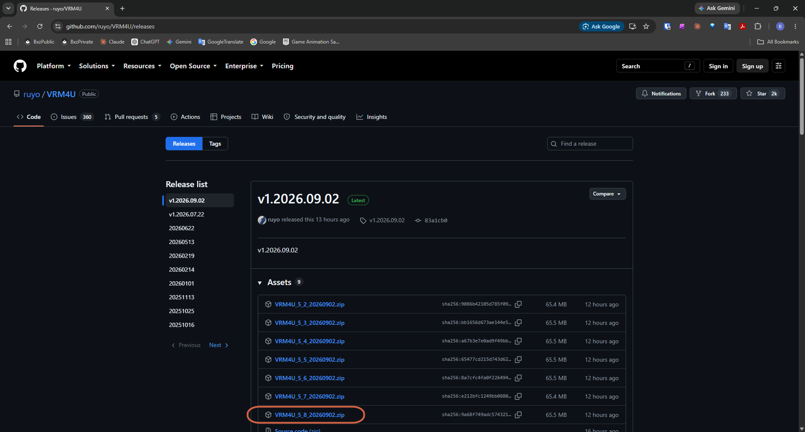
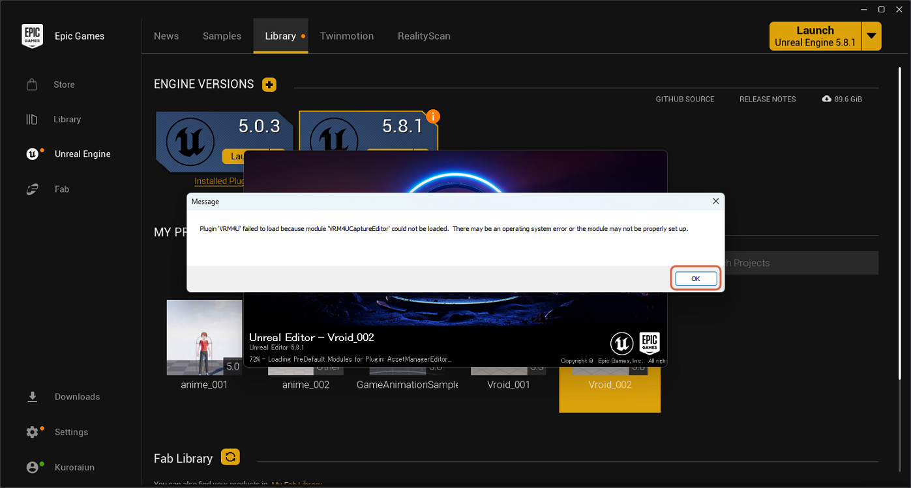
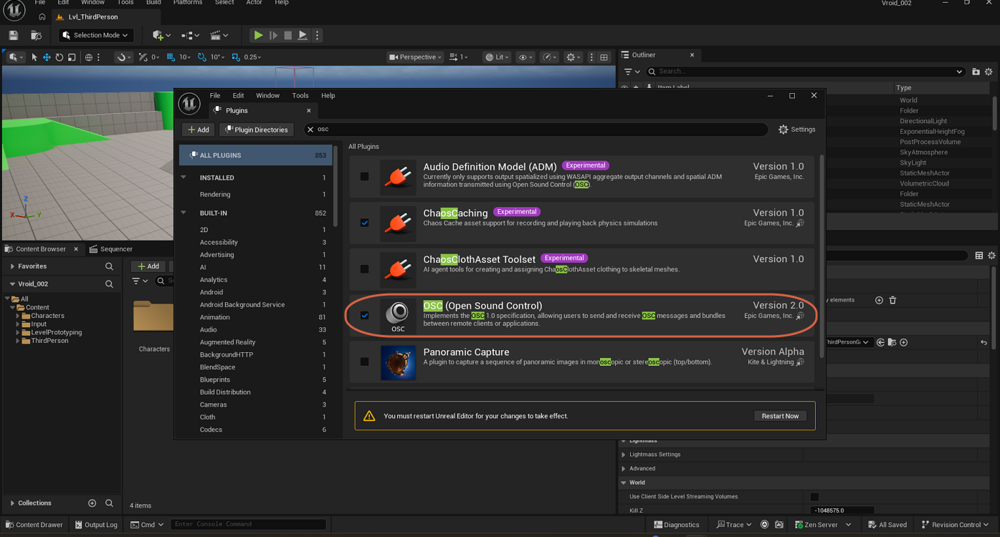
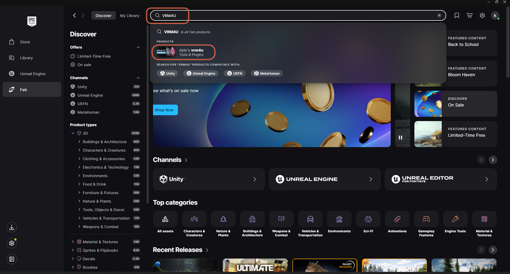

# Installing the VRM4U Plugin

> **Note:** This document was generated by Claude Code and has not been reviewed by a human. Please use it as a reference only.

**VRM4U** is a third-party plugin that lets Unreal Engine import `.vrm` character files — such as one [exported from VRoid Studio](../vroid-studio/export-character-as-vrm.md) — as a skeletal mesh with materials, an IK retargeter, and blendshapes ready to use.

> **Warning:** Do not drag a `.vrm` file into Unreal Engine before installing and enabling VRM4U, or the editor will crash.

## Method 1: Manual Download

### Step 1: Download VRM4U

Go to the [VRM4U releases page](https://github.com/ruyo/VRM4U/releases) and download the zip archive that matches your Unreal Engine version — the filename encodes it, for example `VRM4U_5_8_<date>.zip` for UE 5.8. Extract the downloaded zip file.

### Step 2: Find Your Project's Root Folder

In the Content Browser, right-click the **Content** folder and select **Show in Explorer**, then navigate up one level to the project's root folder (`<YOUR-PROJECT-PATH>\`).

### Step 3: Copy the Plugin into Your Project

Copy the extracted `Plugins` folder into your project's root folder.

> **Note:** If a `Plugins` folder already exists in your project, copy just the `VRM4U` folder into your existing `Plugins` folder instead of replacing it.

### Step 4: Restart and Verify

Restart your Unreal Engine project. Go to **Edit** → **Plugins** and confirm **VRM4U** is listed and enabled.

> **Note:** You may see a message reading "Plugin 'VRM4U' failed to load because module 'VRM4UCaptureEditor' could not be loaded." Closing this dialog and continuing is fine — the main VRM4U import functionality still works even if this optional submodule fails to load.

> **Note:** Some workflows also enable Unreal's built-in **OSC (Open Sound Control)** plugin alongside VRM4U, to send or receive real-time facial tracking data from external tools. This is not required for a basic VRM import — only enable it if your pipeline needs live OSC streaming.

## Method 2: Fab Marketplace

### Step 1: Search Fab for VRM4U

In the Epic Games Launcher, open the **Fab** tab and search for `VRM4U`. Select **dylo's VRM4U** under **Tools & Plugins** — this is the standard listing for the plugin.

### Step 2: Check Engine Compatibility

On the listing's product page, check the dropdown of supported Unreal Engine versions to confirm it covers your installed version.

### Step 3: Install the Plugin

Click **Add to Library**, then open the Epic Games Launcher's **Library** tab and install VRM4U directly into your project from there.

> **Note:** If you downloaded the plugin manually instead of installing it through the Library tab, enable it the same way as Method 1's Step 4 — via **Edit** → **Plugins**.
