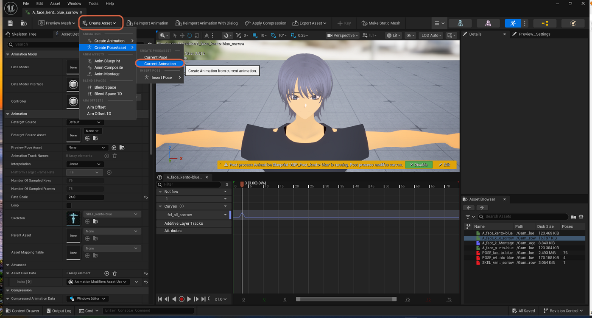
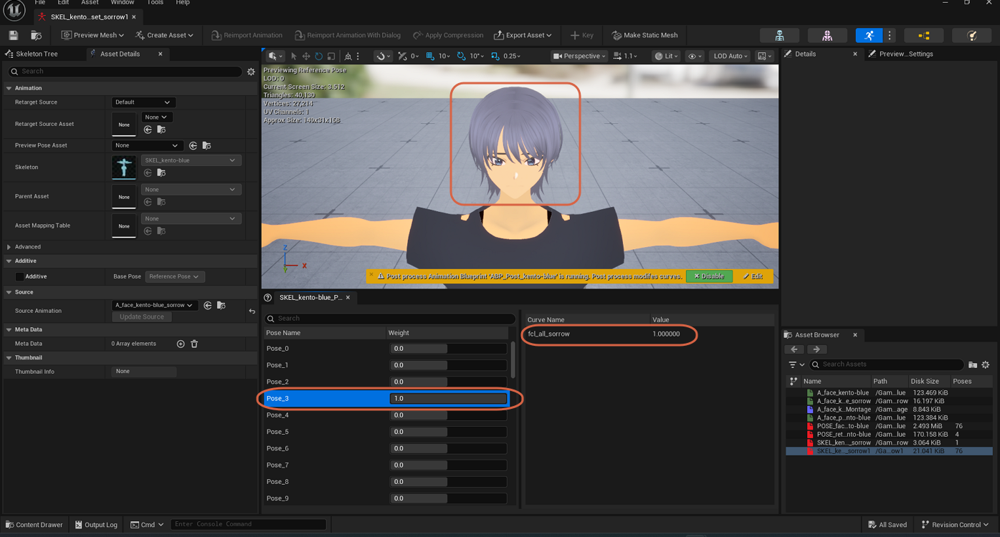
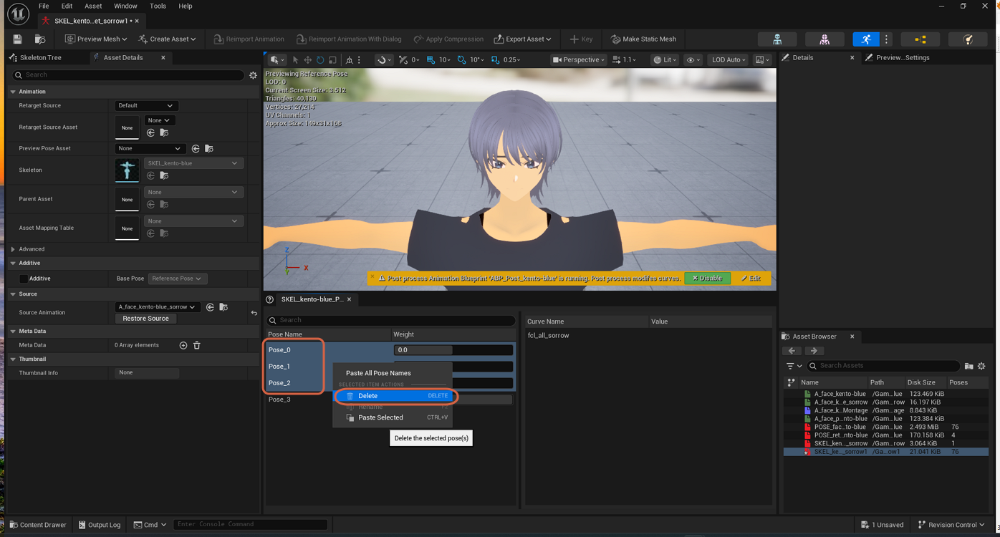
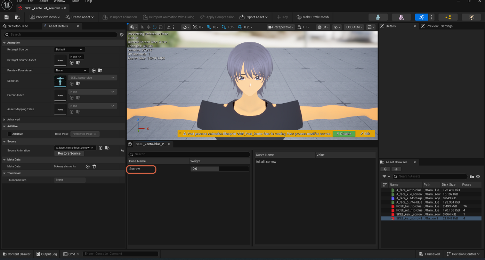

# Isolating a Single Pose in a Pose Asset

> **Note:** This document was generated by Claude Code and has not been reviewed by a human. Please use it as a reference only.

[Creating a Pose Asset from an Animation Sequence](create-pose-asset-from-animation.md) using **Current Animation** generates one pose per sampled frame of the source animation — 76 poses (`Pose_0` through `Pose_75`) for a 75-frame clip, not the single named pose you usually want. Clean this up by deleting the poses you don't need and renaming the one you're keeping.

## Step 1: Find the Frame with the Curve Value You Want

Check which pose corresponds to the frame where your target curve reaches its intended value — here, `Pose_3` holds `fcl_all_sorrow` at `1.000000`, matching the source animation's peak frame.

## Step 2: Select and Delete the Unwanted Poses

Select a range of poses you don't need — for example `Pose_0` through `Pose_2` — right-click, and choose **Delete**.

Repeat across the rest of the list — for example `Pose_66` through `Pose_75` — until only the pose you want to keep remains.

## Step 3: Rename the Remaining Pose

Right-click the pose you kept and select **Rename** to give it a meaningful name, such as `Sorrow`.

> **Note:** The screenshots show multiple poses selected at once before deleting, which is faster than removing them one at a time — the exact selection method (Shift-click, Ctrl-click) isn't captured, but both are standard for multi-selecting list rows in Unreal Engine.
