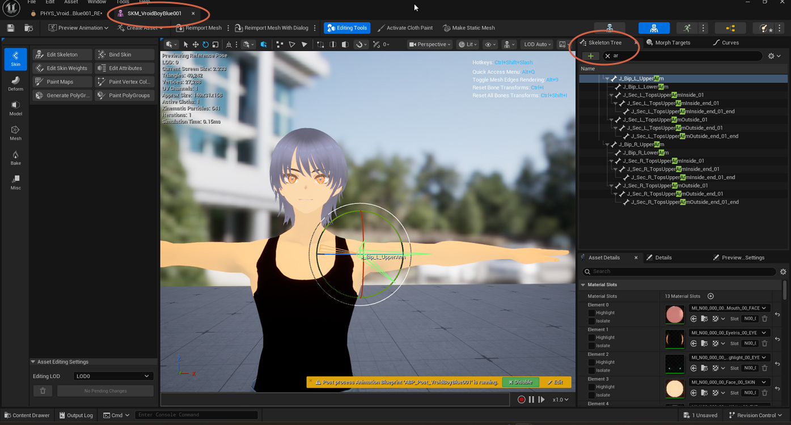

# Moving a Body Part

> **Note:** This document was generated by Claude Code and has not been reviewed by a human. Please use it as a reference only.

This guide covers repositioning or rotating an individual bone on a skinned character mesh, using the Skeleton Tree in the Skeletal Mesh editor. Use this when a bone needs a small manual adjustment — for example, straightening an arm before generating collision, or fixing a joint that doesn't match a piece of clothing.

## Step 1: Open the Skeletal Mesh Editor

Open your character's **Skeletal Mesh** editor and select the **Skin** tab. Make sure the **Skeleton Tree** panel is visible on the right.

## Step 2: Find the Bone

In the **Skeleton Tree** search box, type part of the bone's name to filter the list — for example, typing `ar` filters the list down to the arm bones.

Select the bone you want to adjust, such as `J_Bip_L_UpperArm`. A manipulation gizmo appears on the bone's pivot in the viewport.

## Step 3: Move or Rotate the Bone

Switch the gizmo mode with the standard Unreal Engine hotkeys — `W` for Move, `E` for Rotate, `R` for Scale — then drag the gizmo to adjust the bone. Every bone below it in the hierarchy moves with it.

> **Note:** If you make a mistake, press `Ctrl+/` to reset the selected bone's transform, or `Ctrl+Shift+/` to reset every bone back to the reference pose.

> **Warning:** Moving a bone changes the character's reference pose. Anything generated from that pose — collision bodies on a [Physics Asset](create-physics-asset.md), Chaos Cloth simulation, or retargeted animations — may need to be regenerated afterward to match.
