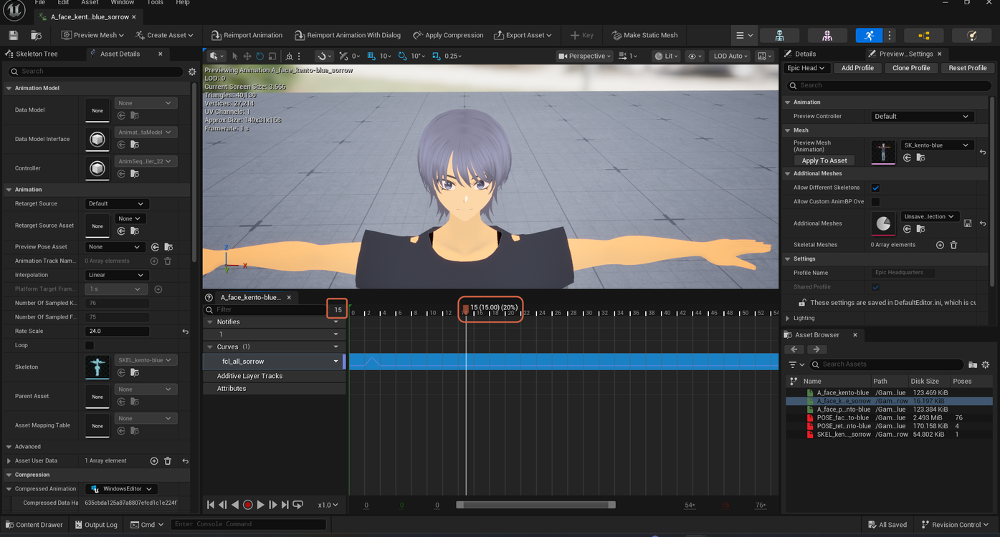

# Moving the Playhead

> **Note:** This document was generated by Claude Code and has not been reviewed by a human. Please use it as a reference only.

An Animation Sequence editor's curve panel has two ways to set the current frame: dragging on the timeline itself, or typing an exact value.

## Dragging the Time Row

Click and drag anywhere in the ruler row that shows time (the row with the frame ticks, above the curve list) to scrub the playhead. The screenshot below shows the playhead sitting at frame `15`, with its position tooltip — `15 (15.00) (20%)` — displayed above the ruler.

> **Note:** The screenshot captures the playhead's resting position and tooltip, not the mouse mid-drag. The dragging technique itself comes from this page's source memo rather than being directly visible in the image.

## Typing an Exact Frame Number

Next to the `Filter` search box (used to filter the curve list, not the timeline), there's a small numeric field. The same screenshot shows it holding `15`, matching the playhead's position on the ruler — confirming this field jumps the playhead to a typed frame number.

> **Note:** Only one screenshot exists for this topic, so it can't show a before/after of typing into this field. Its value simply matches where the playhead ended up.
