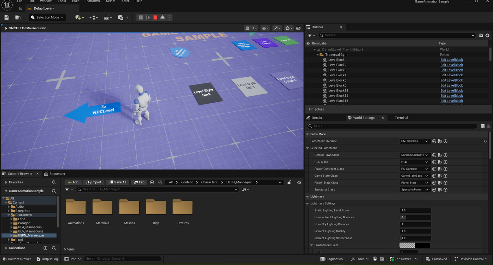
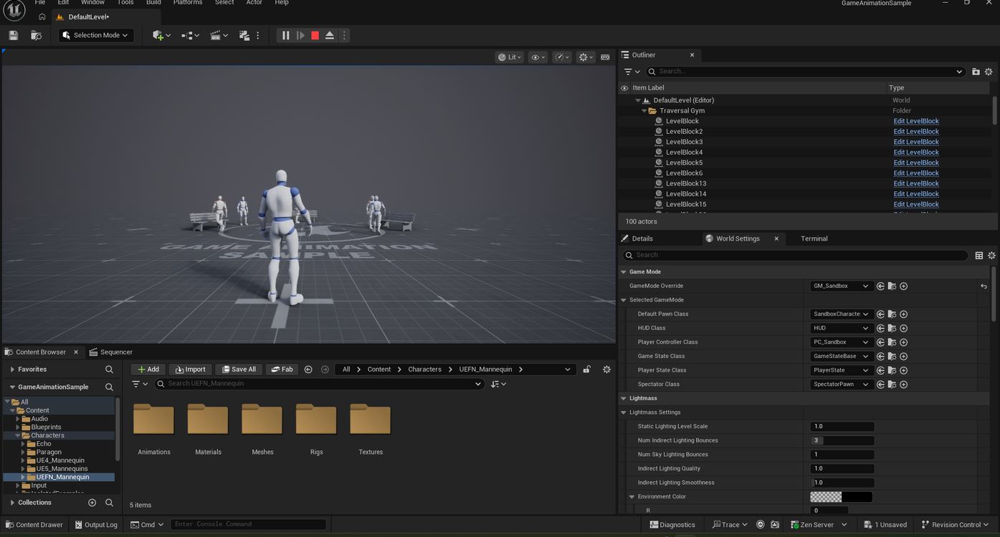

# Moving to the NPC Level in Game Animation Sample

> **Note:** This document was generated by Claude Code and has not been reviewed by a human. Please use it as a reference only.

The **Game Animation Sample** hub connects to several other levels through signposted portals on the ground — one of them leads to the **NPC Level**.

## Step 1: Play the Game and Find the Plates

Press **Play**. You start in the main hub, surrounded by labeled plates and signs on the ground pointing to different areas and features.

## Step 2: Locate the "To NPCLevel" Sign

Look for the blue arrow-shaped sign labeled **To NPCLevel** near the edge of the hub.

## Step 3: Walk Onto the Sign

Walk your character onto the arrow to load the NPC Level, the same way walking onto the **Game Animation Widget** plate opens that widget (see [Swapping the Character](swap-character.md)).

## Result

The NPC Level loads with your character standing among several NPCs positioned around the level.

