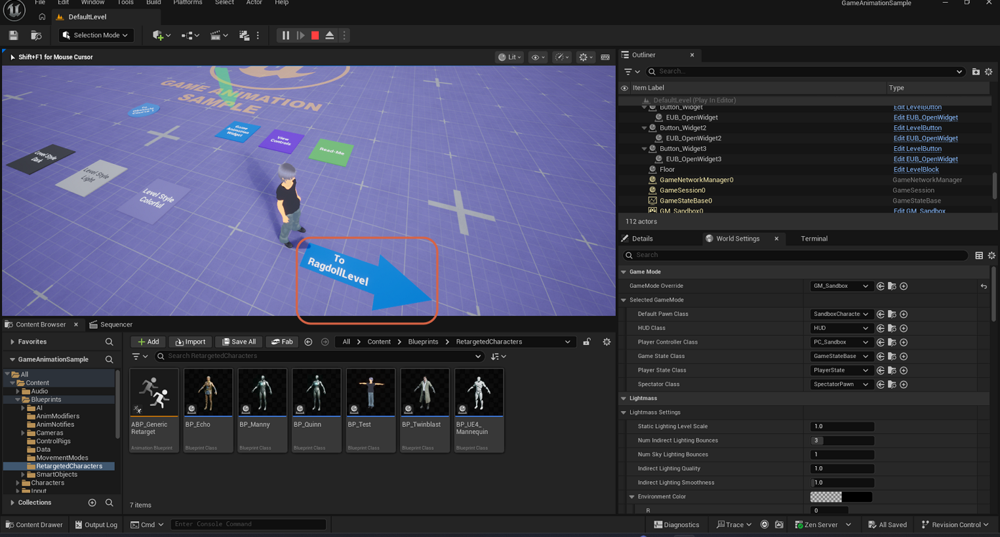
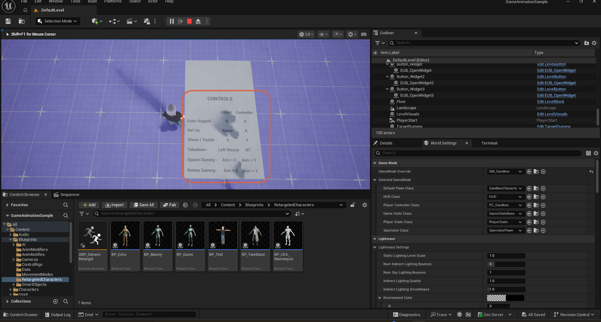

# Moving to the Ragdoll Level in Game Animation Sample

> **Note:** This document was generated by Claude Code and has not been reviewed by a human. Please use it as a reference only.

The **Game Animation Sample** hub connects to several other levels through signposted portals on the ground — one of them leads to the **Ragdoll Level**.

## Step 1: Locate the "To RagdollLevel" Sign

Press **Play**. Look for the blue arrow-shaped sign labeled **To RagdollLevel** on the ground of the main hub.

## Step 2: Walk Onto the Sign

Walk your character onto the arrow to load the Ragdoll Level.

## Result

The Ragdoll Level loads with a **Controls** panel listing the level's actions for keyboard and mouse (**KB&M**) and controller:

| Action | KB&M | Controller |
| --- | --- | --- |
| Enter Ragdoll | `R` | `X` |
| Get Up | `Space` | `A` |
| Shove / Tackle | `E` | `Y` |
| Takedown | Left Mouse | `RT` |
| Spawn Dummy | Aim + `E` | Aim + `Y` |
| Rotate Dummy | Aim + `E` | Aim + `Y` |

> **Note:** Spawn Dummy and Rotate Dummy share the same input in this panel — aiming and pressing the button spawns a dummy if none is out yet, or rotates the existing one if there already is one.

