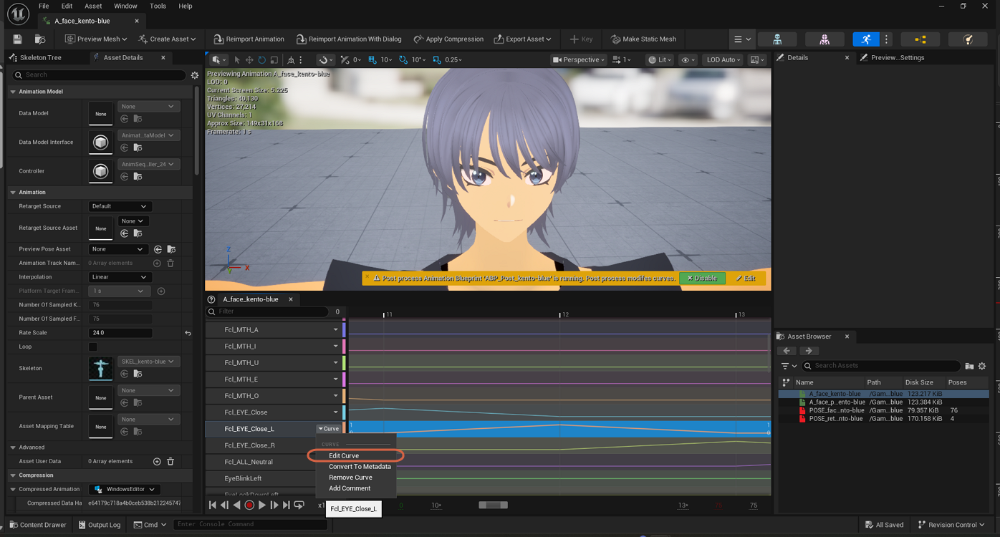
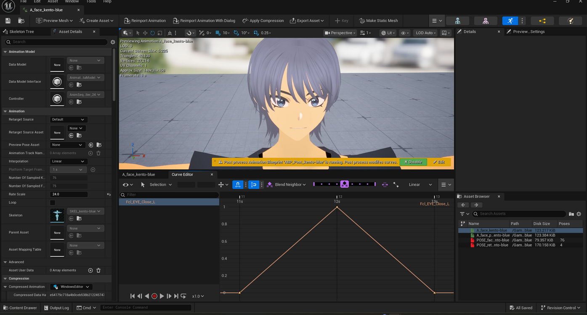

# Opening a Curve in the Curve Editor

> **Note:** This document was generated by Claude Code and has not been reviewed by a human. Please use it as a reference only.

An Animation Sequence's compact curve list (in the bottom panel, under **Curves**) plots every curve at once, at a small scale. To work on one curve in more detail, open it in a dedicated **Curve Editor** tab.

## Step 1: Open the Curve's Dropdown Menu

In the **Curves** list, click the small `▼ Curve` dropdown next to the curve you want — in this example, `Fcl_EYE_Close_L`. It opens a menu with **Edit Curve**, **Convert To Metadata**, **Remove Curve**, and **Add Comment**.

## Step 2: Select Edit Curve

Click **Edit Curve**. A new **Curve Editor** tab opens next to the animation's main tab, showing just that curve's keyframes plotted against value and time — here, `Fcl_EYE_Close_L` rising from `0` to `1` and back down to `0`.

> **Note:** These two screenshots capture opening the Curve Editor, not a keyframe or tangent actually being dragged. The Curve Editor's toolbar (Selection, Tangents, Snap, and framing tools) is visible for further editing, but that editing itself isn't shown here.

> **Note:** If a **Post process Animation Blueprint** status bar is visible above the curve panel, it's modifying curves on top of whatever you see in the Curve Editor — see [Understanding the Post Process Animation Blueprint](understand-post-process-anim-blueprint.md).
