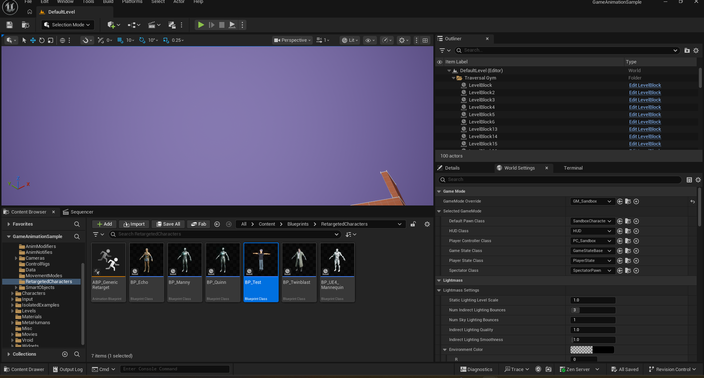
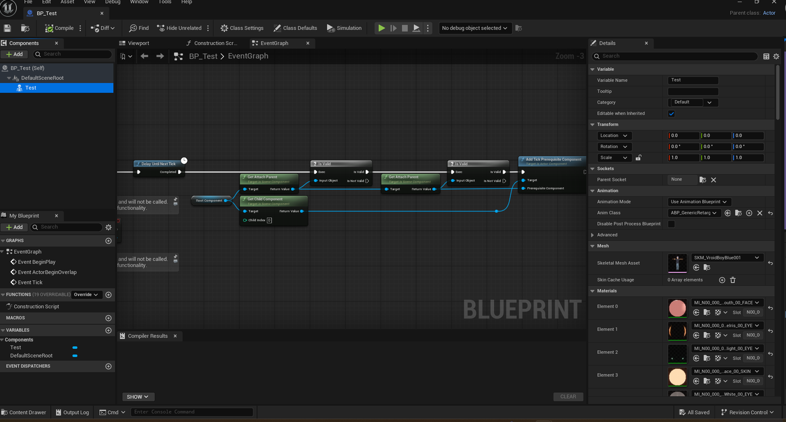
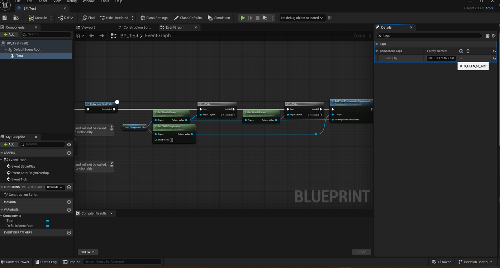
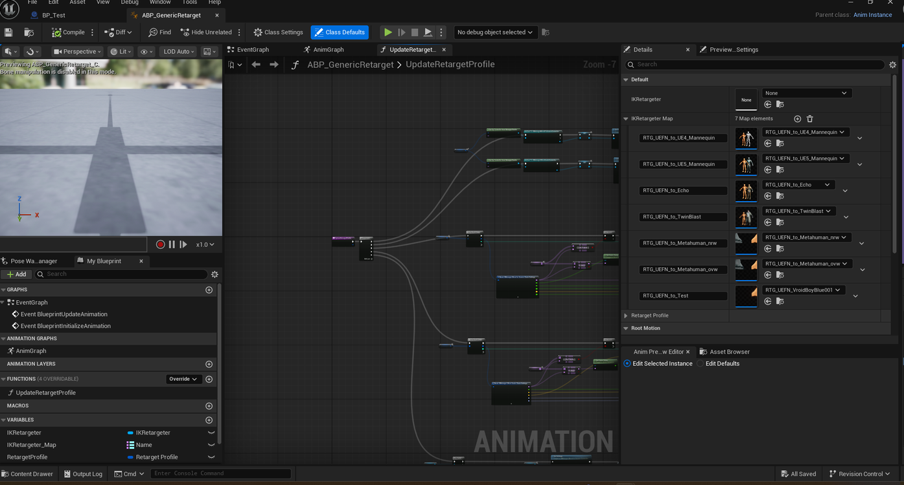
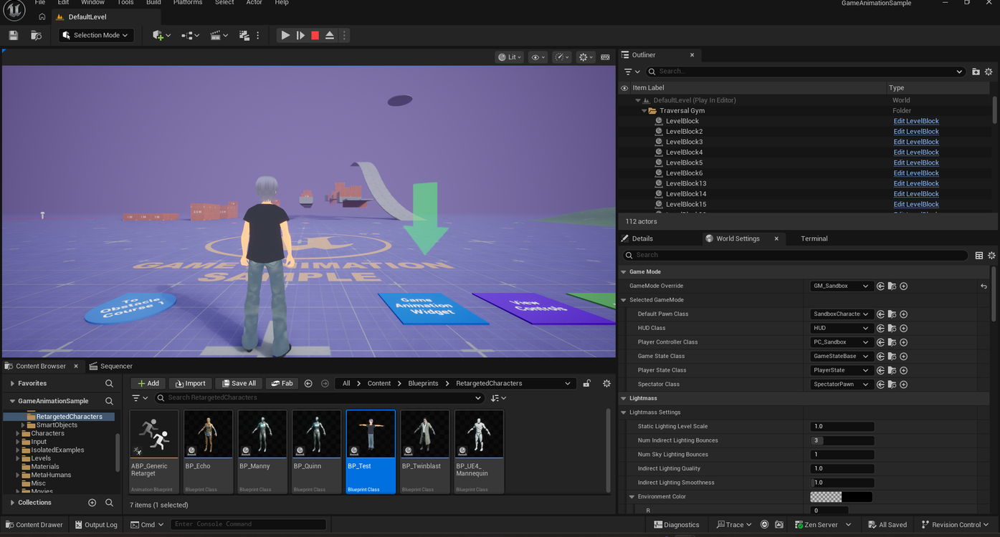

# Retargeting a VRM Character to Game Animation Sample

> **Note:** This document was generated by Claude Code and has not been reviewed by a human. Please use it as a reference only.

This guide binds an imported VRM character to the **Game Animation Sample** project's animation system, using its tag-based retargeting setup rather than copying an Animation Blueprint by hand.

> **Reference Video:** [Anime Character to Game Animation Sample in Unreal Engine 5](http://www.youtube.com/watch?v=H63IXj625Qc) by *Code With Ro*

## Before You Start

Complete these first:

1. [Exporting a Character as VRM](../vroid-studio/export-character-as-vrm.md)
2. [Installing the VRM4U Plugin](install-vrm4u-plugin.md)
3. [Importing a VRM Character](import-vrm-character.md)

## Step 1: Duplicate the Sandbox Character Blueprint

1. Open **World Settings** (**Window** → **World Settings**).
2. Under **GameMode Override**, find **Default Pawn Class** (`CBP_SandboxCharacter`). Click the magnifying glass icon next to it to locate it in the Content Browser, under **Content** → **RetargetedCharacters**.
3. Select one of the existing character Blueprints, such as `CBP_SandboxCharacter_Quinn`, press **Ctrl+D** to duplicate it, and rename the copy — for example, `BP_Test`.

## Step 2: Assign Your Mesh and a Custom Tag

1. Double-click your new Blueprint to open it.
2. Select the **Mesh** component in the Components panel, then in the Details panel under **Mesh** → **Skeletal Mesh Asset**, select your imported character mesh.

    

3. Scroll to **Tags** → **Component Tags** and replace the existing tag with a custom one, such as `RTG_UEFN_to_Test`.

    

    > **Warning:** Component tags are case-sensitive. Use the exact same tag in the next step.

4. Click **Compile** and **Save**.

## Step 3: Add a Retargeter Map Entry

1. With **Mesh** still selected, click the magnifying glass icon next to **Anim Class** (`ABP_GenericRetarget`) to locate it in the Content Browser, then double-click to open it.
2. In the Details panel, find the **Retargeter Maps** array and click **+** (Add Element):
      - **Key** — your custom tag from Step 2, such as `RTG_UEFN_to_Test`.
      - **Value** — the IK Retargeter asset that VRM4U generated during import, such as `RTG_UEFN_YourCharacter`.
3. Click **Compile** and **Save**.

## Step 4: Test Play

1. Return to the main level viewport, open **World Settings** → **GameMode Override**, and change **Default Pawn Class** to your new character Blueprint.
2. Press **Play** to test locomotion, vaulting, and directional animations on your character.

