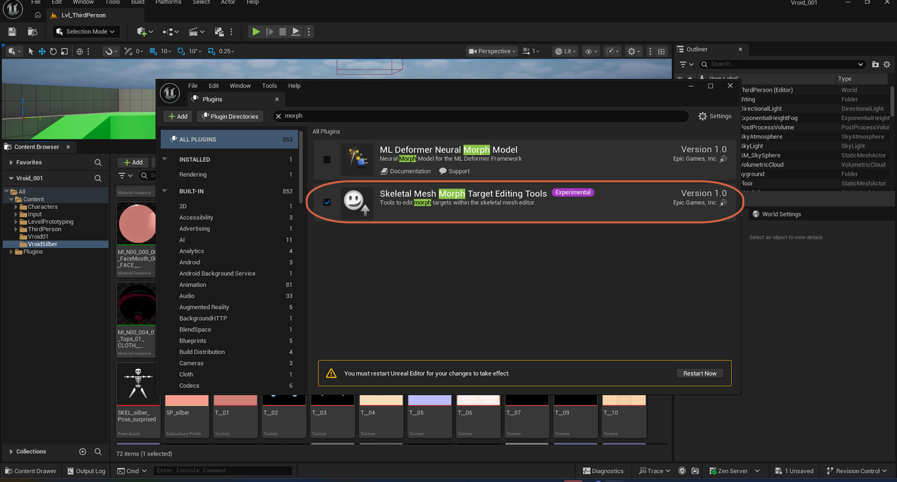
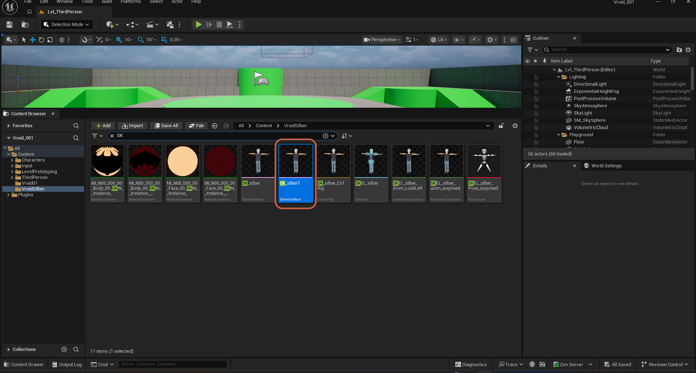
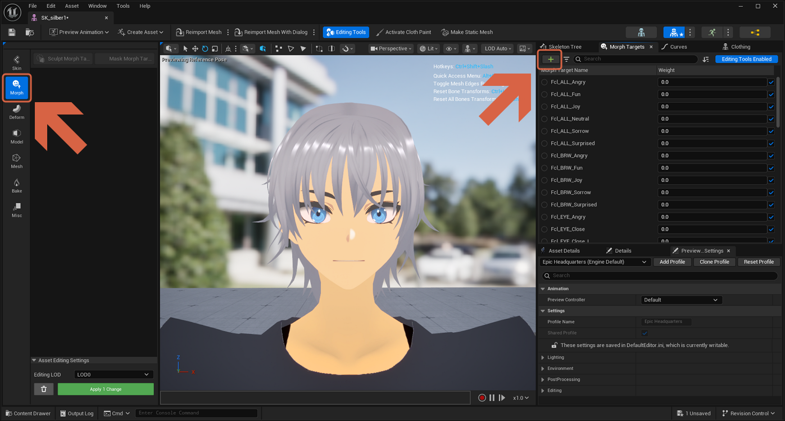
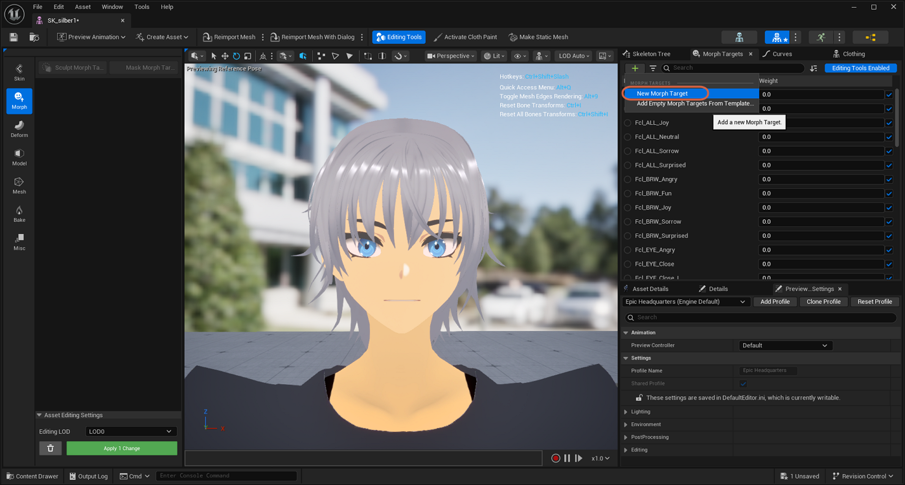
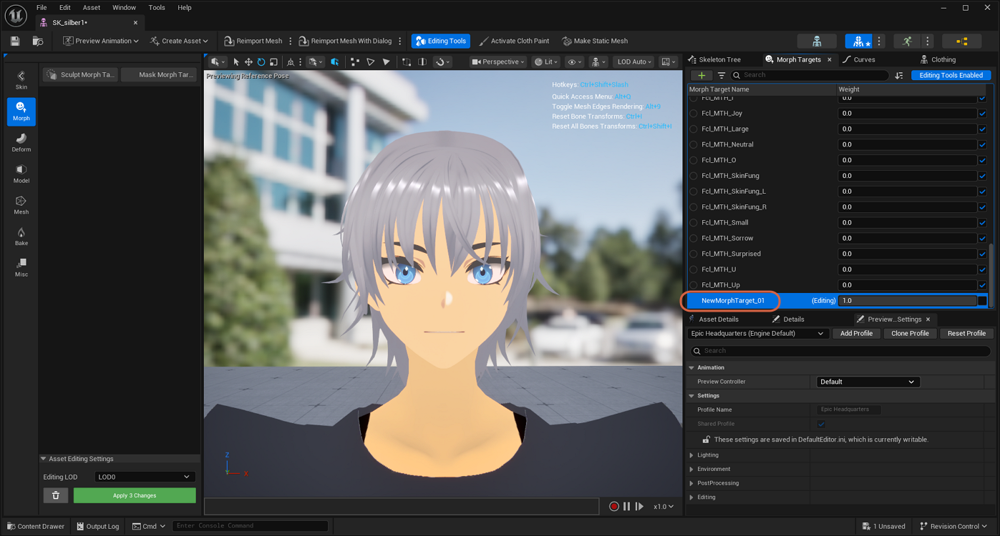
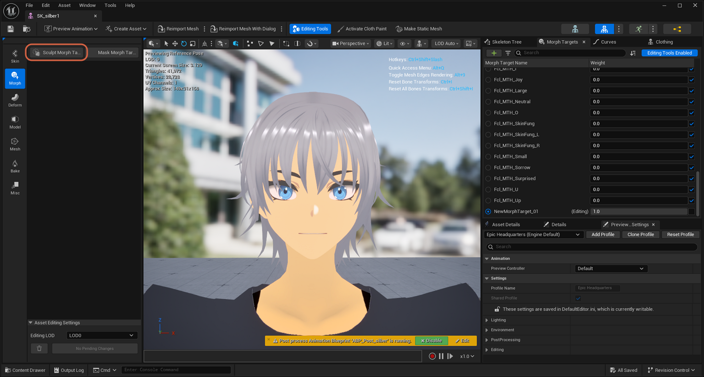
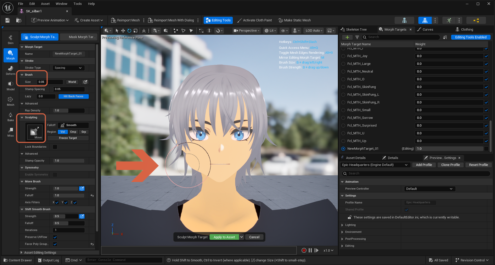
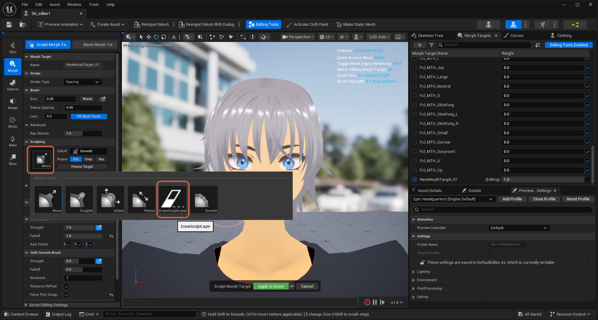
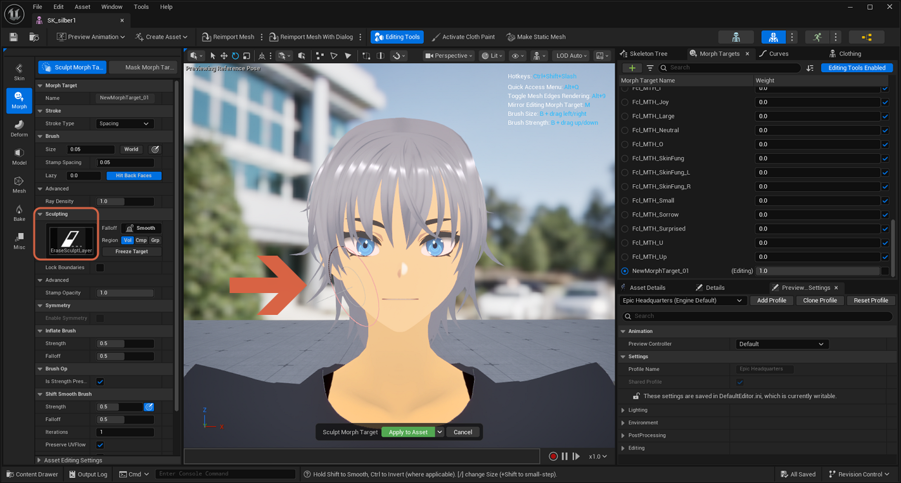

# Sculpting a Custom Morph Target

> **Note:** This document was generated by Claude Code and has not been reviewed by a human. Please use it as a reference only.

Sculpt Morph Target lets you reshape a Skeletal Mesh directly in the viewport by painting a new morph target with a brush — useful for deformations a bone can't produce alone, like pulling on a character's cheek.

## Step 1: Enable the Sculpting Plugin

Sculpting requires the experimental **Skeletal Mesh Morph Target Editing Tools** plugin. Go to **Edit** → **Plugins**, search for `morph`, and enable it. Restart the editor when prompted.

## Step 2: Open the Skeletal Mesh

In the Content Browser, open the Skeletal Mesh you want to sculpt.

## Step 3: Create a New Morph Target

Select the **Morph** tab, then click **+** in the Morph Targets panel and choose **New Morph Target**.

## Step 4: Name and Preview the Morph Target

Name the new morph target, then set its **Weight** to `1.0` so the sculpt previews at full strength while you work.

## Step 5: Sculpt the Shape

Click **Sculpt Morph Target**.

Adjust the **Brush Size**, select a sculpting mode such as **Move**, then drag on the mesh to reshape it — for example, dragging on the cheek pulls it outward.

## Step 6: Undo Part of the Sculpt

If part of a sculpt looks wrong, switch the brush type to **EraseSculptLayer** and brush back over that area to remove the change.

> **Note:** Click **Apply to Asset** when you're done to save the sculpt to the morph target.
