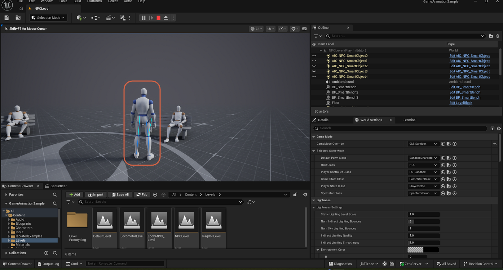
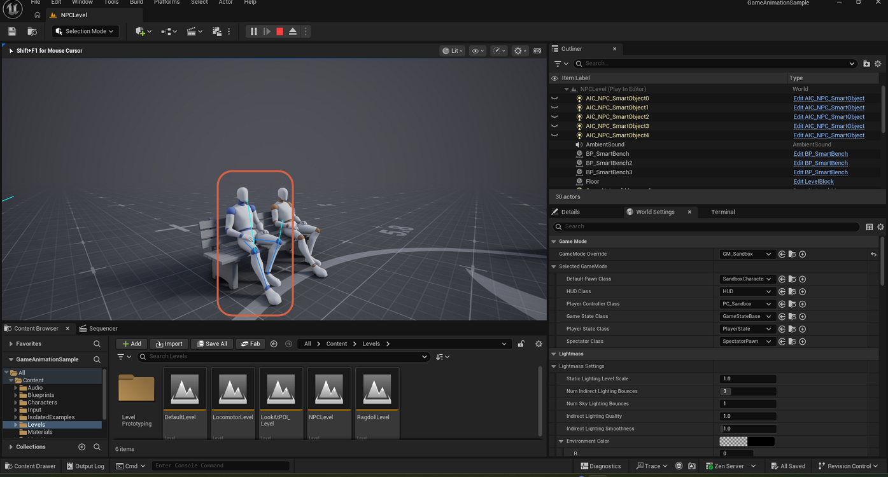

# Sitting on a Bench in the NPC Level in Game Animation Sample

> **Note:** This document was generated by Claude Code and has not been reviewed by a human. Please use it as a reference only.

`NPCLevel` is a standalone demo level, opened directly from the Content Browser the same way as `LookAtPOI_Level`, that shows the Smart Object system driving NPC behavior — including NPCs automatically sitting on benches. This is different from reaching the NPC area through the hub's **To NPCLevel** sign (see [Moving to the NPC Level](move-to-npc-level.md)); opening `NPCLevel` directly drops you straight into the standalone demo scene without going through the hub.

## Step 1: Open NPCLevel and Press Play

In the Content Browser, navigate to **Content** → **Levels** → **Level Prototyping**, double-click `NPCLevel`, and press **Play**. NPCs in the level are already using its `BP_SmartBench` actors — you will see some already seated on benches as soon as the level loads.

> **Note:** These NPCs sit down on their own through Smart Object components (`AIC_NPC_SmartObject`) — this is AI-driven behavior, not the result of any player input.

## Step 2: Approach an Open Bench

Press `W` to walk close to the bench.

> **Note:** The available screenshots only capture NPCs that are already seated through their own AI behavior — none of them show the player character in the act of sitting down. The step below is based on the author's own notes rather than an on-screen prompt.

## Step 3: Sit Down

Press `E` to sit down on the bench.

