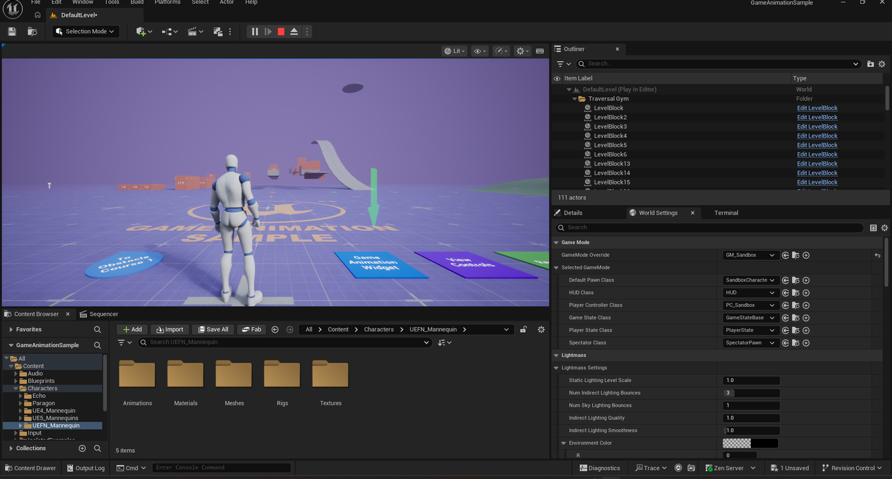
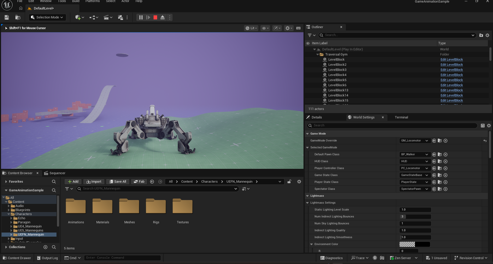

# Spawning the Locomotor Robot in Game Animation Sample

> **Note:** This document was generated by Claude Code and has not been reviewed by a human. Please use it as a reference only.

By default, the level uses the **Sandbox** game mode and its usual playable character. Switching the level's GameMode Override to **GM_Locomotor** instead spawns a quadruped "locomotor" robot.

## Step 1: Note the Default State

By default, **GameMode Override** is set to `GM_Sandbox` with **Default Pawn Class** `SandboxCharacter`, and the level spawns your usual character.

## Step 2: Change the GameMode Override

Open **World Settings** (**Window** → **World Settings**) and set **GameMode Override** to `GM_Locomotor`. This game mode's **Default Pawn Class** is `BP_Walker` — the quadruped locomotor robot.

## Result

The level now spawns the locomotor robot instead of the usual character.

