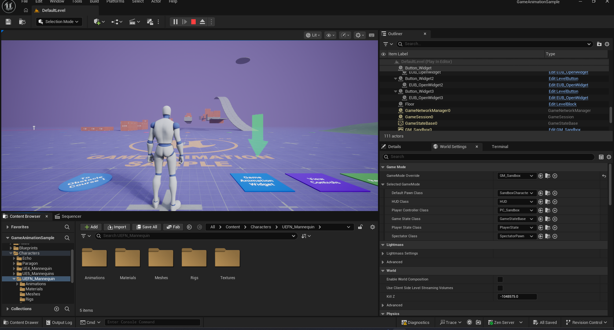
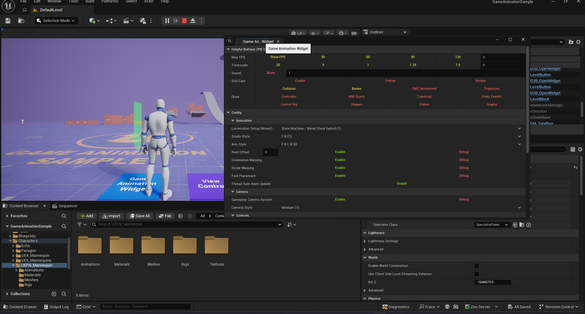
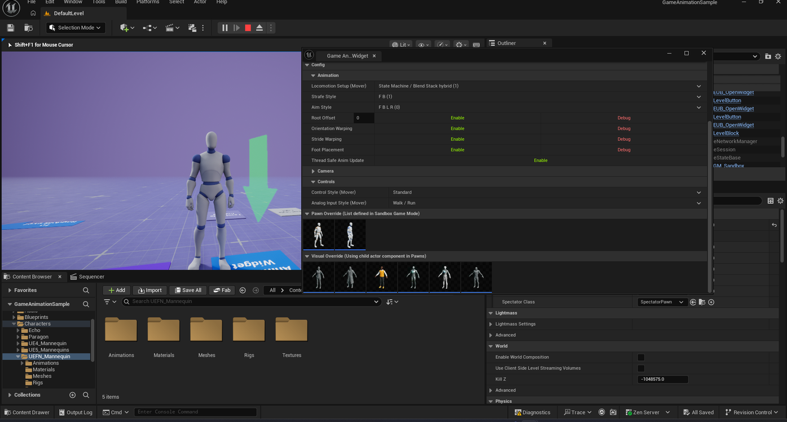
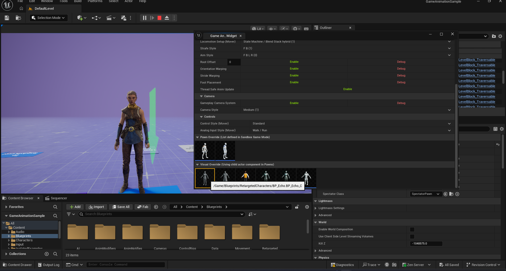
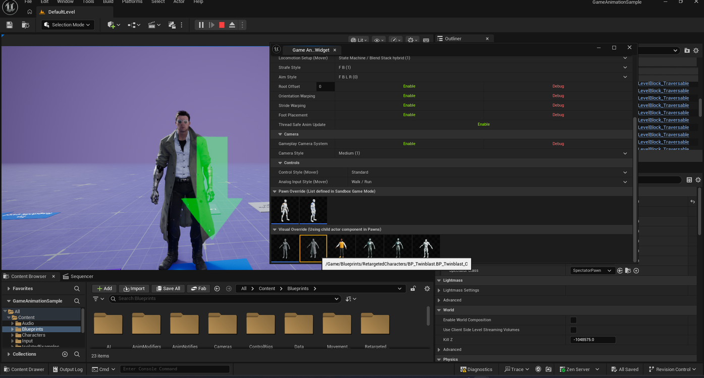
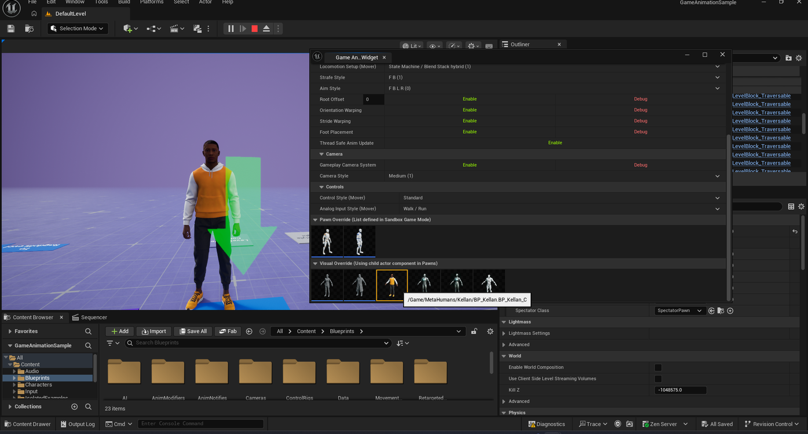
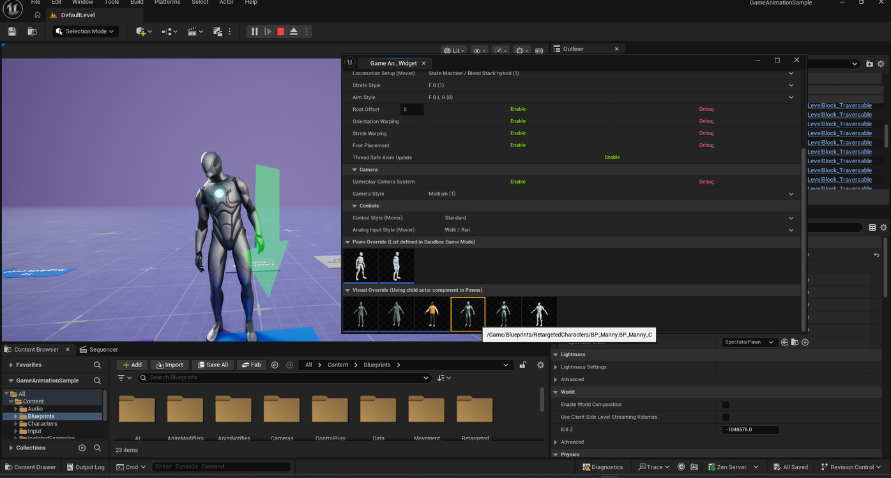
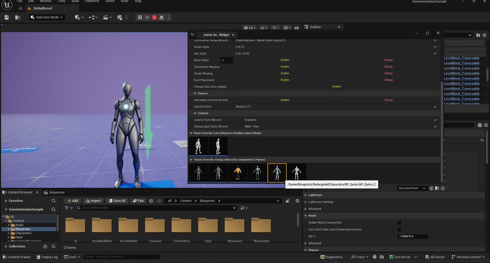
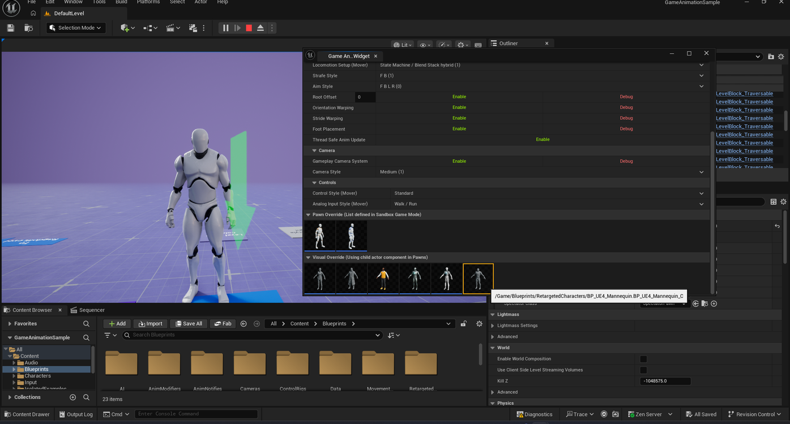

# Swapping the Character in Game Animation Sample

> **Note:** This document was generated by Claude Code and has not been reviewed by a human. Please use it as a reference only.

This guide is specific to Epic's **Game Animation Sample** project, which includes a set of swappable character presets and an in-game **Game Animation Widget** for testing them.

## Step 1: Play the Game and Find the Plates

Press **Play**. In the sandbox level, look for the labeled plates on the ground, including one marked **Game Animation Widget**.

## Step 2: Open the Game Animation Widget

Walk your character onto the **Game Animation Widget** plate. A prompt appears, and the widget opens.

## Step 3: Scroll to Visual Override

In the widget, scroll down to the **Visual Override (Using child actor component in Pawns)** section. This row lists the selectable character presets as thumbnails.

## Step 4: Select a Character

Hover over a thumbnail to see its asset name in a tooltip, then click it to swap your character to that preset.

> **Note:** To reset back to the default character instead of picking a specific one, see [Getting Back to the Default Character](get-back-to-default-character.md).

## Available Characters

- **UEFN Mannequin** — the default character.

  

- **Echo** — a female character.

  

- **Twinblast** — a male character.

  

- **Kellan** — a MetaHuman character.

  

- **Manny** — the UE Mannequin (male).

  

- **Quinn** — the UE default mannequin (female).

  

- **UE4 Mannequin**

  
