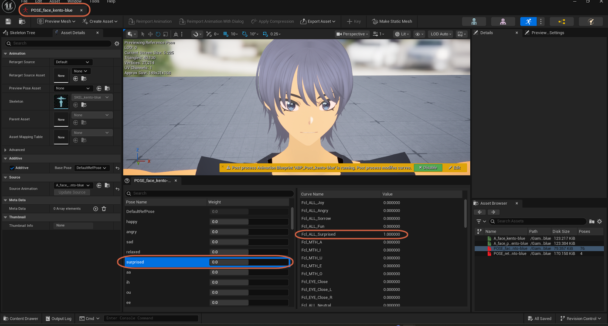
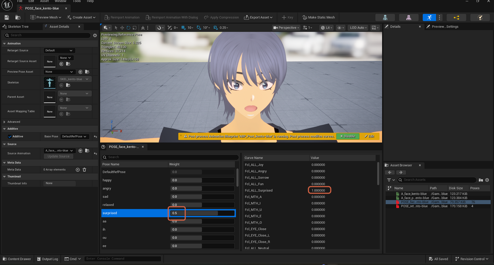

# Understanding Pose Weights vs. Curve Values

> **Note:** This document was generated by Claude Code and has not been reviewed by a human. Please use it as a reference only.

A **Pose Asset** (such as `POSE_face_kento-blue`) lists each pose on the left and the curve values it drives on the right. It's easy to assume the two panels stay in sync — they don't.

## Selecting a Pose Shows Its Baked Curve Value

Selecting a pose row, such as `surprised`, shows that pose's baked curve value on the right — for example, `Fcl_ALL_Surprised` at `1.000000`.

## Changing a Pose's Weight Does Not Change Its Curve Value

The **Weight** field next to a pose only controls how strongly that pose blends into the viewport preview. Setting `surprised`'s weight to `0.5` changes the preview, but `Fcl_ALL_Surprised` in the curve list on the right still reads `1.000000` — the pose's actual baked value hasn't changed.

> **Note:** To actually change what a pose does, edit its source animation's curves and re-derive the pose from that — editing the Weight field only previews a blend, it doesn't author the pose.
