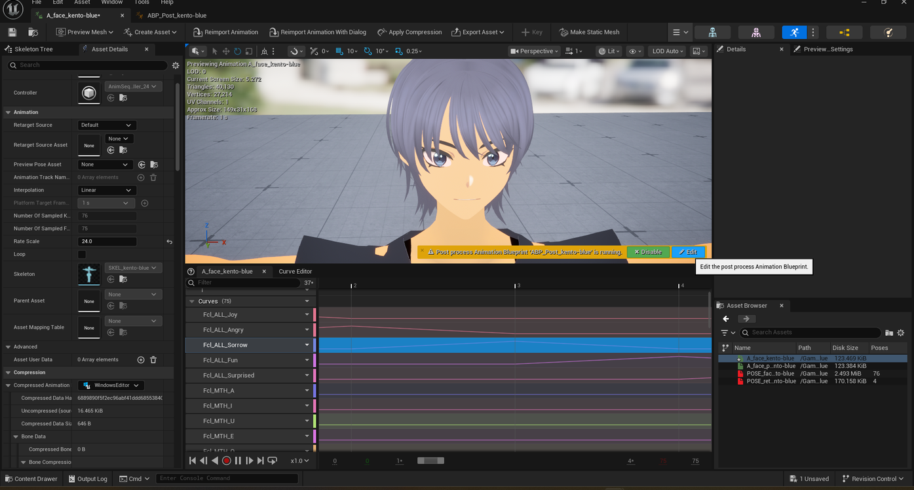

# Understanding the Post Process Animation Blueprint

> **Note:** This document was generated by Claude Code and has not been reviewed by a human. Please use it as a reference only.

A skeletal mesh can have a **Post Process Animation Blueprint** assigned to it — a second Anim Blueprint layered on top of whatever animation is already playing, used here to drive facial expression curves (`Fcl_ALL_*`, `Fcl_MTH_*`) on top of the base animation.

## Recognizing It

Opening an animation asset for a mesh with one assigned shows a status bar reading "Post process Animation Blueprint '`ABP_Post_<character>`' is running. Post process modifies curves."

## Disabling and Editing It

- Click **Disable** to preview the animation without the post-process layer applied — this shows the plain baked animation, without whatever curve-driven modifications the Post Process Animation Blueprint adds.
- Click **Edit** to open the Post Process Animation Blueprint itself.

> **Note:** Assigning a Post Process Animation Blueprint to a skeletal mesh in the first place is done through the mesh's own asset settings, not from this status bar — that step isn't covered here.
