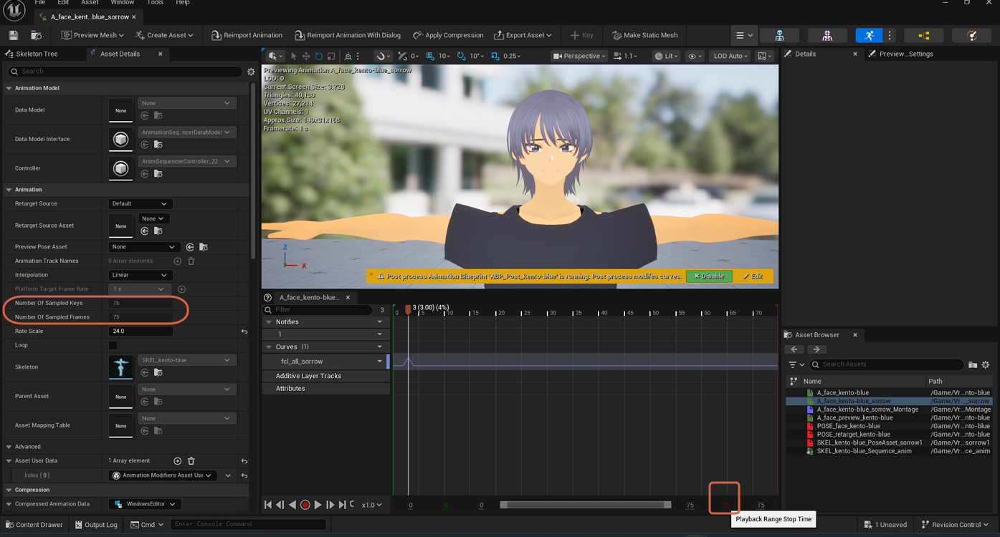

# Understanding the Number of Sampled Frames Limit

> **Note:** This document was generated by Claude Code and has not been reviewed by a human. Please use it as a reference only.

An Animation Sequence's **Number of Sampled Frames** and **Playback Range Stop Time** fields resist editing directly in the Details panel.

## Why It's Read-Only

**Number of Sampled Frames** reflects the total frame count the animation was originally imported or created with — it's a read-out of the source data, not an editable setting. If it's stuck at `1` and grayed out, the sequence effectively contains only a single frame, usually from an import issue or how the source was keyed.

## Trimming or Extending Instead

- **To play back only part of the sequence:** wrap it in an Anim Montage and set a Start/End range on the segment — see [Clipping an Animation with an Anim Montage](clip-animation-with-montage.md).
- **To add more frames to the sequence itself:** find the frame number control at the bottom-right of the graph editor, right-click it, and choose **Append Frames at End of Sequence**.

> **Note:** The Append Frames option above wasn't tested directly in this session — it's included as documented Unreal Engine behavior, not something confirmed on screen here.
