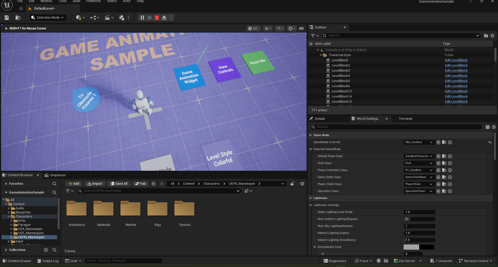
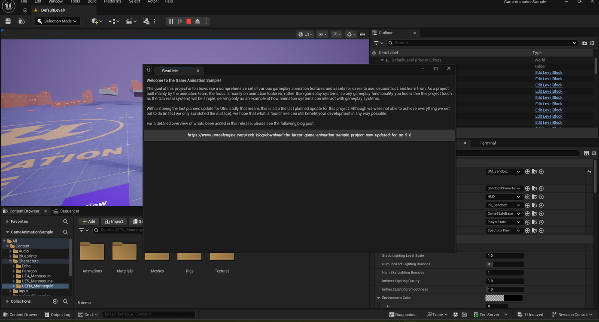
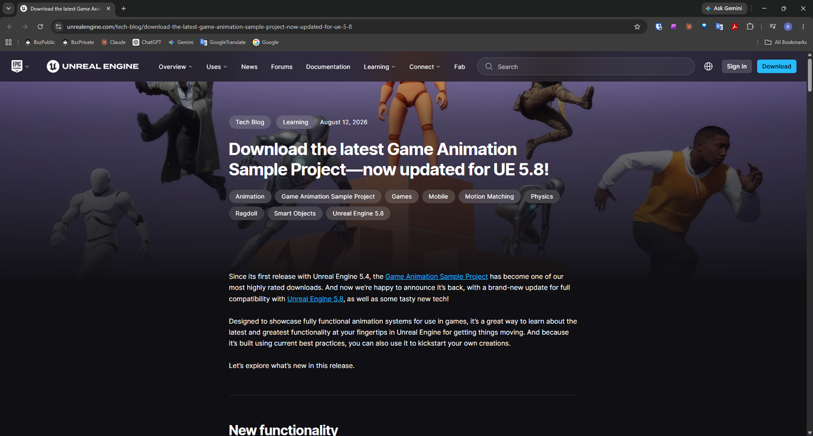
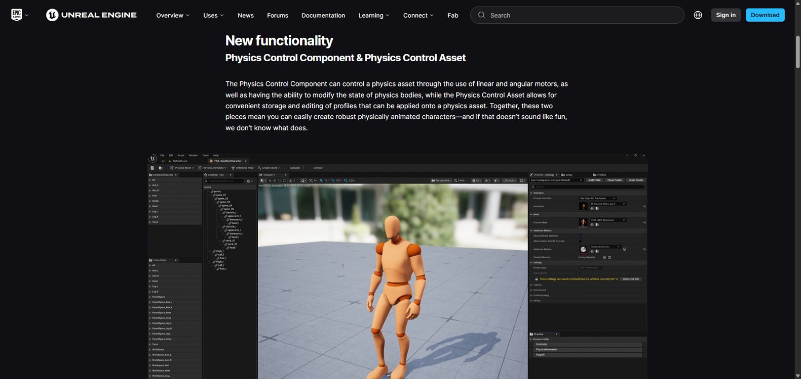
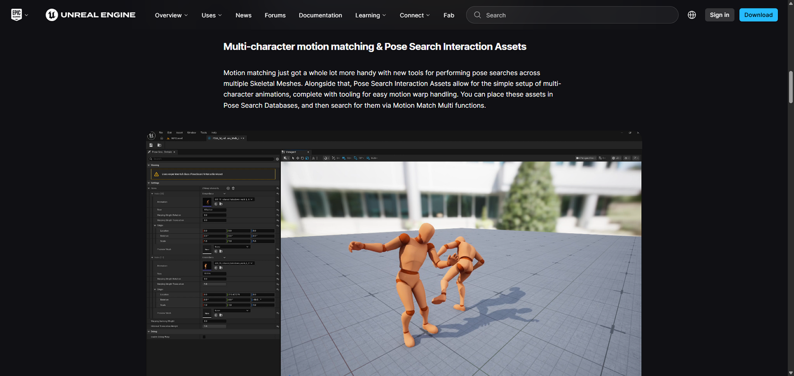

# Viewing the Read-Me and Its Release Notes in Game Animation Sample

> **Note:** This document was generated by Claude Code and has not been reviewed by a human. Please use it as a reference only.

The hub's **Read-Me** sign opens an in-game popup with a link to Epic's blog post covering what's new in the current release.

## Step 1: Find the Read-Me Sign

In the hub, look for the green **Read-Me** sign among the other labeled plates.

## Step 2: Open the Read-Me

Walk your character onto the sign to open the **Read Me** window, which shows a welcome message and a link to the release's blog post.

## Step 3: Open the Blog Post in a Browser

Open the URL shown in the Read Me window in a browser to read Epic's tech blog post about the release.

## Two Featured Functions in the Release

The blog post highlights new tech added in this update, including:

- **Physics Control Component & Physics Control Asset** — the Physics Control Component drives a physics asset through linear and angular motors and can modify the state of physics bodies. The Physics Control Asset stores and edits reusable profiles for it, making it easier to build robust, physically animated characters.

  

- **Multi-Character Motion Matching & Pose Search Interaction Assets** — new tools for performing pose searches across multiple Skeletal Meshes, plus Pose Search Interaction Assets for setting up multi-character animations with motion warp handling, searchable via Motion Match Multi functions.

  
