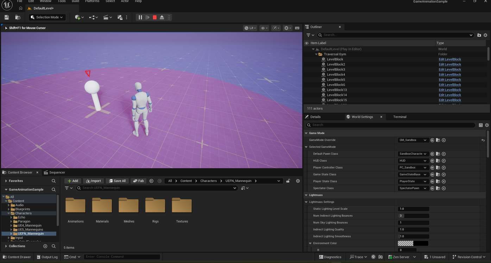
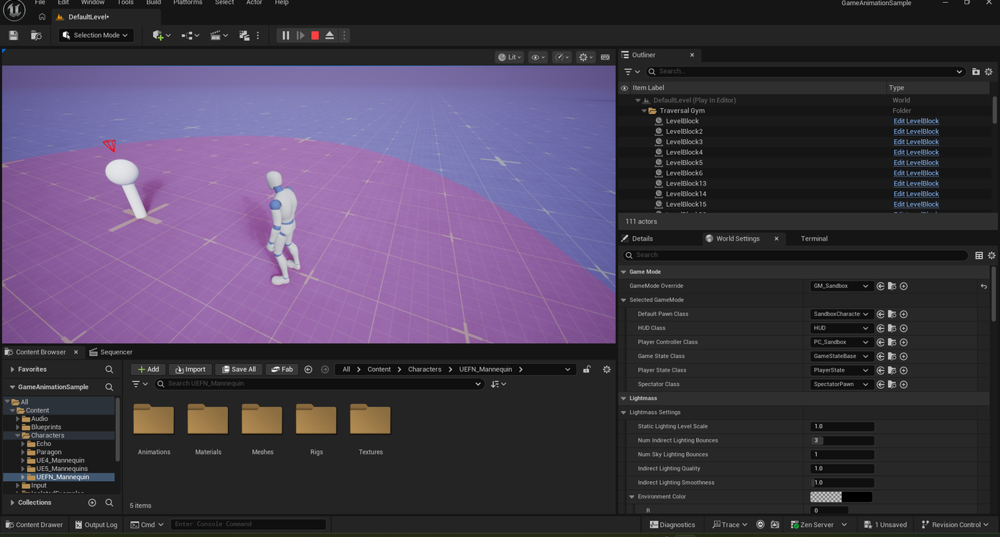

# Watching a Target Point in Game Animation Sample

> **Note:** This document was generated by Claude Code and has not been reviewed by a human. Please use it as a reference only.

Some areas of the sandbox include a look-at target — a white pole with a sphere head planted in the ground. Standing inside the purple circle around one of these targets makes your character continuously look toward it.

## Step 1: Enter the Purple Circle

Walk your character into the purple circular area on the ground near a target point.

## Step 2: Watch the Character Track the Target

As you move around inside the circle, the character's head and eyes turn to keep looking at the target point instead of facing your movement direction.

> **Note:** For a more in-depth look at this same look-at system, with live parameter tweaking across several scenarios, see [Exploring the LookAtPOI Level's Look-At Demos](explore-lookatpoi-level.md).
