# Using a Preset Voice

> **Note:** This document was generated by Claude Code and has not been reviewed by a human. Please use it as a reference only.

Voicebox also ships with a small set of built-in preset voices, so you can generate speech without recording your own voice sample first.

## Step 1: Open Create Voice

Click **Create Voice**.

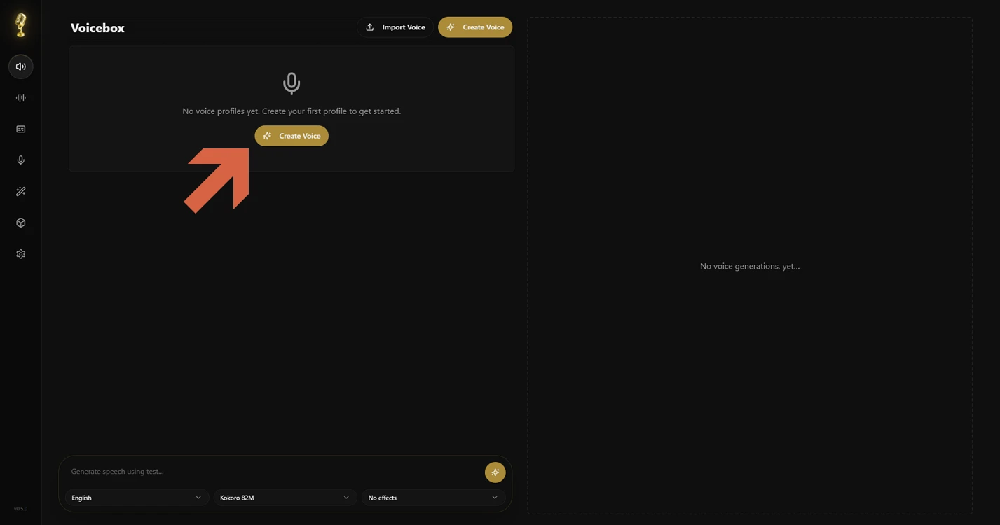

## Step 2: Choose a Built-In Voice

In the **Create Voice** dialog, click **Built-in voice** instead of **Clone from audio**.

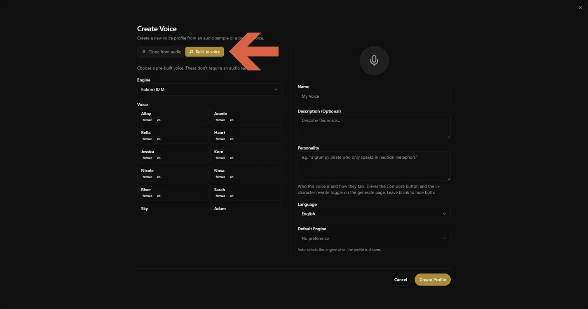

## Step 3: Pick an Engine

Preset voices are only available for two engines: **Kokoro 82M** and **Qwen CustomVoice**.

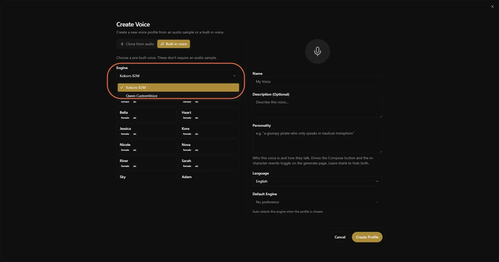

## Step 4: Browse the Available Voices

Scroll through the **Voice** list to see what each engine offers. Kokoro 82M's list is mostly English (`en`) voices:

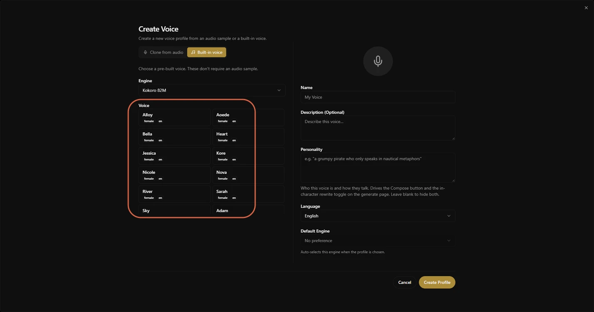

Scroll further down for the Japanese (`ja`) voices — there aren't many, and **Kumo** is the only male one:

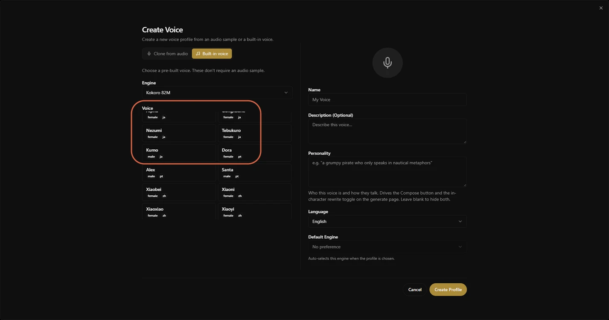

**Qwen CustomVoice** has even fewer voices: two English (**Ryan**, **Aiden**) and one Japanese (**Ono Anna**).

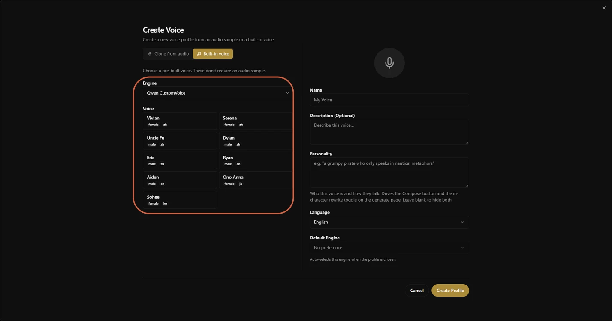

## Step 5: Create the Voice Profile

Select a voice, name the profile, set its language, then click **Create Profile**. For example, selecting **Ryan** and naming it `ryan-male-en`:

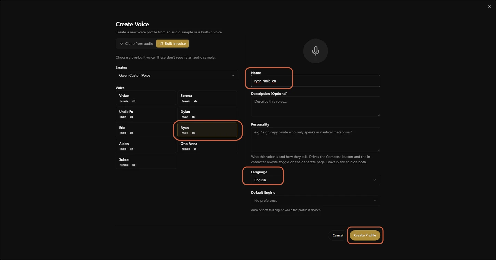

The new profile appears as a card, and the generate bar at the bottom defaults to it.

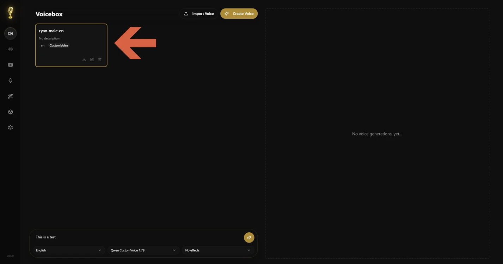

## Step 6: Generate Speech

With the profile selected, type text into the box at the bottom and click the generate button.

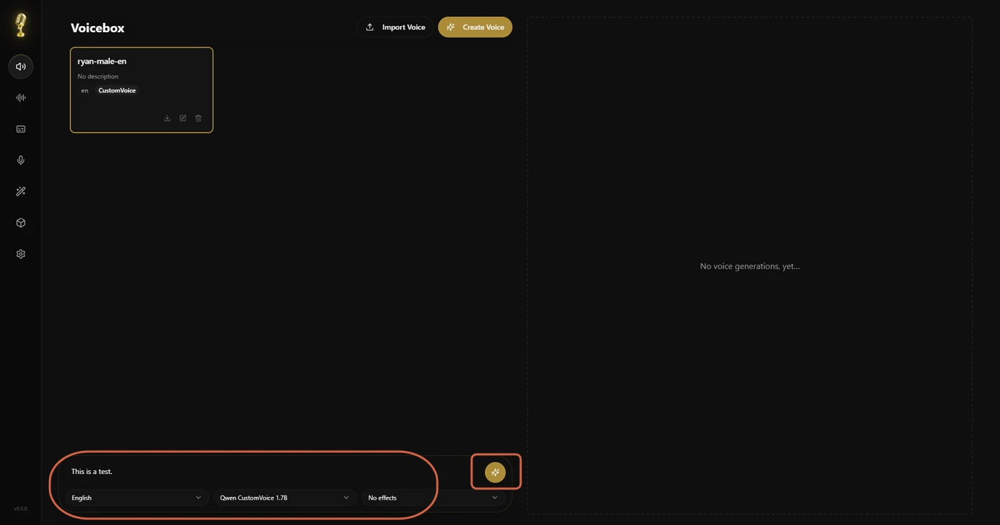

Generation takes a moment — Voicebox shows a "Loading model..." status while it works.

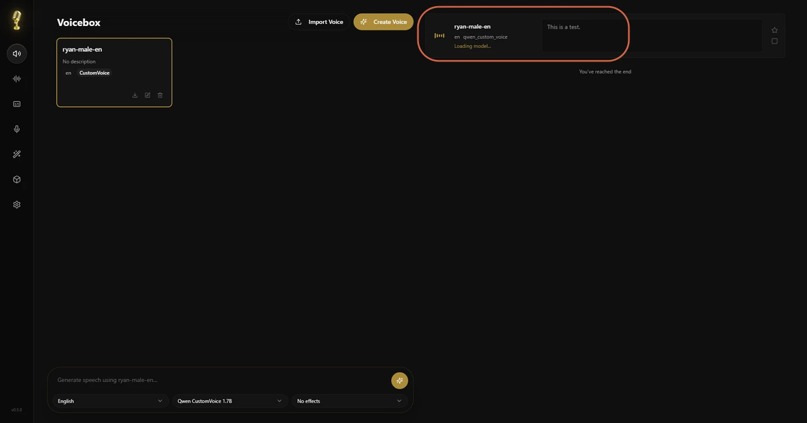

## Step 7: Play the Result

Once it finishes, a waveform player appears so you can listen right away.

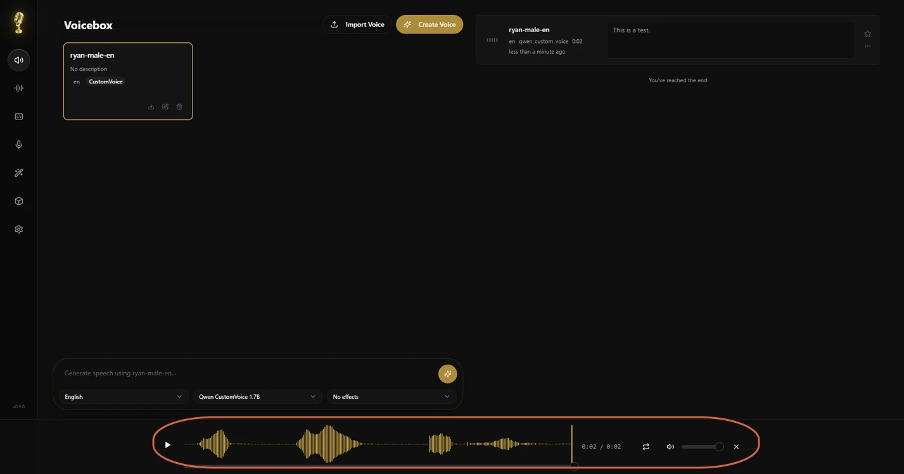

## Step 8: Favorite, Export, or Delete a Generation

Click the star on a generation to mark it as a favorite.

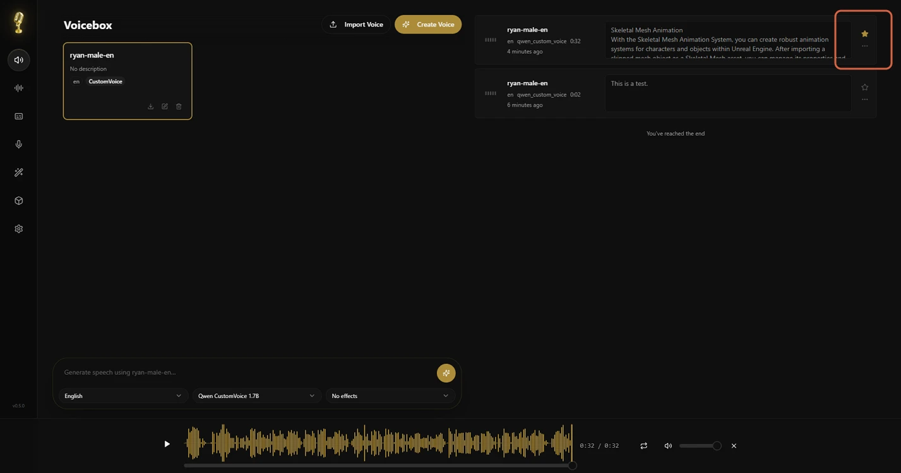

Open its **...** menu to play it again, export the audio or a full package, apply effects, regenerate, or delete it.

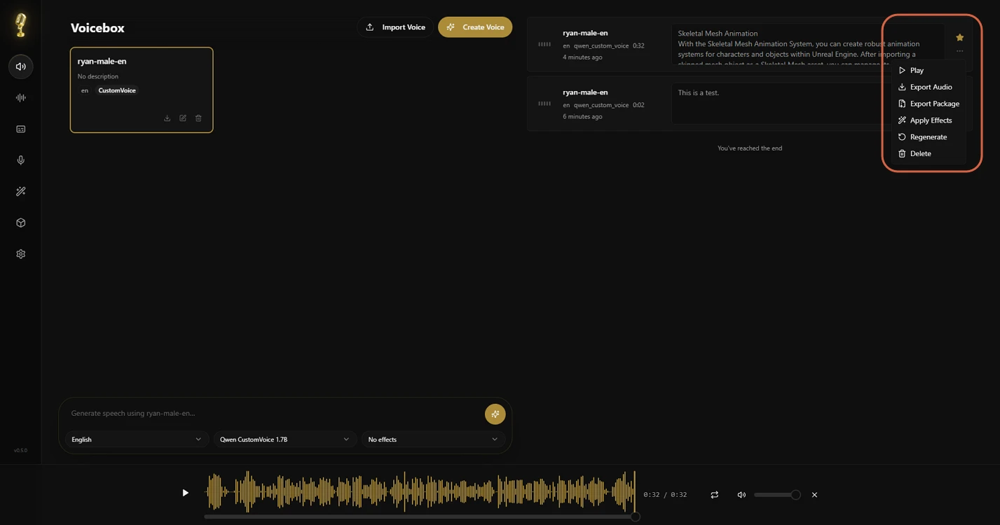

## Managing Voice Profiles

The microphone icon in the sidebar opens the **Voices** page, where you can view and edit every profile in more detail — description, language, default effects, and audio samples.

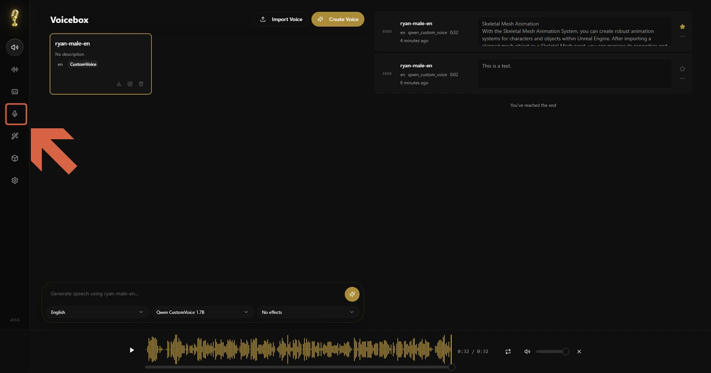

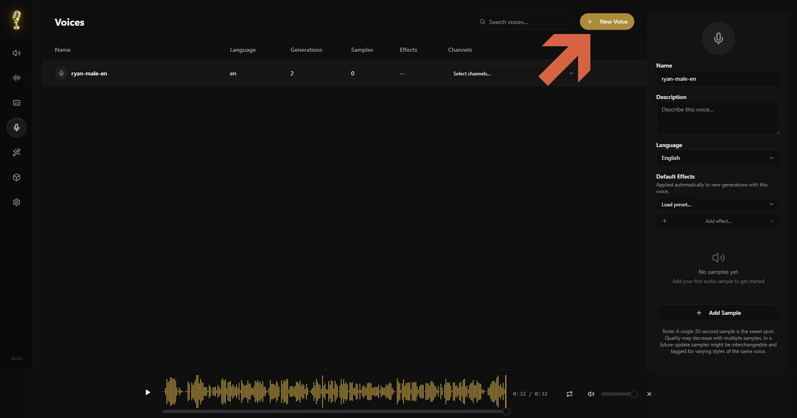

> **Warning:** Voice profile selection is filtered by engine — a profile made with one engine (e.g. Qwen CustomVoice) can't be selected while a different engine (e.g. Kokoro 82M) is active, and vice versa. Voicebox shows "Only supported voice profiles can be selected for the current model" when this happens.

For example, creating a second profile from Kokoro 82M's **Kumo** voice, named `kumo-male-ja` in Japanese:

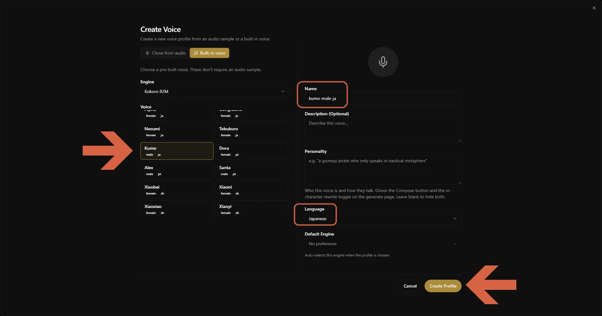

Both profiles now show up in the Voices list.

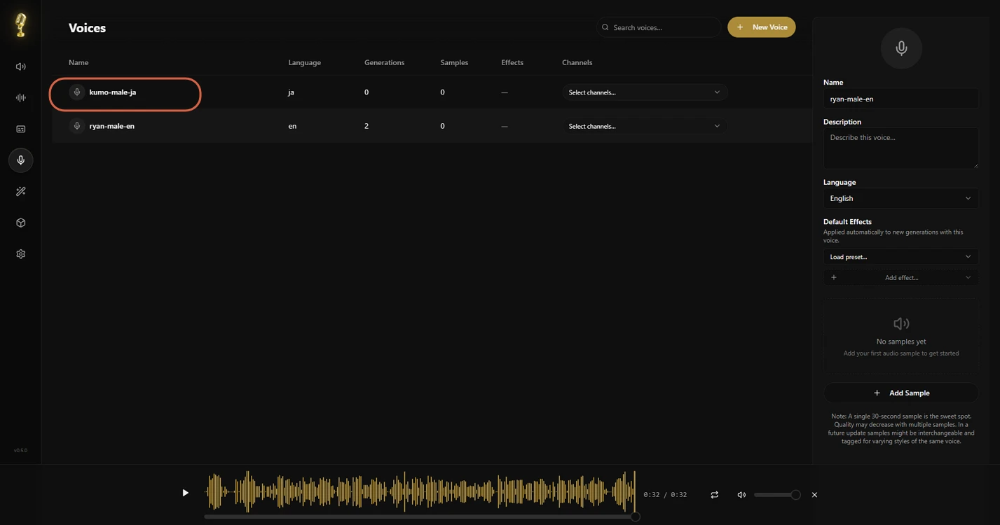

Back on the main page, selecting `kumo-male-ja` grays out `ryan-male-en` (different engine), and the generate bar switches to Japanese and Kokoro 82M automatically.

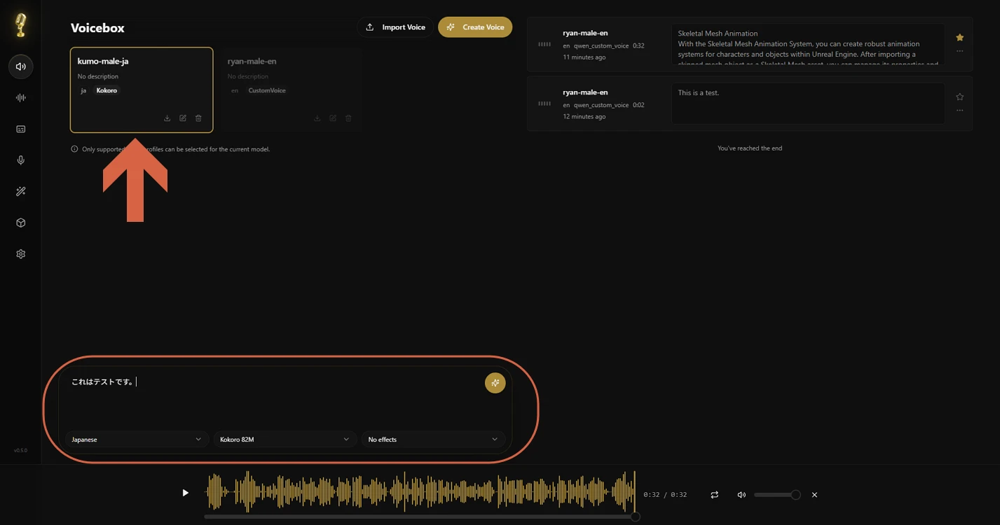

> **Warning:** Generating with a Japanese Kokoro 82M voice may fail with a `Failed initializing MeCab` error. This is a missing dependency in Voicebox itself, not a mistake in your setup — see the [fugashi README](https://github.com/polm/fugashi) linked in the error message for details.

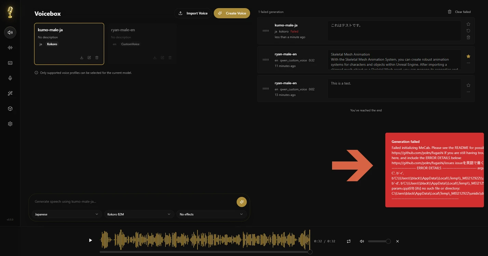
