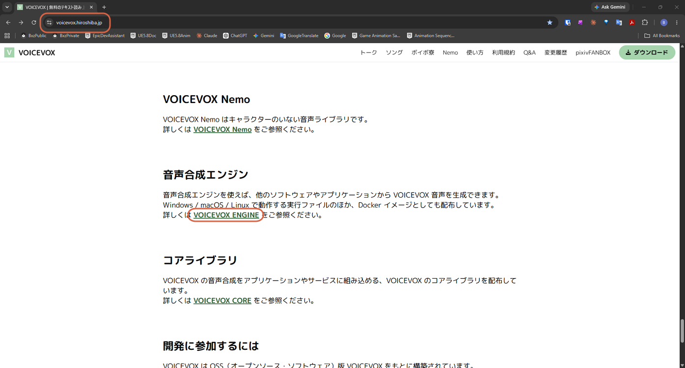

# Accessing the VOICEVOX Engine Repository

> **Note:** This document was generated by Claude Code and has not been reviewed by a human. Please use it as a reference only.

VOICEVOX Engine is the HTTP server VOICEVOX itself runs on — send it a request and it returns synthesized speech. Useful if you want to call VOICEVOX from your own code instead of the desktop app.

## Step 1: Open the Official Site

Go to the [official VOICEVOX site](https://voicevox.hiroshiba.jp), scroll down to the **音声合成エンジン** (Voice Synthesis Engine) section, then click **VOICEVOX ENGINE**.

## Step 2: Open the GitHub Repository

This opens the [VOICEVOX/voicevox_engine](https://github.com/VOICEVOX/voicevox_engine) GitHub repository, with links to the User Guide, Contributor Guide, and Developer Guide depending on what you want to do.

