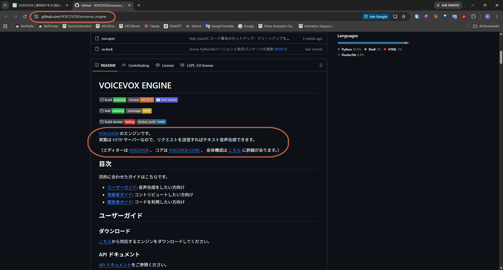
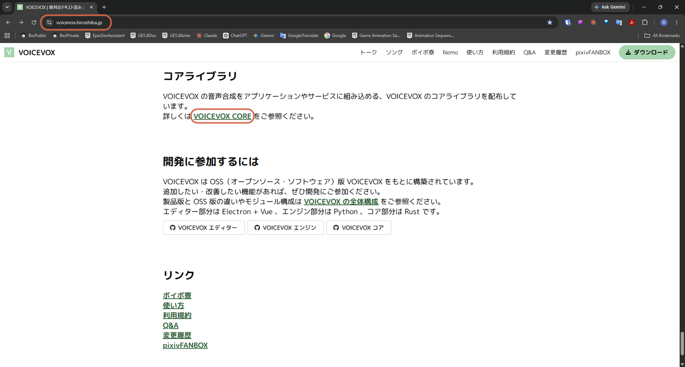
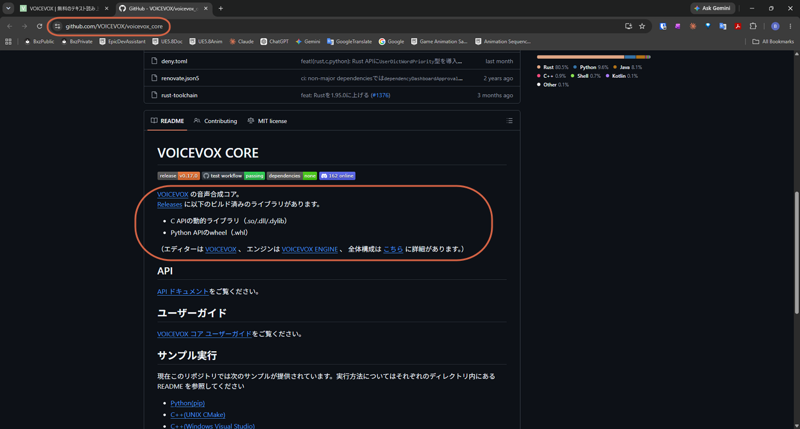

# Accessing VOICEVOX's GitHub Repositories

> **Note:** This document was generated by Claude Code and has not been reviewed by a human. Please use it as a reference only.

VOICEVOX is split across separate repositories — the Engine (an HTTP server) and the Core (the speech synthesis library) are both linked from the official site, for anyone who wants to build on VOICEVOX instead of just using the desktop app.

## VOICEVOX Engine

VOICEVOX Engine is the HTTP server VOICEVOX itself runs on — send it a request and it returns synthesized speech.

### Step 1: Open the Official Site

Go to the [official VOICEVOX site](https://voicevox.hiroshiba.jp), scroll down to the **音声合成エンジン** (Voice Synthesis Engine) section, then click **VOICEVOX ENGINE**.

### Step 2: Open the GitHub Repository

This opens the [VOICEVOX/voicevox_engine](https://github.com/VOICEVOX/voicevox_engine) GitHub repository, with links to the User Guide, Contributor Guide, and Developer Guide depending on what you want to do.

## VOICEVOX Core

VOICEVOX Core is the underlying speech synthesis library — a lower-level building block than the Engine, distributed as a C API (`.so`/`.dll`/`.dylib`) or a Python API (`.whl`).

### Step 1: Open the Official Site

Scroll further down to the **コアライブラリ** (Core Library) section, then click **VOICEVOX CORE**.

### Step 2: Open the GitHub Repository

This opens the [VOICEVOX/voicevox_core](https://github.com/VOICEVOX/voicevox_core) GitHub repository. **Releases** has prebuilt libraries for both APIs, plus sample execution instructions for Python and C++ (CMake or Visual Studio).

## Reference

- [VOICEVOX Engine (GitHub)](https://github.com/VOICEVOX/voicevox_engine)
- [VOICEVOX Core (GitHub)](https://github.com/VOICEVOX/voicevox_core)
- [VOICEVOX Editor (GitHub)](https://github.com/VOICEVOX/voicevox) — the desktop app itself
