# Adding Nemo Voices

> **Note:** This document was generated by Claude Code and has not been reviewed by a human. Please use it as a reference only.

[VOICEVOX Nemo](https://voicevox.hiroshiba.jp/nemo/) is a free, character-less voice library — extra voices (numbered, not named) you can add to VOICEVOX as a separate multi-engine.

## Step 1: Open the Official Site

Go to the [official VOICEVOX site](https://voicevox.hiroshiba.jp).

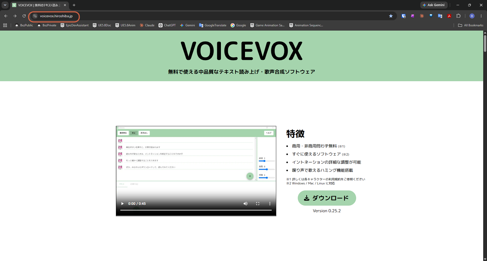

## Step 2: Open VOICEVOX Nemo

Scroll down and click **VOICEVOX Nemo**.

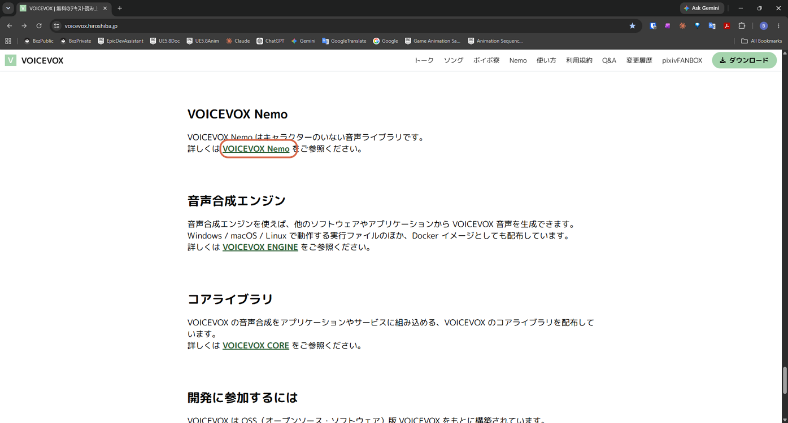

## Step 3: Open the Nemo Download Page

On the VOICEVOX Nemo page, click **ダウンロード** (Download).

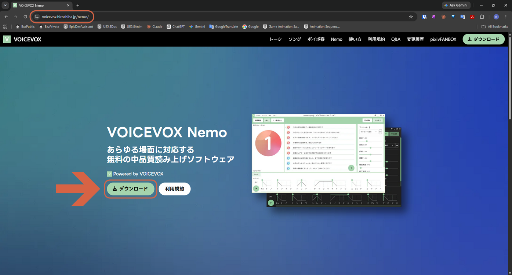

## Step 4: Review the Setup Steps

A usage guide dialog appears with three steps: install VOICEVOX, turn on the Multi-engine function in VOICEVOX's settings, then download the Nemo Engine. Click **Nemo エンジン ダウンロード** (Nemo Engine Download) — Step 3 in the dialog.

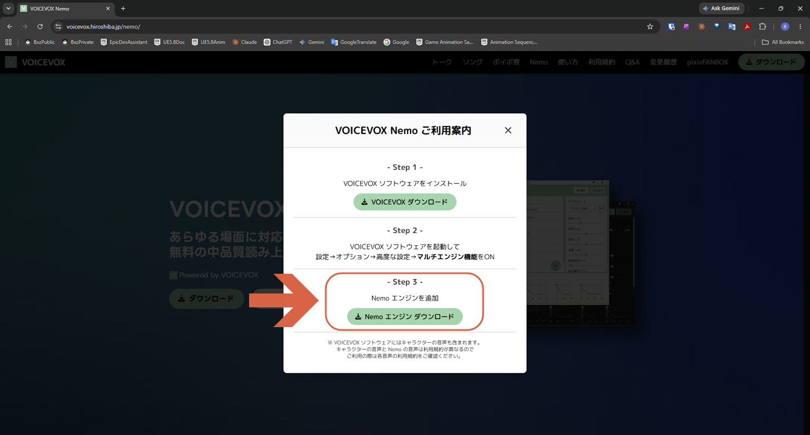

> **Note:** Skip Step 1 in the dialog (installing VOICEVOX) if you already have it installed.

## Step 5: Open Options

In VOICEVOX, go to **設定** (Settings) → **オプション** (Options).

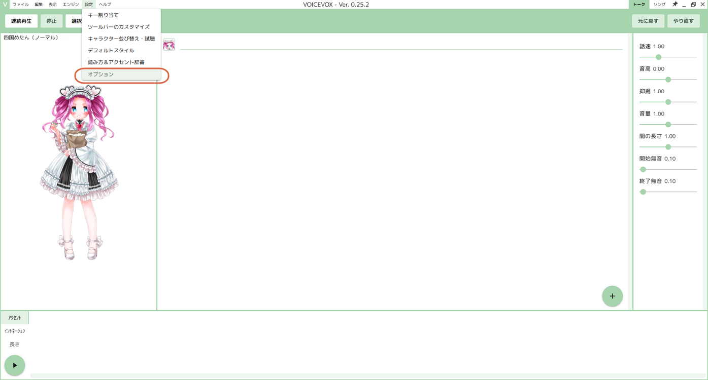

## Step 6: Turn On the Multi-Engine Function

Under **高度な設定** (Advanced Settings), turn on **マルチエンジン機能** (Multi-engine function).

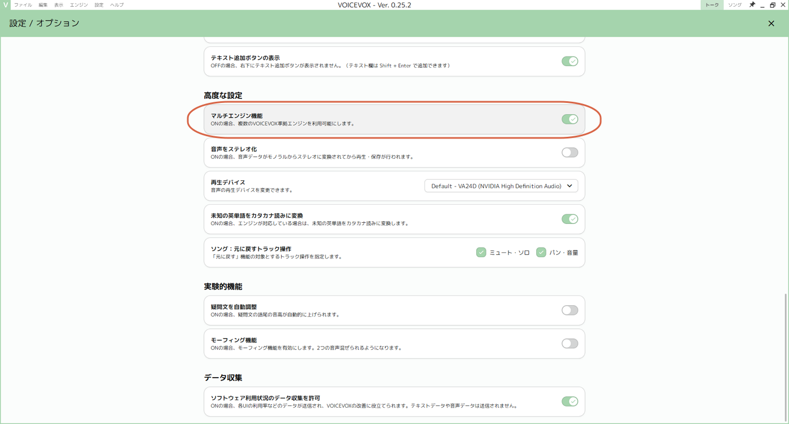

## Step 7: Download the Nemo Engine

Back on the download dialog, choose your OS and mode (GPU/CPU or CPU-only), then click **ダウンロード** (Download).

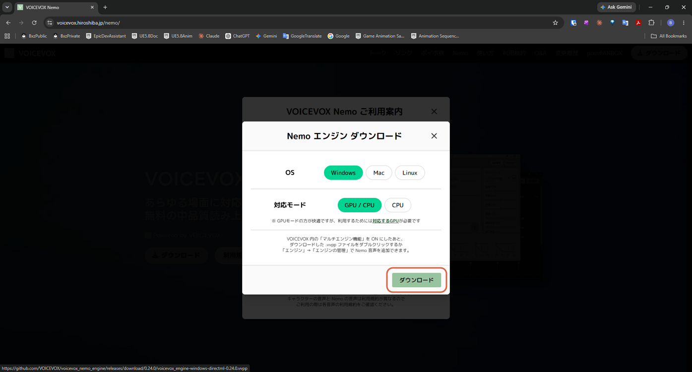

> **Warning:** If [AivisSpeech](../aivisspeech/get-started-with-aivisspeech.md) is also installed, double-clicking the downloaded `.vvpp` file may launch **AivisSpeech** instead of VOICEVOX and import the Nemo voices there — as extra numbered character slots — rather than into VOICEVOX. If that happens, skip ahead and add the engine to VOICEVOX manually using Steps 8–12 below.

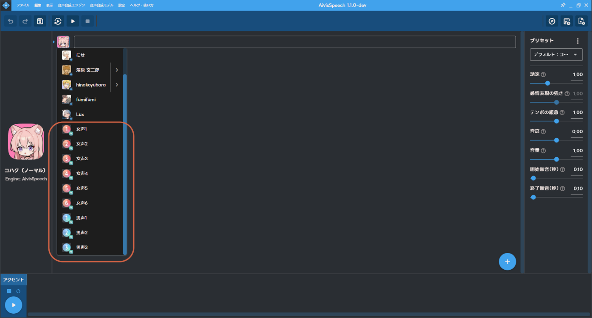

## Step 8: Open Manage Engines

In VOICEVOX, go to **エンジン** (Engine) → **エンジンの管理** (Manage Engines).

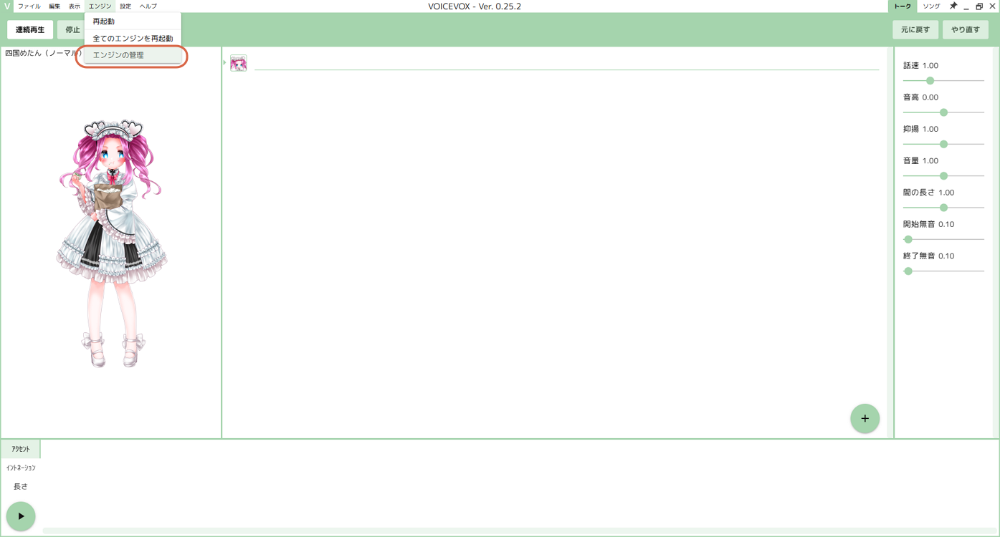

## Step 9: Add a New Engine

Click **追加** (Add).

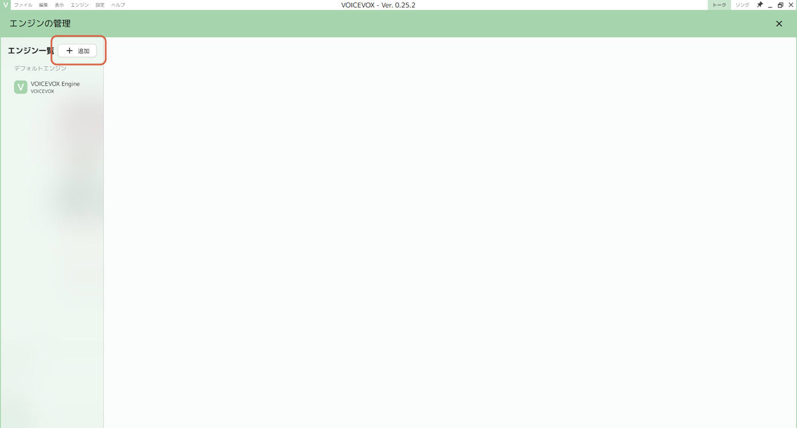

## Step 10: Select the VVPP File

Choose the **VVPPファイル** (VVPP File) tab, select the downloaded `.vvpp` file, then click **追加** (Add).

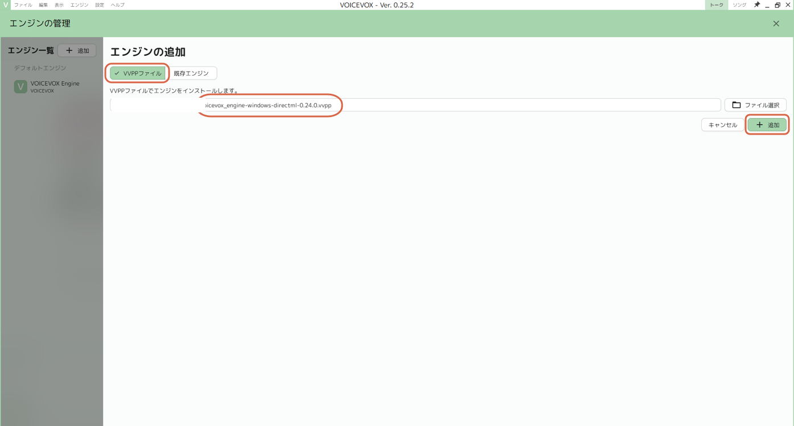

## Step 11: Reload

Click **再読み込みする** (Reload) to apply the new engine.

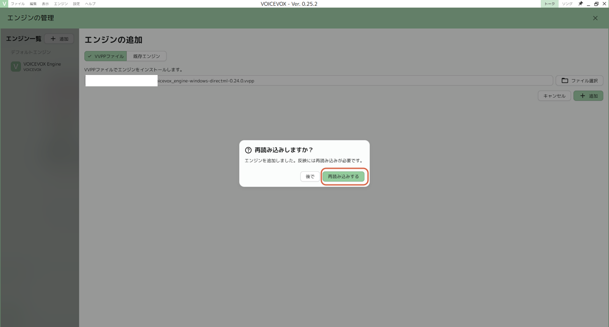

## Step 12: Confirm the Nemo Voices Are Added

The new Nemo voices — six female (女声1–6) and three male (男声1–3) — appear in the character list, marked **NEW!**.

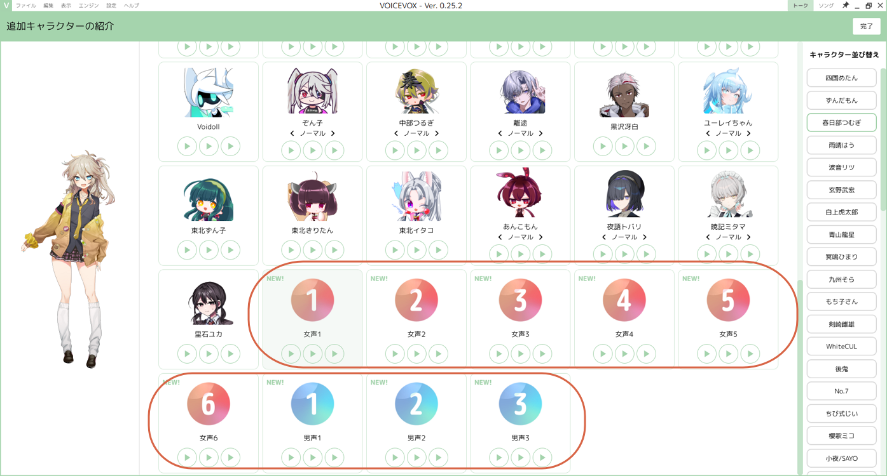
