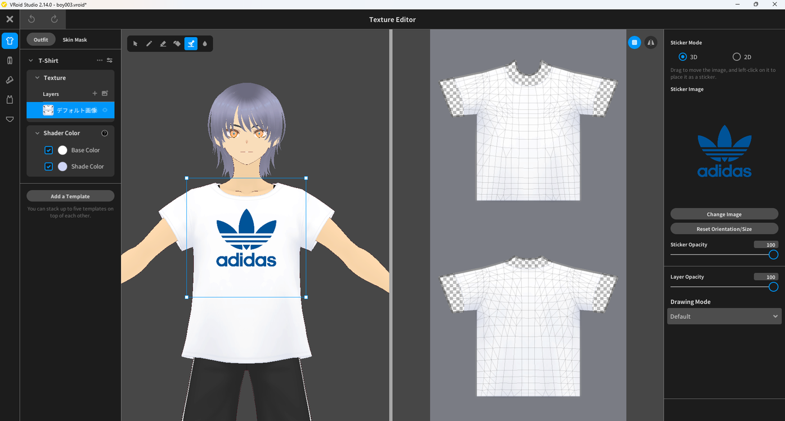
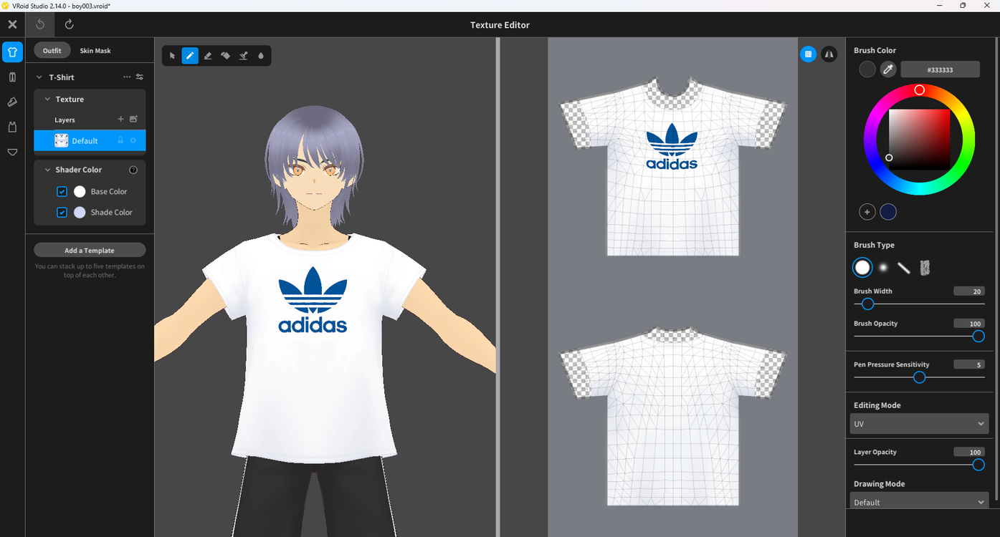
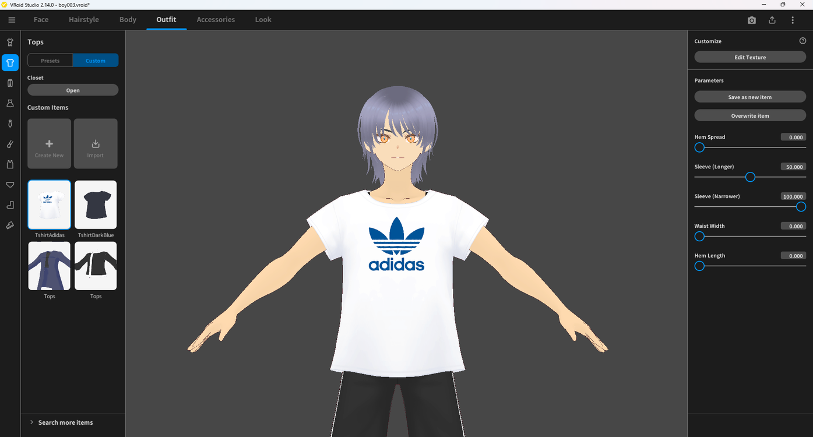

# Adding a Sticker to a Texture

> **Note:** This document was generated by Claude Code and has not been reviewed by a human. Please use it as a reference only.

The **Sticker** tool lets you drop a flat image — such as a logo — onto a clothing texture directly, without hand-painting it.

## Step 1: Open the Texture Editor

Click **Edit Texture** under **Customize** in the right panel for the item you want to edit.

## Step 2: Select the Layer

In the left panel, select the texture layer you want to add the sticker to.

## Step 3: Place the Sticker

Select the **Sticker** tool from the toolbar, then choose the image file to use as a sticker. Drag it into position on the 3D preview.

> **Note:** **Sticker Mode** offers **3D** (drag directly on the model) and **2D** (position on the flat UV canvas) placement, along with **Sticker Opacity** and **Layer Opacity** controls.

## Step 4: Apply the Sticker

Click the sticker image while it is still selected to bake it into the texture layer.

## Step 5: Confirm the Result

The sticker is now part of the texture and shows on the model. The updated item is also saved as a new entry under **Custom Items**.

