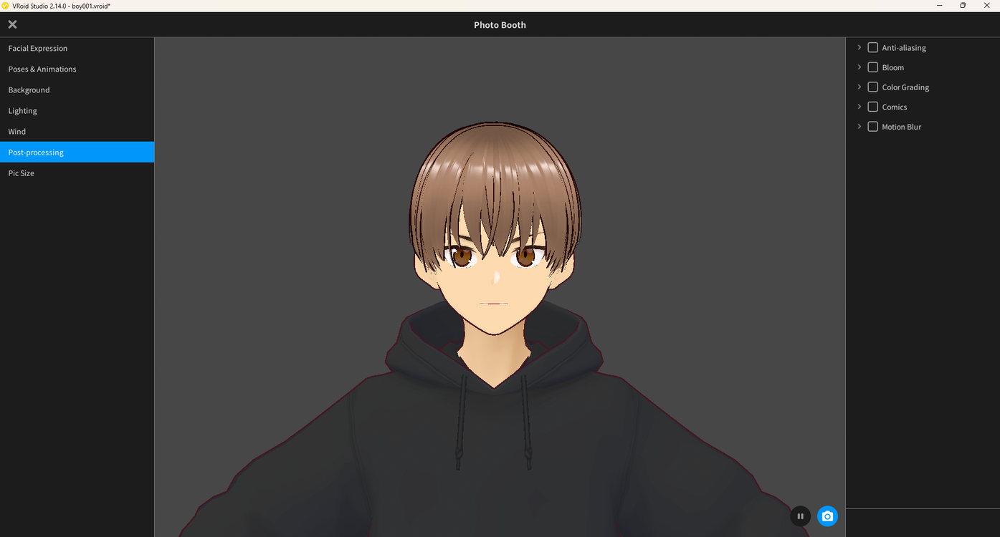
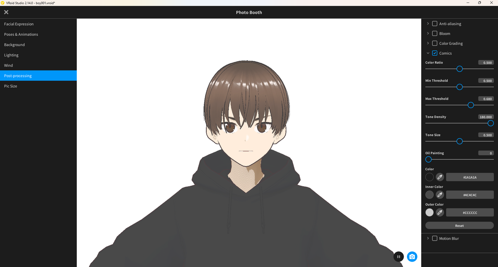
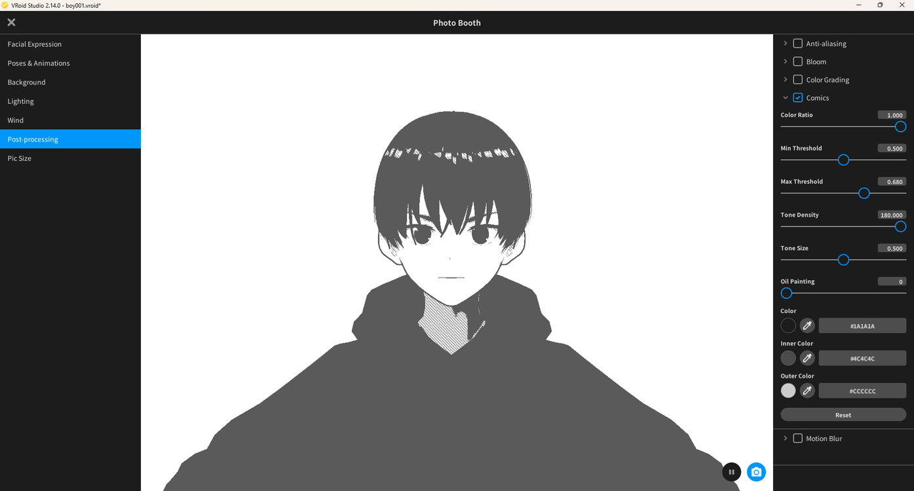
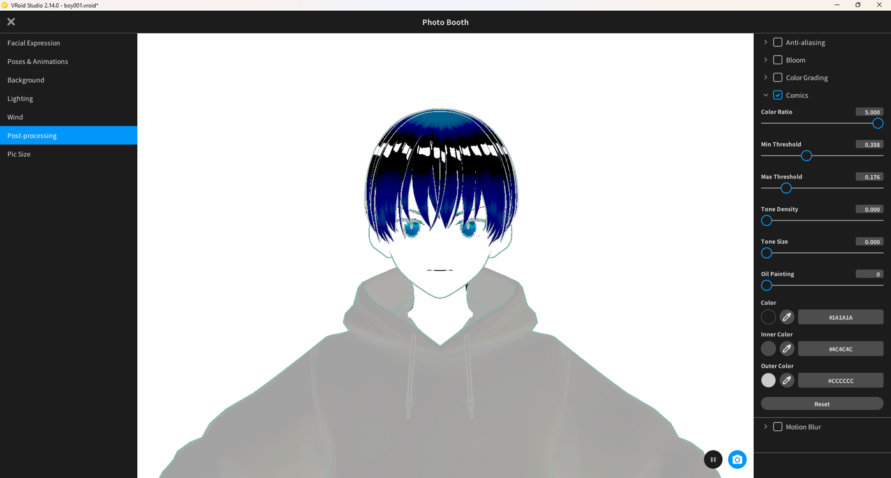
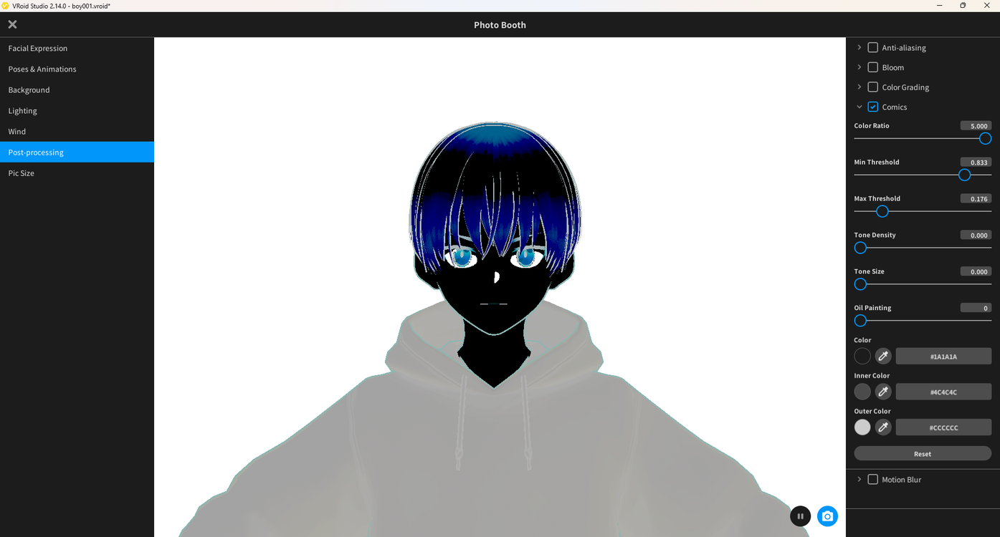

# Apply the Manga-Style Comics Effect

> **Note:** This document was generated by Claude Code and has not been reviewed by a human. Please use it as a reference only.

The **Comics** post-processing effect in Photo Booth posterizes colors into flat bands and adds halftone-style dot shading, turning a captured photo into a print-style manga panel. It only applies to Photo Booth captures, not to the live viewport.

## Step 1: Open Post-Processing and Enable Comics

1. Open **Photo Booth** (camera icon, top right).
2. In the left sidebar, select **Post-processing**.
3. Check **Comics**.

## Step 2: Adjust Color Ratio and Thresholds

The Comics panel exposes **Color Ratio**, **Min Threshold**, **Max Threshold**, **Tone Density**, **Tone Size**, **Oil Painting**, and color pickers for **Color**, **Inner Color**, and **Outer Color**.

- **Color Ratio 0.5** — a light two-tone posterize that keeps most of the model's original color and shading.

  

- **Color Ratio 1.0** — a near-monochrome posterize with visible halftone dot shading in the hoodie's shadow.

  

- **Color Ratio 5.0 (version 1)** — with Min Threshold 0.358 and Max Threshold 0.176, colors invert into high-contrast bands with hard white highlight streaks in the hair.

  

- **Color Ratio 5.0 (version 2)** — raising Min Threshold to 0.833 crushes the face and body to a near-black silhouette, leaving only the eyes and hair highlights visible.

  

> **Note:** Small changes to Min Threshold and Max Threshold make a large visual difference at high Color Ratio values — adjust in small increments.

## Result

A lower Color Ratio (0.5–1.0) gives a print-manga panel look, while pushing Color Ratio to 5.0 and tuning the thresholds produces a high-contrast, ink-heavy panel style.
