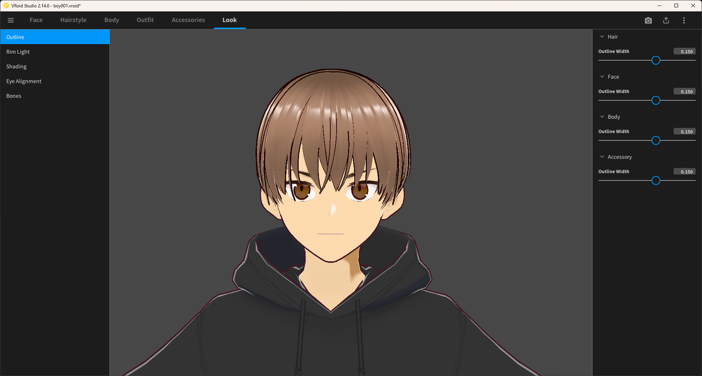
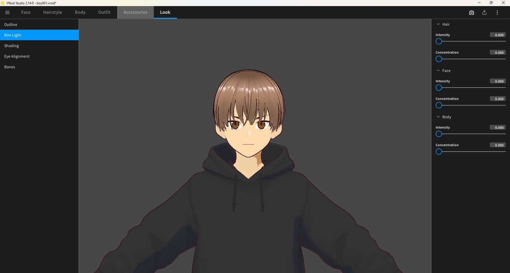
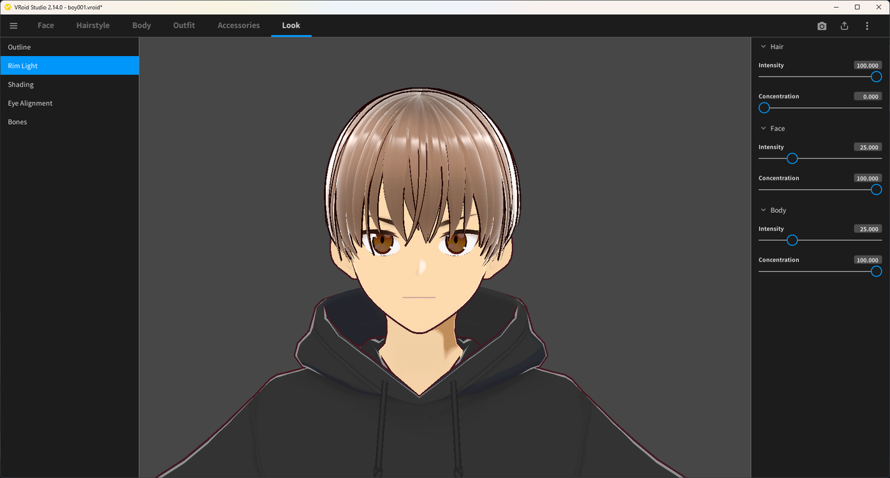
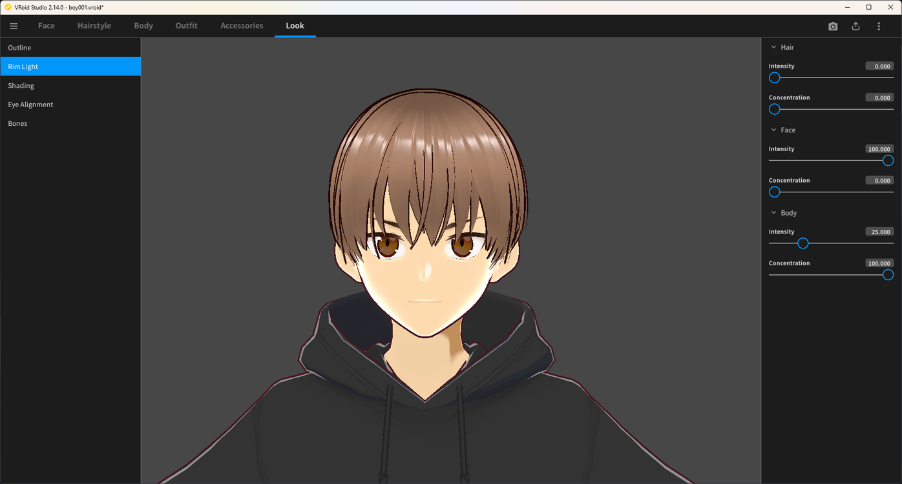
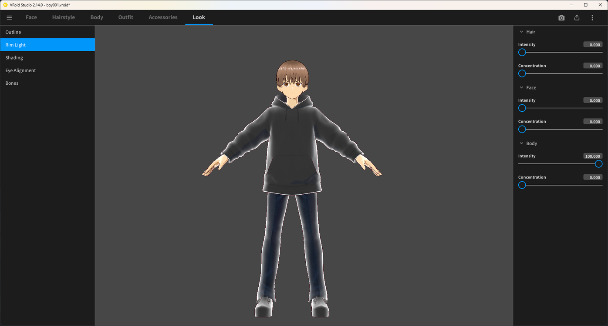
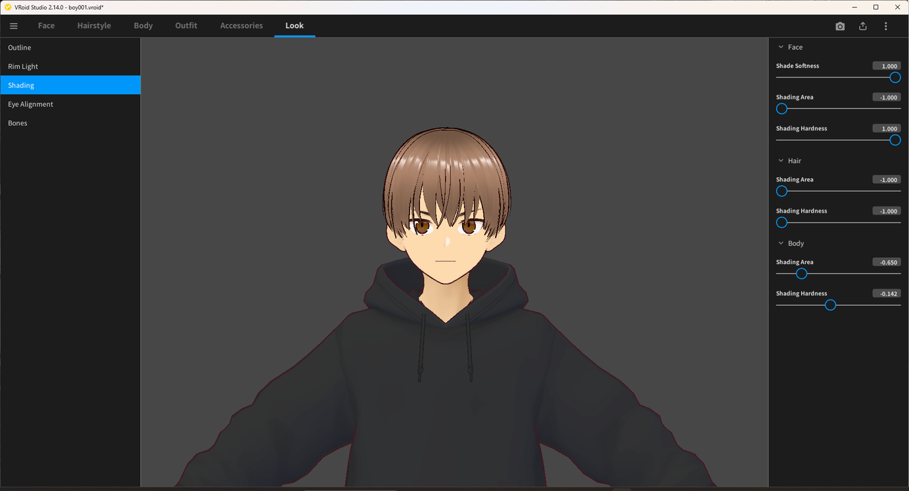
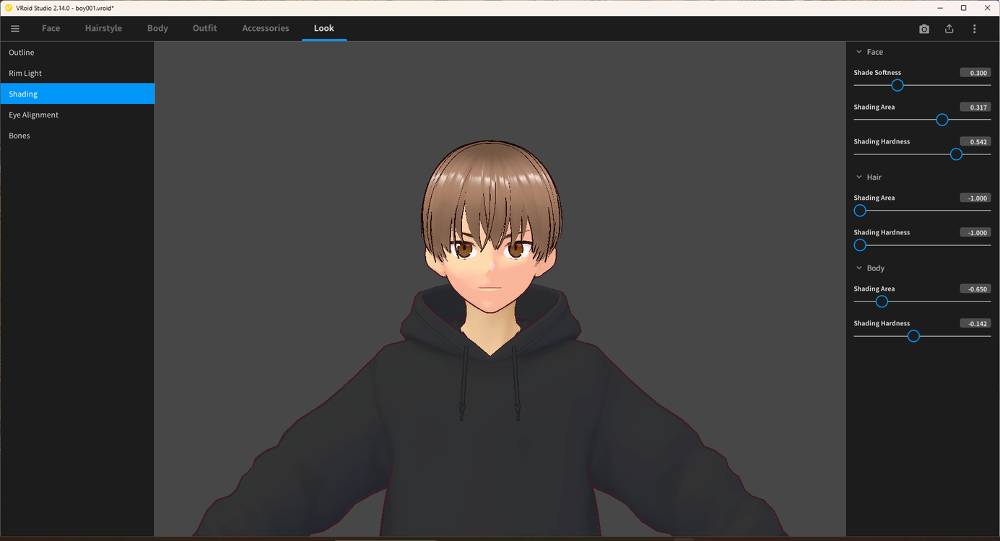
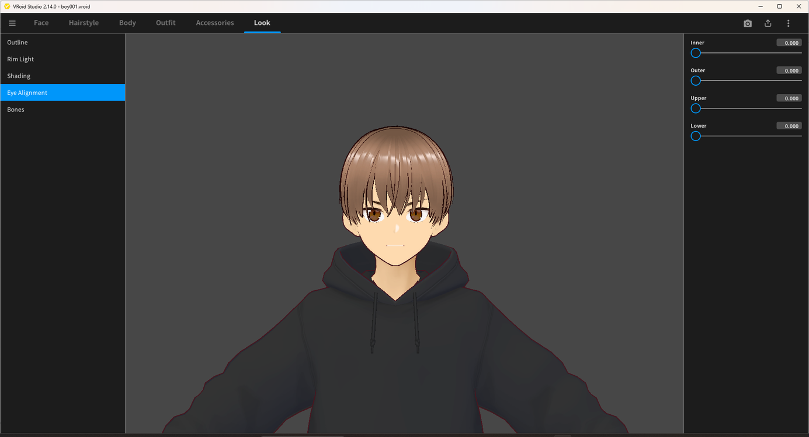

# Manga-Style Look Settings

> **Note:** This document was generated by Claude Code and has not been reviewed by a human. Please use it as a reference only.

The **Look** tab controls how VRoid Studio renders your model in real time. Combining these four settings — Outline, Rim Light, Shading, and Eye Alignment — pushes the default render toward a flat, print-style manga look instead of the smoother default anime shading.

## Set the Outline Width

Location: **Look** tab → **Outline**.

A width of **0.150** works as a solid starting point for **Hair**, **Face**, **Body**, and **Accessory** outlines — thick enough to read as a manga-style line without overwhelming the model.

## Set the Rim Light

Location: **Look** tab → **Rim Light**.

For a flat manga look, set **Intensity** and **Concentration** to **0** for Hair, Face, and Body. This removes the lit rim glow along backlit edges, which reads as a 3D render cue rather than a manga one.

Rim Light can also be tuned per part if you want a partial glow instead of removing it entirely:

## Set the Shading

Location: **Look** tab → **Shading**.

For a hard-edged, two-tone manga shadow, use a low **Shading Area** and high **Shading Hardness** — a negative Shading Area shrinks the shaded region, and a Shading Hardness near 1.000 gives it a crisp edge instead of a soft gradient. **Shading Area** and **Shading Hardness** can be tuned separately for Hair, Face, and Body.

For comparison, lowering **Shading Hardness** and raising **Shading Area** and **Shade Softness** on the Face produces a softer, more painterly shadow — closer to standard anime shading than the manga look:

## Align the Eyes

Location: **Look** tab → **Eye Alignment**.

Set **Inner**, **Outer**, **Upper**, and **Lower** all to **0** to keep the eyes in their neutral, unadjusted position.

