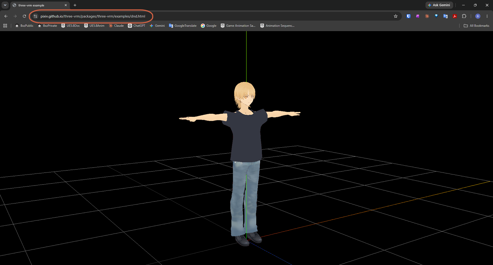
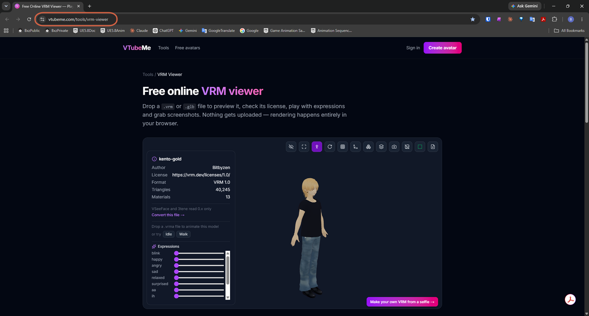

# Checking a VRM Model Online

> **Note:** This document was generated by Claude Code and has not been reviewed by a human. Please use it as a reference only.

After [exporting a character as VRM](export-character-as-vrm.md), you can check how it looks without opening Unreal Engine. Pick a method based on how much detail you need.

## Method 1: Check the Look Only

If you just want a quick look at the model with no detailed checks, drag and drop the VRM file onto the [three-vrm viewer](https://pixiv.github.io/three-vrm/packages/three-vrm/examples/dnd.html) — this is the simplest option.

> **Note:** For more detail, see the [three-vrm examples list](https://pixiv.github.io/three-vrm/packages/three-vrm/examples/) or [pixiv's press release](https://www.pixiv.co.jp/news/press-release/article/7361/).

## Method 2: Check Expressions and Other Details

To check details like facial expressions, use the [VTubeMe VRM Viewer](https://vtubeme.com/tools/vrm-viewer). It shows model info such as author, license, format, triangle count, and material count, plus **Expressions** sliders (`blink`, `happy`, `angry`, `sad`, `relaxed`, `surprised`, `aa`, `ih`, and more) for testing each expression individually. You can also drop a `.vrma` file to play an animation on the model, or try the built-in `Idle` and `Walk` presets.

## Method 3: Make Changes to the Model

To actually modify the model, use Unreal Engine — see [Importing a VRM Character](../ue/import-vrm-character.md).
