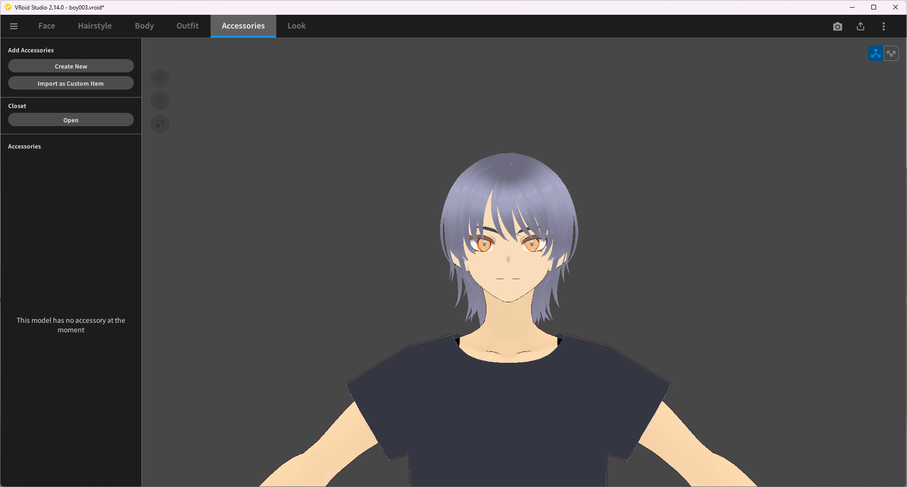
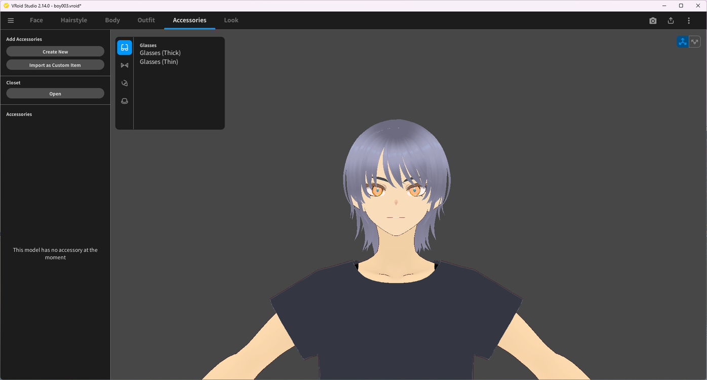
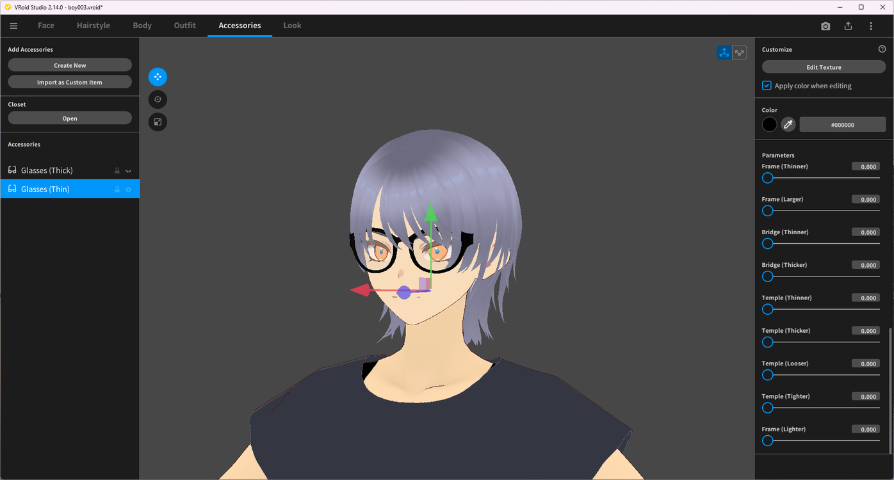

# Creating Custom Glasses

> **Note:** This document was generated by Claude Code and has not been reviewed by a human. Please use it as a reference only.

This guide walks through adding a pair of glasses from a built-in template, then adjusting its shape and color.

## Step 1: Open the Accessories Tab

Select the **Accessories** tab. If the model has no accessories yet, click **Create New** under **Add Accessories**.

## Step 2: Choose a Glasses Template

In the template picker, select the **Glasses** category icon, then pick a template, such as **Glasses (Thick)** or **Glasses (Thin)**.

> **Note:** The icons on the left of the picker switch between accessory categories — glasses are one of several, alongside categories such as hats. See [Creating a Custom Hat](create-custom-hat.md) for the same workflow applied to a hat.

## Step 3: Customize the Glasses

The glasses are added to the **Accessories** list. Use **Color** to change their color, and the **Parameters** panel to adjust the frame, bridge, and temple shape — **Frame (Thinner/Larger)**, **Bridge (Thinner/Thicker)**, and **Temple (Thinner/Thicker/Looser/Tighter)**, among others. Click **Edit Texture** to paint the texture directly instead.

