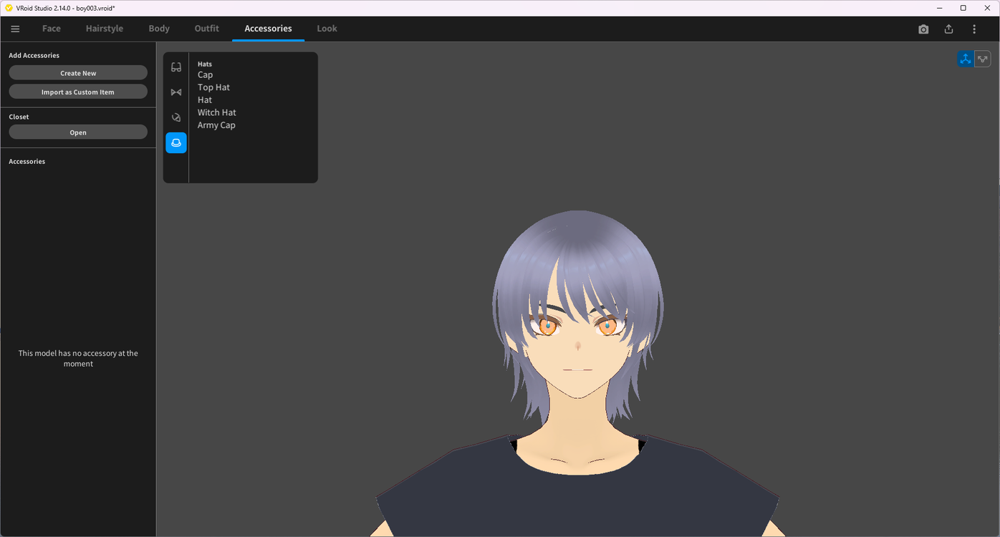
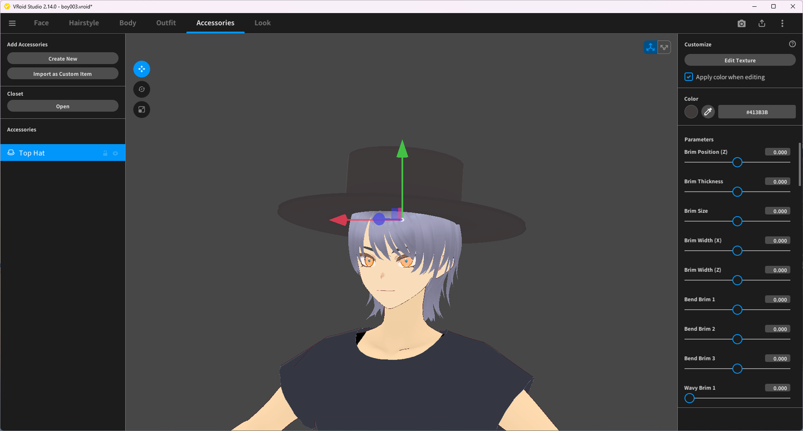

# Creating a Custom Hat

> **Note:** This document was generated by Claude Code and has not been reviewed by a human. Please use it as a reference only.

This guide walks through adding a hat from a built-in template, then adjusting its shape and color.

## Step 1: Open the Accessories Tab

Select the **Accessories** tab. If the model has no accessories yet, click **Create New** under **Add Accessories**.

## Step 2: Choose a Hat Template

In the template picker, select the **Hats** category icon, then pick a template, such as **Cap**, **Top Hat**, **Hat**, **Witch Hat**, or **Army Cap**.

> **Note:** The icons on the left of the picker switch between accessory categories — hats are one of several, alongside categories such as glasses. See [Creating Custom Glasses](create-custom-glasses.md) for the same workflow applied to glasses.

## Step 3: Customize the Hat

The hat is added to the **Accessories** list. Use **Color** to change its color, and the **Parameters** panel to adjust its shape — for a top hat this includes **Brim Position (Z)**, **Brim Thickness**, **Brim Size**, **Brim Width (X/Z)**, and several **Bend Brim** and **Wavy Brim** sliders. Click **Edit Texture** to paint the texture directly instead.

