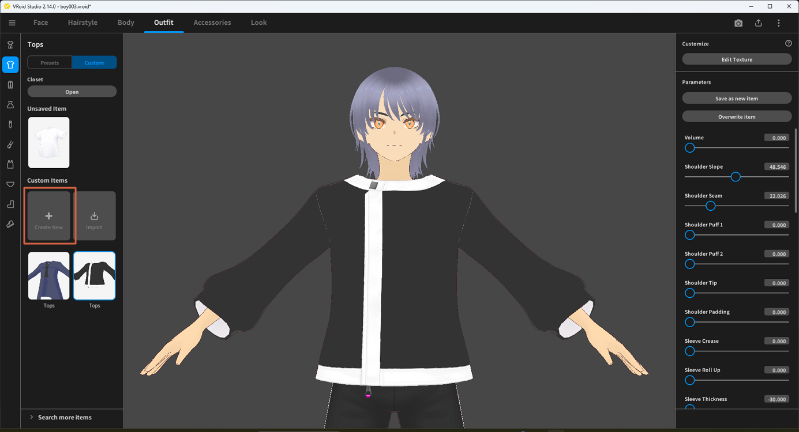
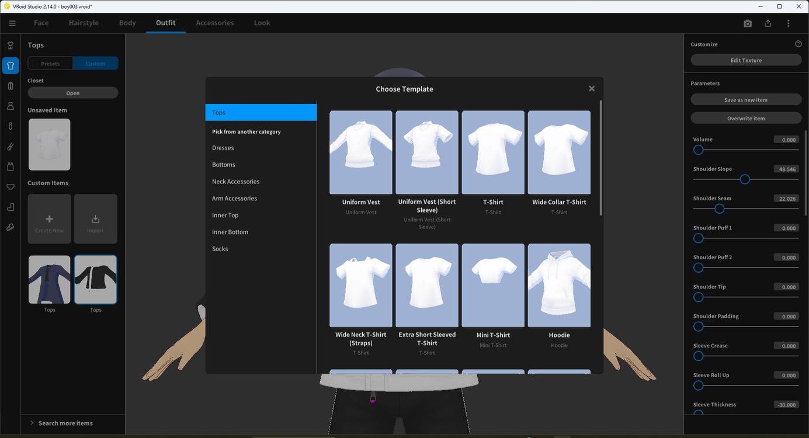
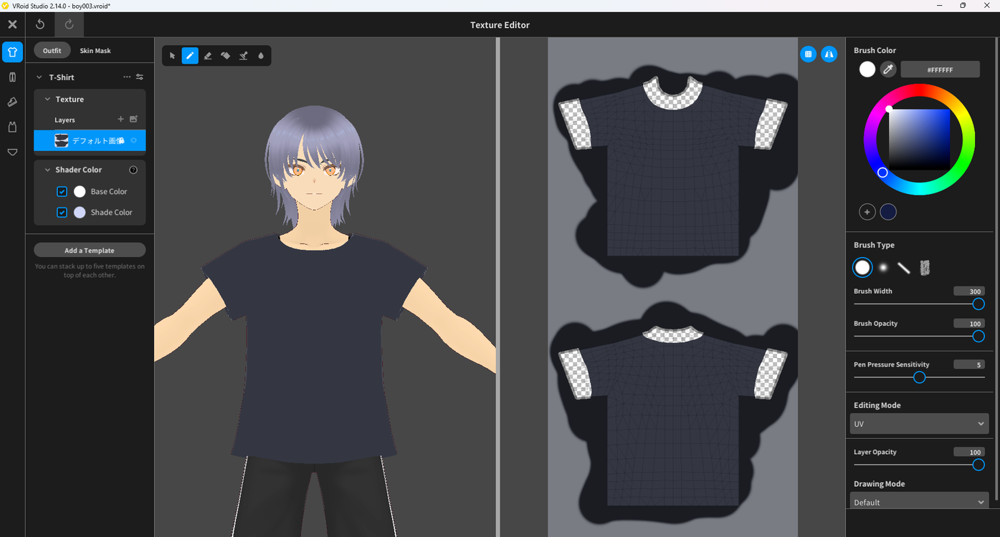
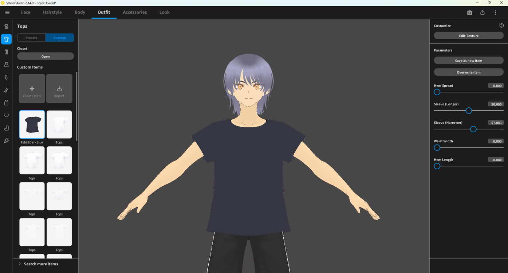

# Creating a Custom T-Shirt

> **Note:** This document was generated by Claude Code and has not been reviewed by a human. Please use it as a reference only.

This guide walks through creating a new T-shirt from a built-in template, then recoloring it in the Texture Editor.

## Step 1: Start a New Custom Top

Select the **Outfit** tab, then **Tops**, then the **Custom** sub-tab. Click **Create New** under **Custom Items**.

## Step 2: Choose a T-Shirt Template

In the **Choose Template** window, select the **Tops** category, then pick a T-shirt template, such as **Extra Short Sleeved T-Shirt**.

## Step 3: Open the Texture Editor

A plain white T-shirt is created from the template. Click **Edit Texture** under **Customize** in the right panel.

## Step 4: Lock the Layer and Change the Color

In the left panel, select the layer and lock it. Then pick a new **Brush Color** and paint over the shirt to change its color.

## Step 5: Save the New Item

The recolored T-shirt appears on the model. Save it as a new entry under **Custom Items** to keep it alongside the original.

> **Note:** See [Using Custom Templates for Tops](use-custom-templates-for-tops.md) for more on browsing template categories, and [Adding a Sticker to a Texture](add-sticker-to-texture.md) to place a logo instead of a flat color.
