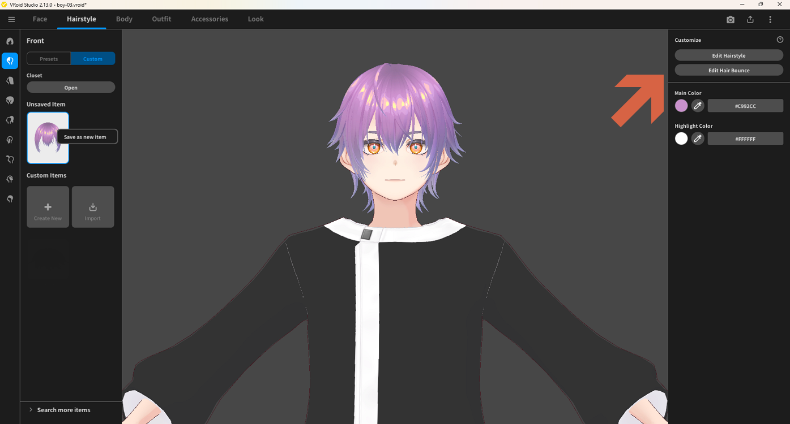
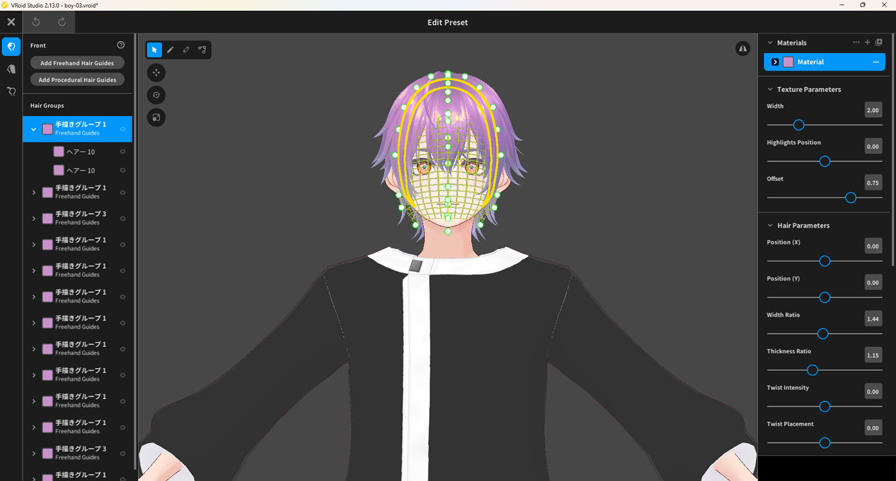
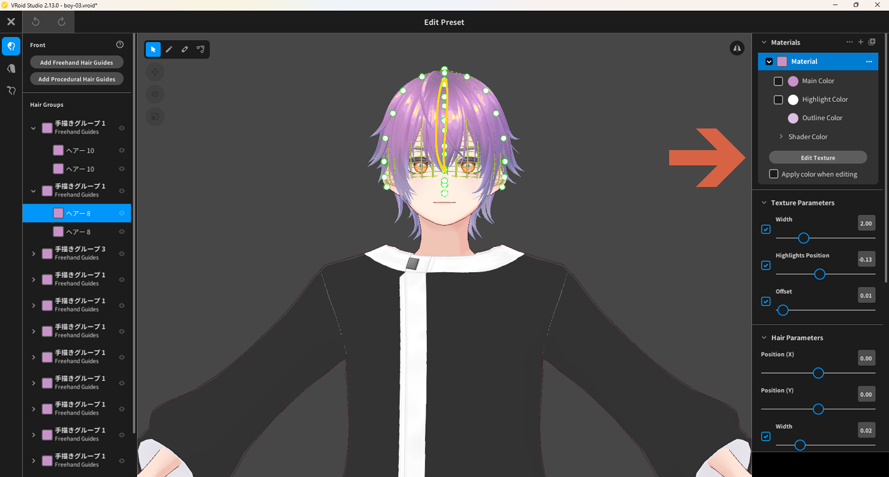
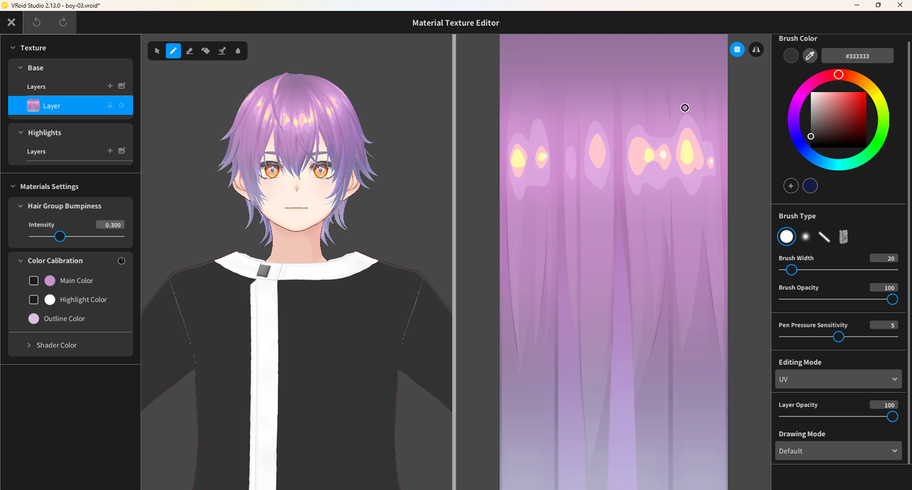

# Editing Hair Texture

> **Note:** This document was generated by Claude Code and has not been reviewed by a human. Please use it as a reference only.

## Step 1: Open the Hairstyle Editor

1. Click **Hairstyle** in the top menu bar.
2. In the left panel, select the hair part you want to edit (e.g., **Front**).
3. Under **Custom Items**, select the desired hair item.
4. Click the **Edit Hairstyle** button on the right panel.

## Step 2: Select a Hair Group or Part and Open the Material

1. In the **Edit Preset** screen, the left panel lists all hair groups and hair parts. Select the one you want to edit.
2. On the right panel, find the **Materials** section.
3. Click the **arrow icon** (▶) to the left of the **Material** label to open the material dropdown.

## Step 3: Open the Texture Editor

1. With the material expanded, click the **Edit Texture** button.

## Step 4: Edit the Texture

The **Material Texture Editor** opens. It has three main areas:

- **Left panel** — Texture layers (Base, Highlights), Hair Group Bumpmap, and Color Calibration settings.
- **Center** — A live 3D preview of the character alongside the texture canvas where you paint.
- **Right panel** — Brush settings: Brush Color, Brush Type, Brush Width, Brush Opacity, Pen Pressure Sensitivity, Editing Mode, Layer Opacity, and Drawing Mode.

Paint directly on the texture canvas to customize the hair texture.

