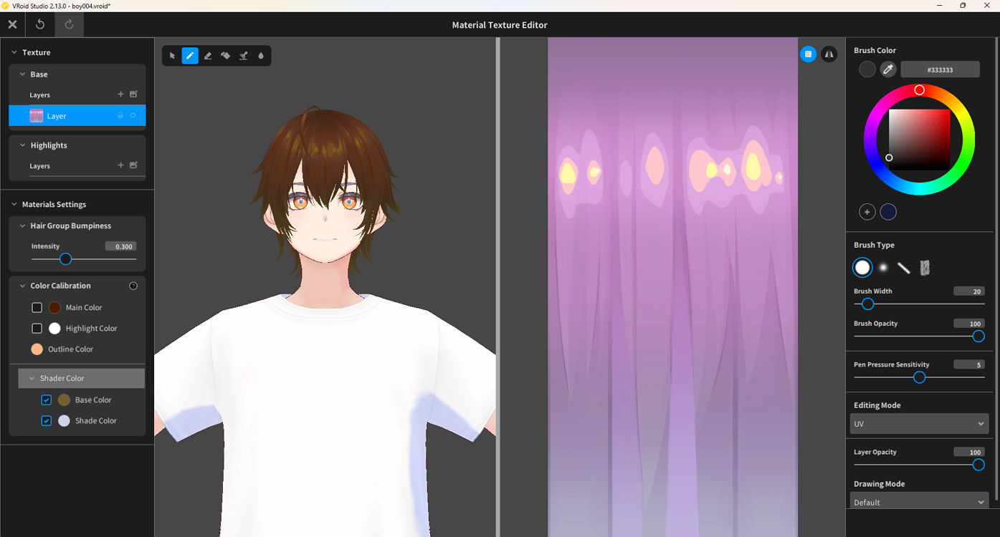

# Recoloring Hair Using Shader Color

> **Note:** This document was generated by Claude Code and has not been reviewed by a human. Please use it as a reference only.

This method lets you change the overall hair color while keeping the highlight patterns in the texture intact.

## Steps

1. Open the **Material Texture Editor** for the hair part you want to recolor (see [Edit Hair Texture](edit-hair-texture.md)).
2. In the left panel, scroll down to **Color Calibration**.
3. Expand **Shader Color**.
4. Check the **Base Color** checkbox and click its color swatch to choose your desired hair color.
5. Optionally, also check **Shade Color** to control the shadow/shading tone separately.

## Notes

- **Shader Color → Base Color** applies the color at the rendering level, so the painted texture patterns (highlight blobs, hair flow details) are preserved.
- This is different from **Color Calibration → Main Color**, which tints on top of the existing texture color — causing unwanted color blending (e.g. brown over purple → reddish).
- For simple recoloring, Shader Color is the recommended approach. Use an external image editor only if you need fine-grained control over the texture itself.
