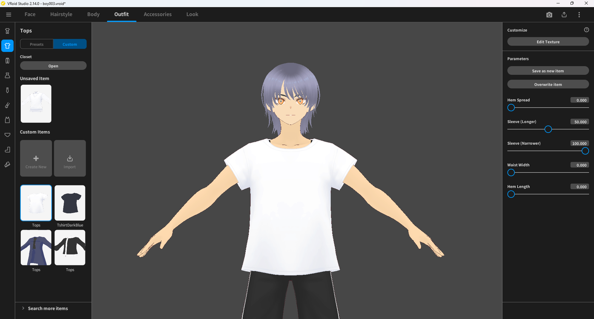
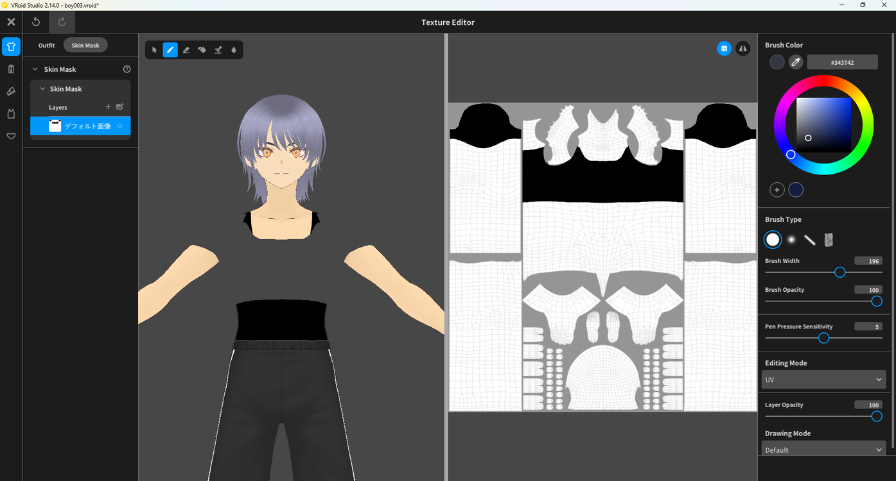
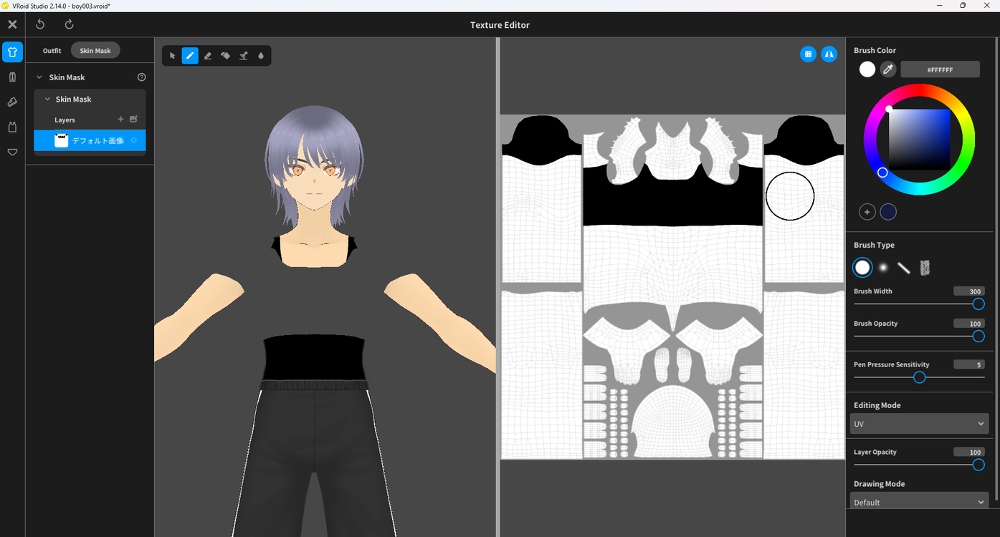
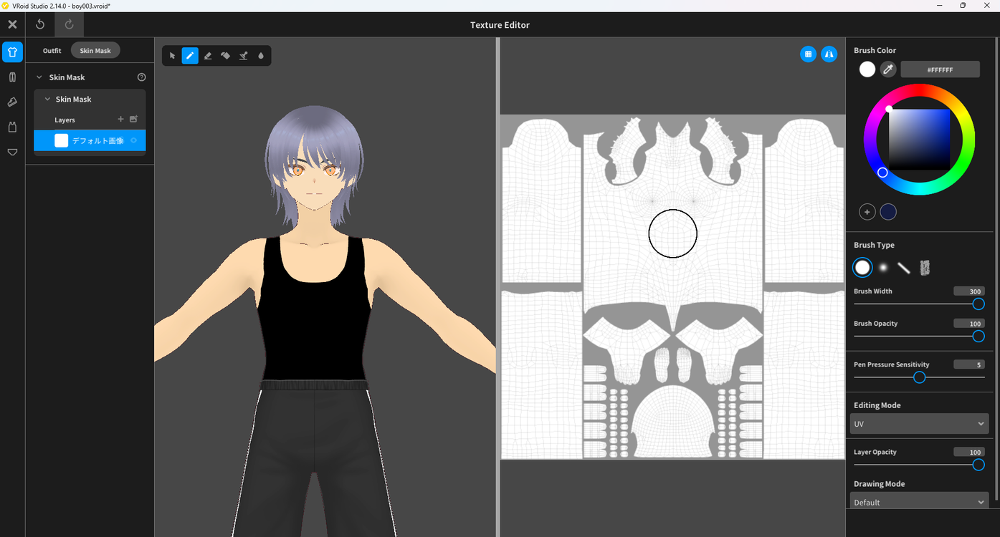

# Removing a Skin Mask

> **Note:** This document was generated by Claude Code and has not been reviewed by a human. Please use it as a reference only.

The **Skin Mask** hides the character's skin underneath clothing so it doesn't show through gaps in the mesh. Painting over the mask reveals skin in areas it currently hides.

## Step 1: Open the Texture Editor

Click **Edit Texture** under **Customize** in the right panel for the item you want to edit.

## Step 2: Switch to the Skin Mask Tab

At the top of the Texture Editor, select **Skin Mask**, then select the layer in the left panel.

## Step 3: Sample the White Area

Using the eyedropper tool, pick up the color from a white area of the texture.

## Step 4: Paint Over the Black Area

Paint over the black area with the sampled white color to remove the mask there.

> **Note:** White areas of the Skin Mask show skin normally; black areas hide it. Painting a black area white removes the mask in that spot.
