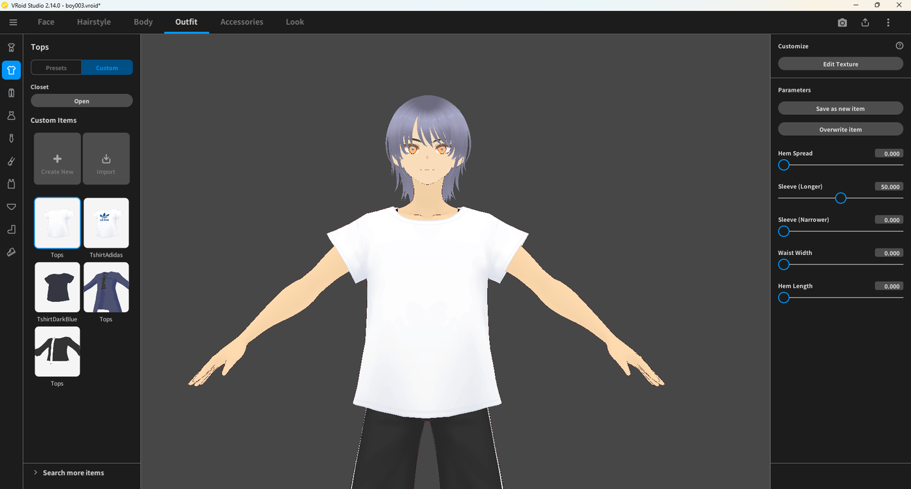
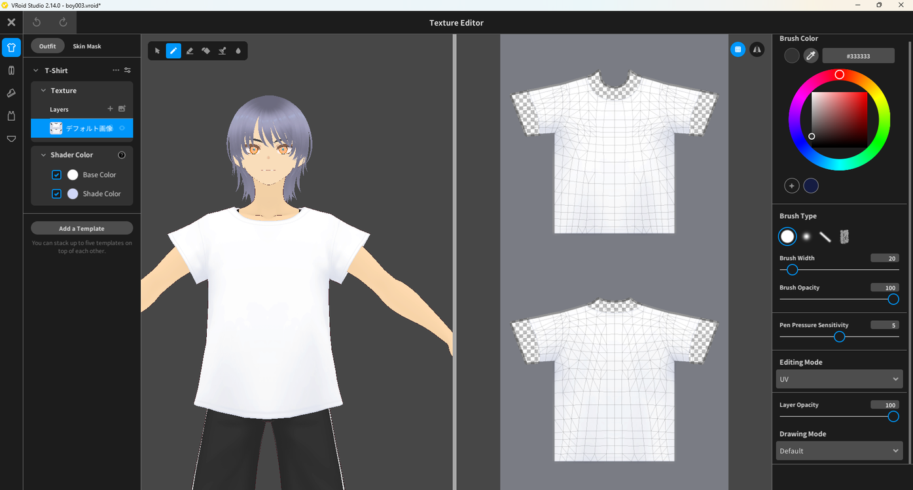
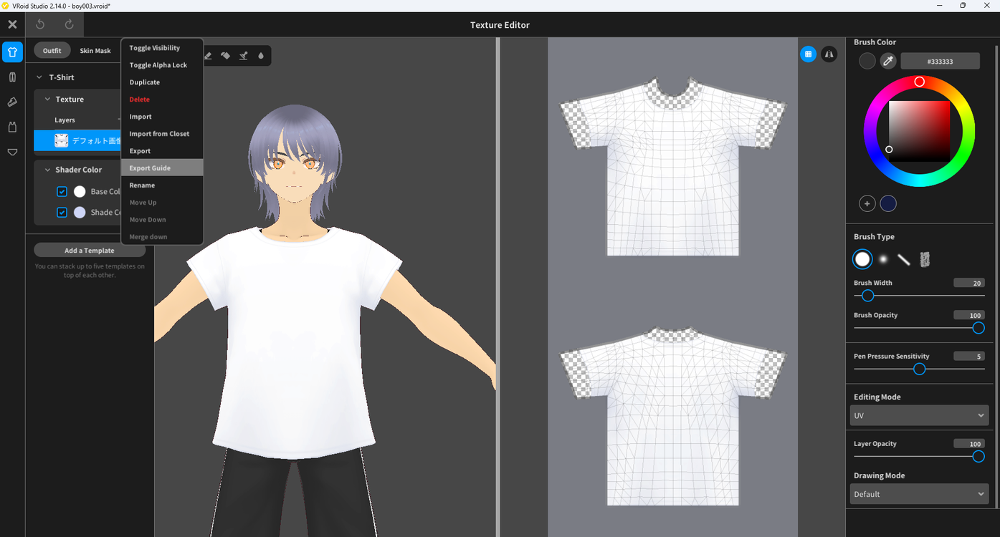
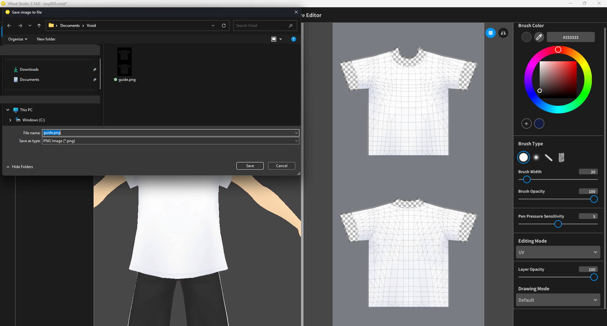
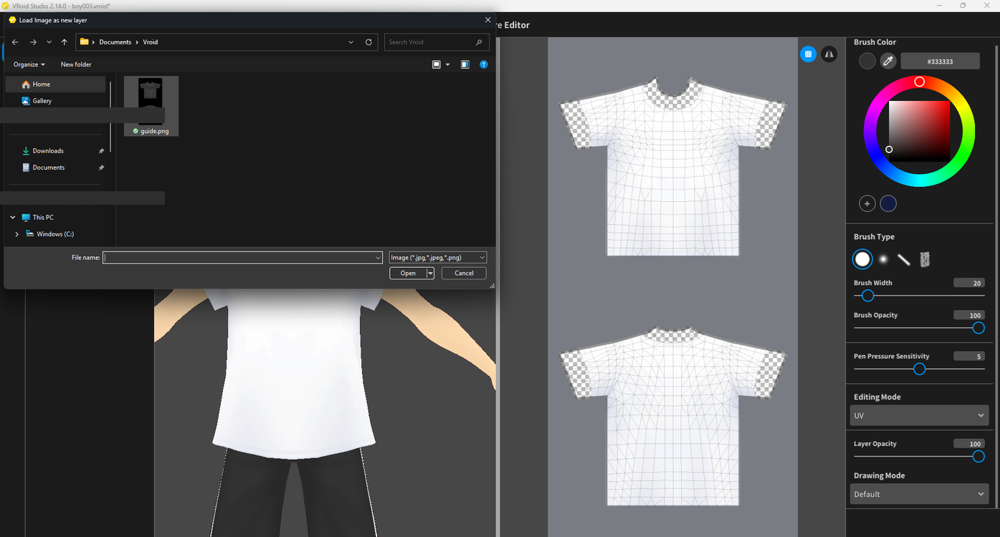
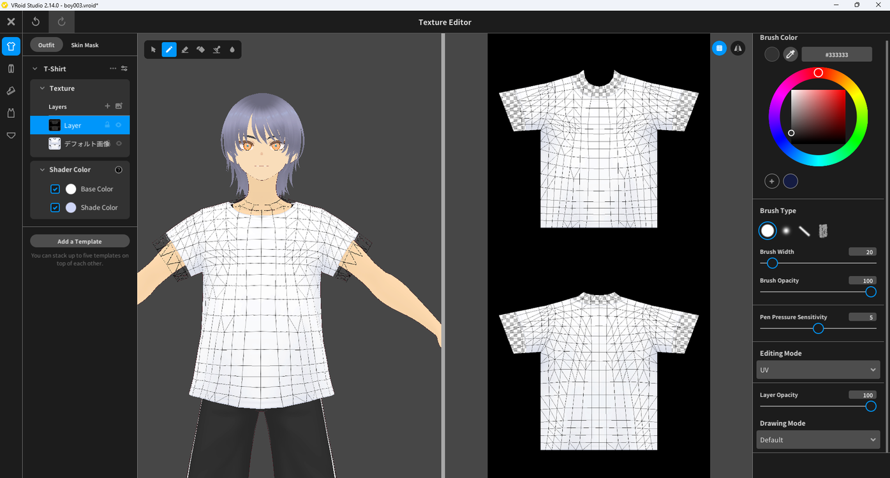
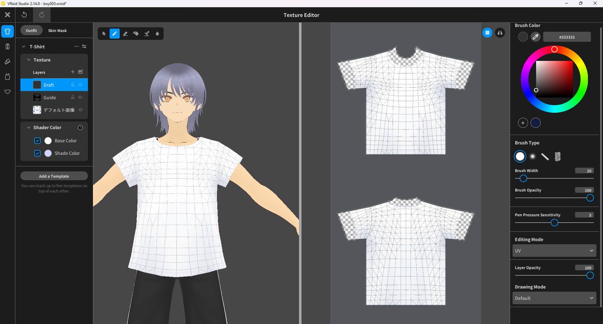
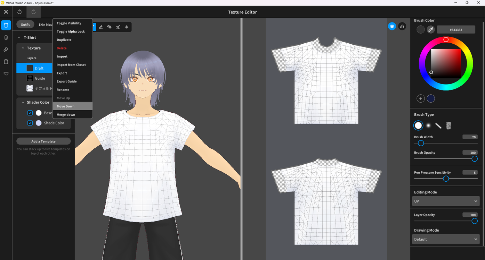
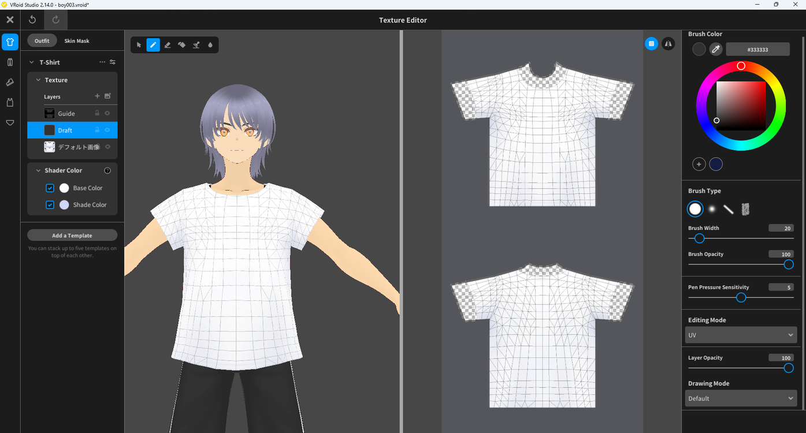
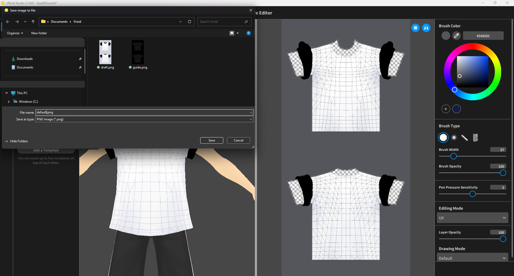

# Using a Guide to Draw a Texture

> **Note:** This document was generated by Claude Code and has not been reviewed by a human. Please use it as a reference only.

Exporting a UV guide lets you bring the model's wireframe into the Texture Editor as a semi-transparent reference layer, so you can draw a new design without losing track of where seams and panels line up.

## Step 1: Open the Texture Editor

Click **Edit Texture** under **Customize** in the right panel for the item you want to edit.

## Step 2: Select the Layer

In the left panel, select the texture layer you want to export a guide from.

## Step 3: Export the Guide

Right-click the layer and select **Export Guide** from the context menu.

## Step 4: Save the Guide Image

In the save dialog, choose a location and save the guide image.

## Step 5: Import the Guide as a New Layer

- Use the layer list's import option and select the guide image you just saved.

  

- The image is added to the layer list as a new layer, and its wireframe becomes visible on the model.

  

## Step 6: Rename the Layer and Lower Its Opacity

Rename the new layer to something like "Guide", then reduce its **Layer Opacity** — for example, to around 30 — so it becomes a faint, semi-transparent overlay instead of covering the texture completely.

## Step 7: Create a Draft Layer

Add a new layer above the guide layer to hold your artwork.

## Step 8: Move the Draft Layer Below the Guide

- Right-click the draft layer and select **Move Down**.

  

- The draft layer now sits beneath the guide layer, so the guide's wireframe overlays your artwork as a semi-transparent reference while you draw.

  

## Step 9: Export the Layers for External Editing

If you want to edit the texture in an external image editor, export each layer individually — the guide, the draft, and the base layer.

