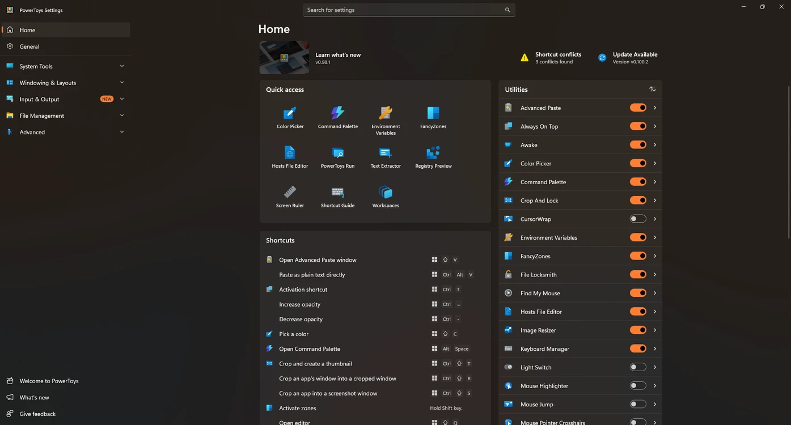
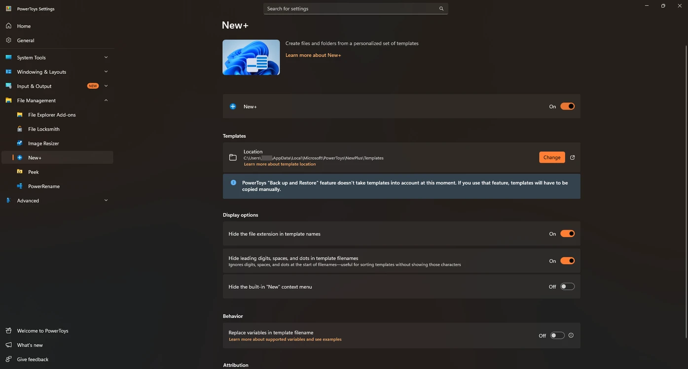
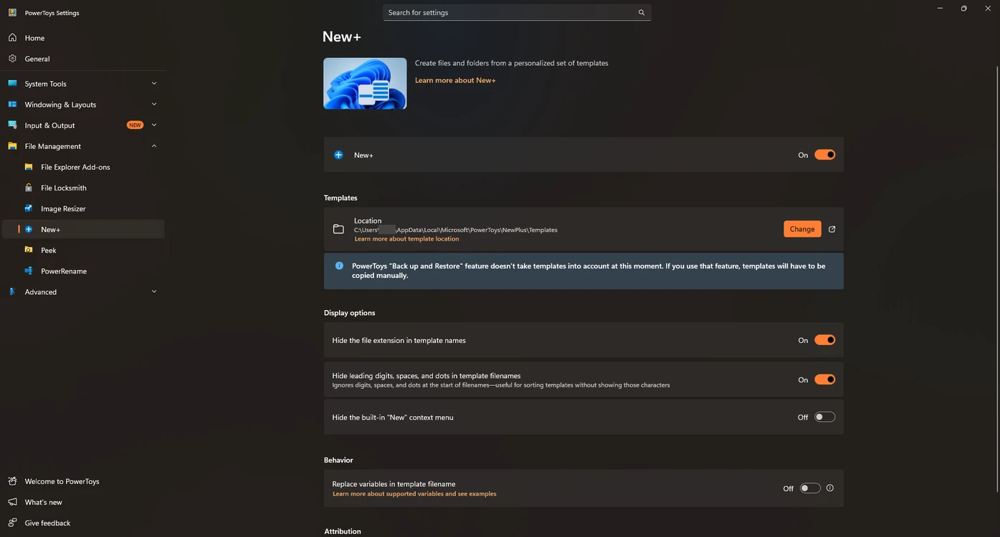
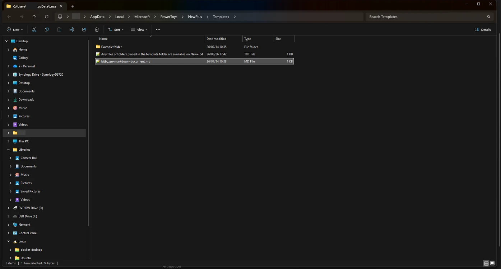
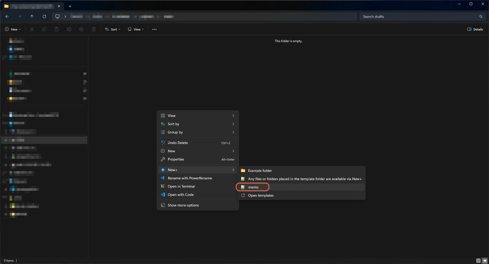

# Adding a New File Format to the Windows 11 New Menu

> **Note:** This document was generated by Claude Code and has not been reviewed by a human. Please use it as a reference only.

Windows 11's right-click **New** menu only offers a fixed set of file types out of the box, and there's no built-in UI to add your own (like `.md`). This guide uses PowerToys' **New+** utility to add custom file types.

> **Note:** Requires PowerToys installed (free, from Microsoft Store or GitHub).

## Step 1: Open PowerToys Settings

Launch PowerToys Settings. You land on the Home page.



## Step 2: Enable New+

In the left sidebar, expand **File Management** and select **New+**. Turn the **New+** toggle **on**.



## Step 3: Note the Templates Location

The New+ page shows where your template files live — by default:

```text
C:\Users\<username>\AppData\Local\Microsoft\PowerToys\NewPlus\Templates
```

Any file or folder you place here becomes a selectable template in the New+ context menu. You can also toggle display options here, such as hiding file extensions in template names.



## Step 4: Add a Template File

Open the Templates folder and create an empty file with the extension you want — for example, `markdown-document.md`. Create it directly, or save one from a text editor into that folder.



## Step 5: Use the Template

Right-click in any folder in File Explorer, choose **New+**, and your template appears in the submenu alongside the example folder. Select it to create a new file with that extension instantly — no typing required.


