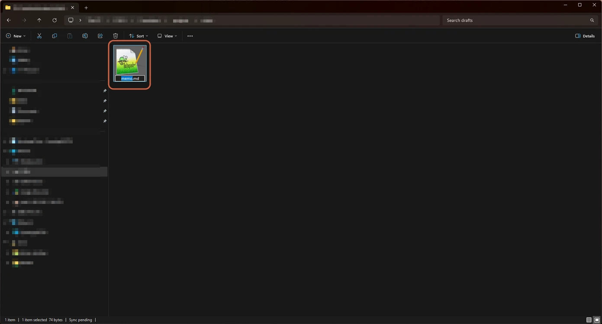
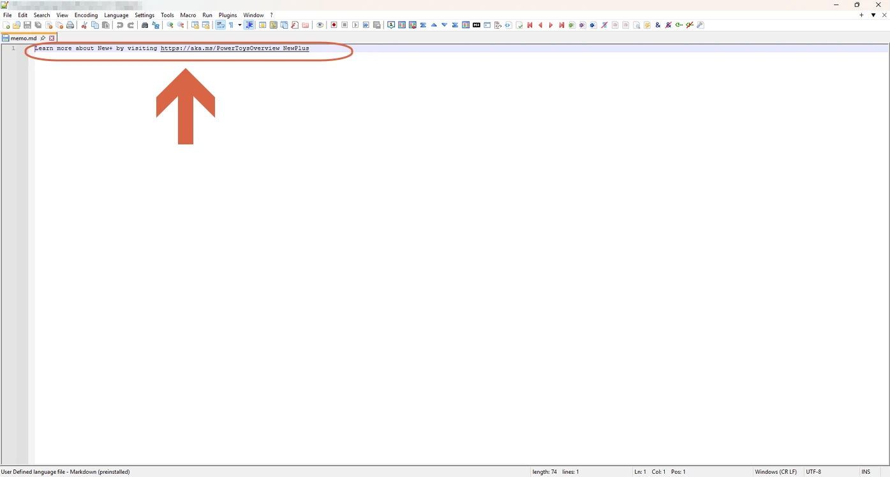
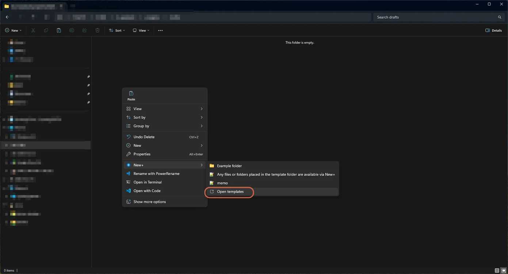
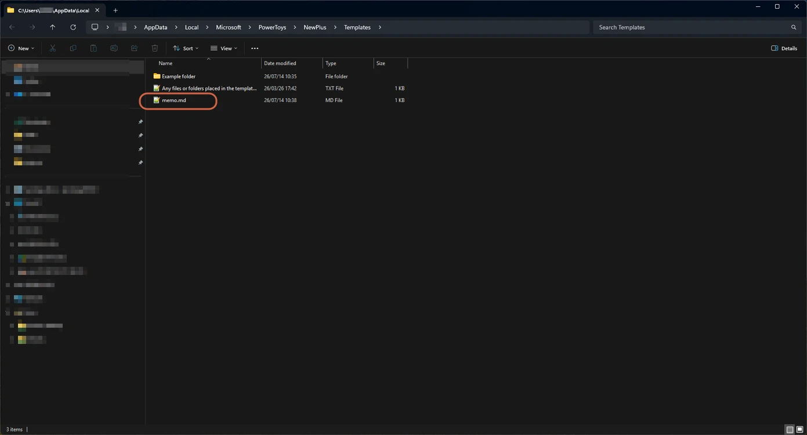
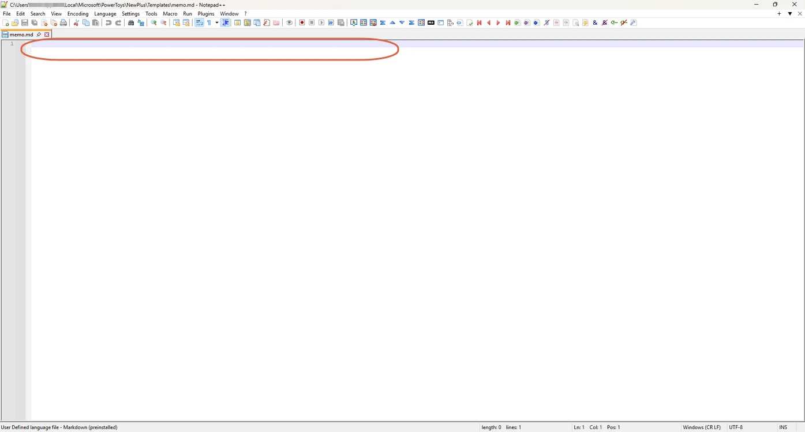
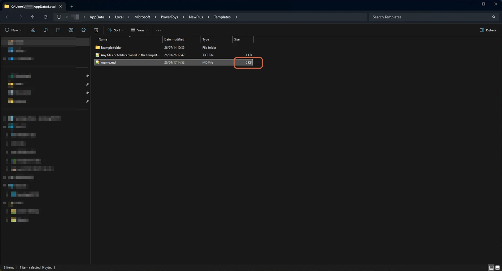
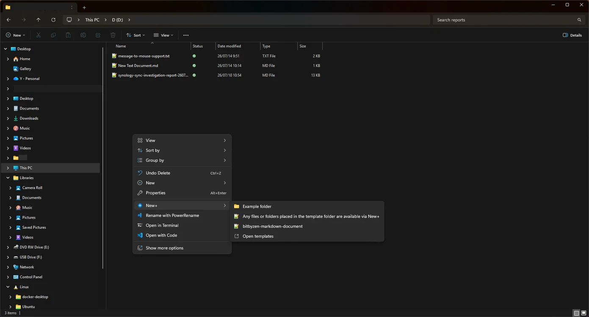

# Adding a New File Format to the Windows 11 New Menu

> **Note:** This document was generated by Claude Code and has not been reviewed by a human. Please use it as a reference only.

Windows 11's right-click **New** menu only offers a fixed set of file types out of the box, and there's no built-in UI to add your own (like `.md`). This guide uses PowerToys' **New+** utility to add custom file types.

> **Note:** Requires PowerToys installed (free, from Microsoft Store or GitHub).

## Step 1: Open PowerToys Settings

Launch PowerToys Settings. You land on the Home page.


## Step 2: Enable New+

In the left sidebar, expand **File Management** and select **New+**. Turn the **New+** toggle **on**.


## Step 3: Note the Templates Location

The New+ page shows where your template files live — by default:

```text
C:\Users\<username>\AppData\Local\Microsoft\PowerToys\NewPlus\Templates
```

Any file or folder you place here becomes a selectable template in the New+ context menu. You can also toggle display options here, such as hiding file extensions in template names.


## Step 4: Add a Template File

Open the Templates folder and create an empty file with the extension you want — for example, `markdown-document.md`. Create it directly, or save one from a text editor into that folder.


## Step 5: Confirm the Template Is Blank

Right-click in a folder → **New** → your template. If the file it creates isn't empty — it already contains PowerToys' own sample text:

```
Learn more about New+ by visiting https://aka.ms/PowerToysOverview_NewPlus
```

...the source template still has that boilerplate baked in, rather than being truly empty. If your file is already blank, skip ahead to [Step 10: Use the Template](#step-10-use-the-template).






The text isn't coming from the folder you're working in — it's baked into the template file itself, in New+'s templates folder. Edit that file once and the boilerplate is gone for good.

## Step 6: Open the Templates Folder Again

You can jump straight back to it via right-click → **New+** → **Open templates**, instead of navigating there manually.



## Step 7: Find Your Template File

Locate the template that matches the one you use from the New menu.



## Step 8: Clear Its Contents

Open the file in a text editor, select all the text, delete it, and save.



## Step 9: Confirm the File Is Empty

Back in the templates folder, check the file's size — it should now show **0 KB**.



> **Note:** If you have more than one New+ template (e.g. one per file type), repeat Steps 7–9 for each one that still contains the default boilerplate.

## Step 10: Use the Template

Right-click in any folder in File Explorer, choose **New+**, and your template appears in the submenu alongside the example folder. Select it to create a new file with that extension instantly — no typing required, and now genuinely blank.


