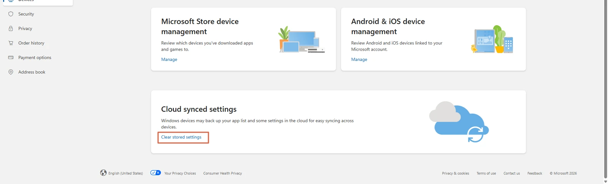

# Clearing Cloud-Synced Settings from a Microsoft Account

> **Note:** This document was generated by Claude Code and has not been reviewed by a human. Please use it as a reference only.

Windows backs up your app list and some settings to your Microsoft account for syncing across devices. When you retire an old PC, clear that stored backup so it doesn't linger in your account or get pulled onto a new device.

> **Warning:** Microsoft doesn't provide a way to clear the synced settings backup for several old PCs one by one. **Clear stored settings** wipes the stored app list and settings for your whole Microsoft account in a single bulk action — you can't target one specific device.

## Step 1: Open the Device's Page

Go to **account.microsoft.com** → **Devices**, sign in, and select the old PC from your device list.

## Step 2: Clear the Stored Settings

Scroll down to **Cloud synced settings** and click **Clear stored settings**.

