# Setting Up Windows 11

> **Note:** This document was generated by Claude Code and has not been reviewed by a human. Please use it as a reference only.

Walk through the Windows 11 out-of-box setup screens (OOBE) that run the first time a device boots, including region and keyboard selection, device naming, Microsoft account sign-in, and privacy settings.

## Step 1: Choose Your Country or Region

Select your country or region and click **Yes**.

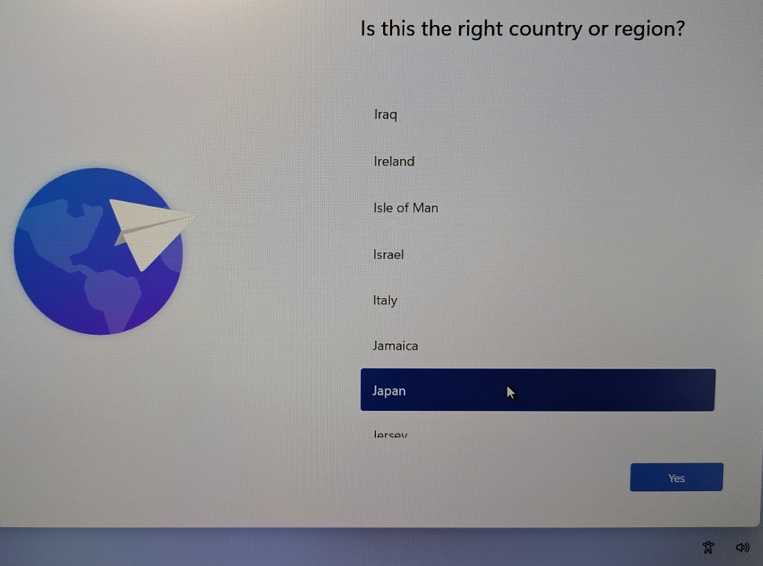

## Step 2: Choose Your Keyboard Layout

Select your primary keyboard layout or input method and click **Yes**.

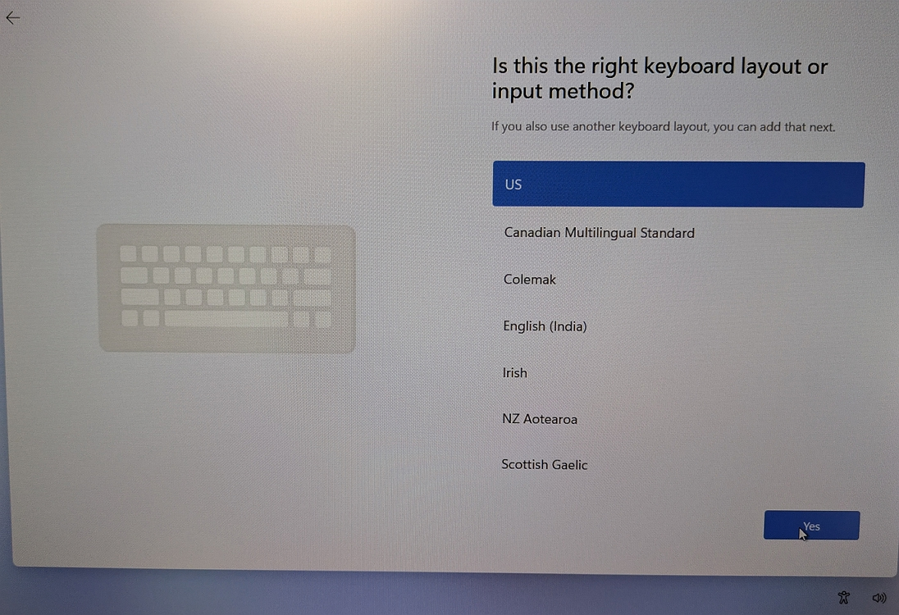

## Step 3: Add a Second Keyboard Layout

Click **Add layout** to add another keyboard layout, instead of **Skip**.

> **Note:** This is useful if you regularly type in more than one language, such as adding a Japanese layout alongside a US English one.

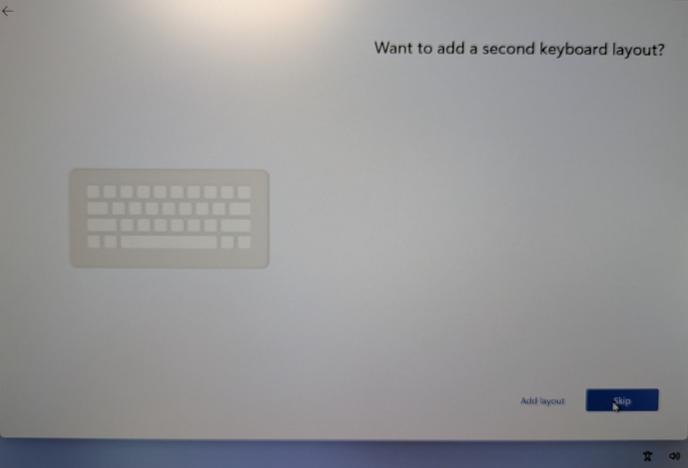

## Step 4: Choose the Second Layout's Language

Select the language for the second keyboard layout and click **Next**.

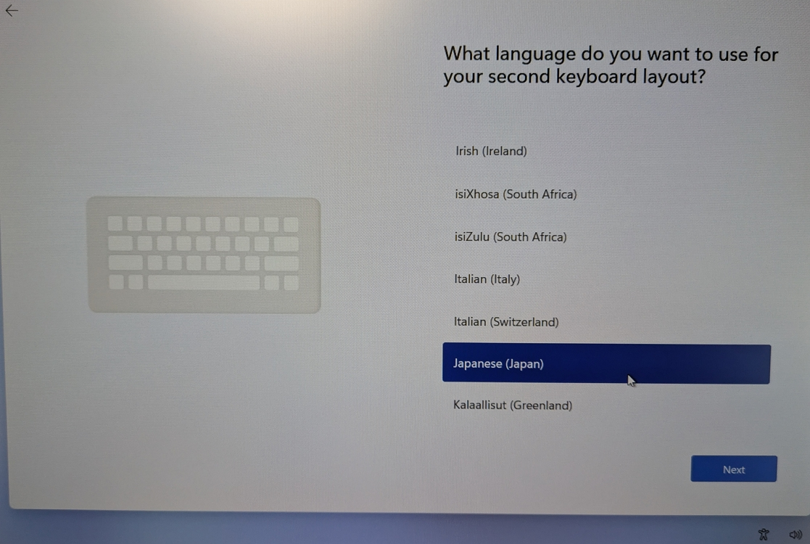

## Step 5: Choose the Input Method

Select the specific input method for that language.

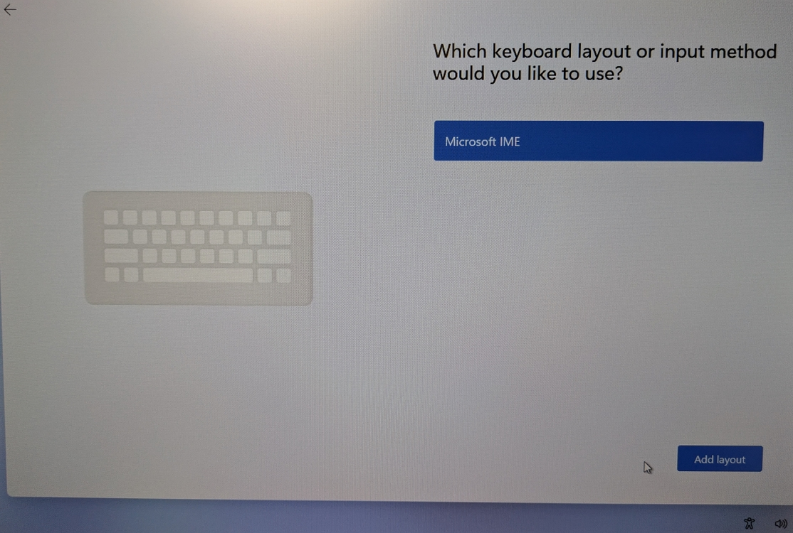

## Step 6: Name Your Device

Enter a device name. Click **Show advanced options** to also set a custom user folder name before continuing.

> **Note:** The device restarts automatically after you name it.

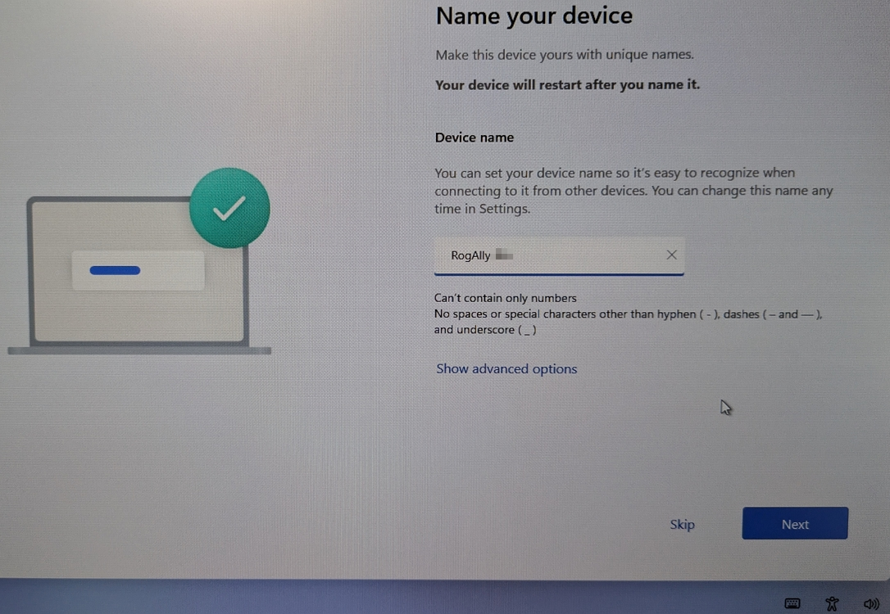

## Step 7: Set the User Folder Name

With advanced options expanded, enter the **User folder name** — this becomes `C:\Users\<name>` — and click **Next**.

> **Warning:** The user folder name can't be changed after setup completes.

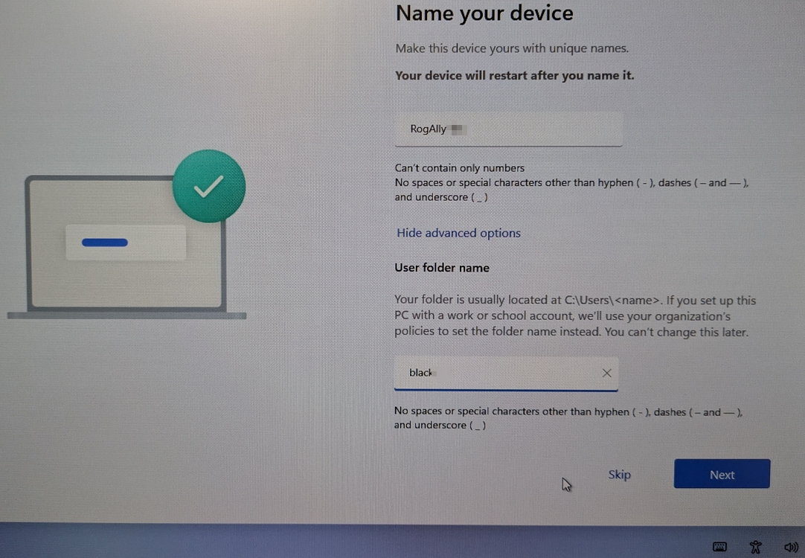

## Step 8: Sign In to Your Microsoft Account

Enter your Microsoft account email or phone number under **Sign in** and click **Next**.

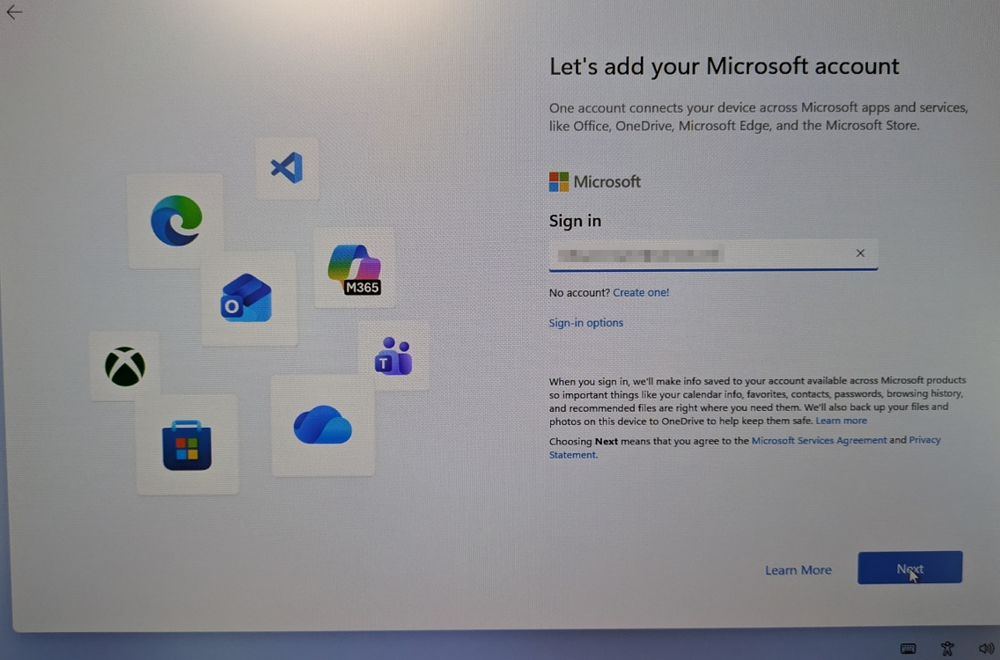

## Step 9: Choose Privacy Settings

Review the privacy toggles (Location, Find My Device, Diagnostic Data, and others further down) and click **Accept**.

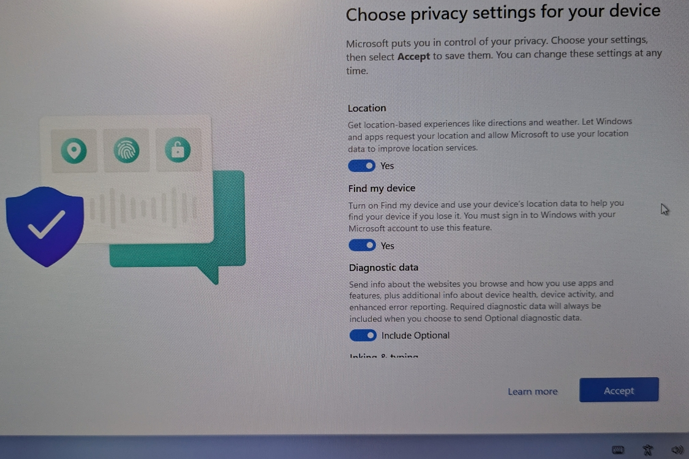

## Step 10: Restore from a Previous Backup

If Windows finds a backup linked to your Microsoft account, click **Continue** to restore folders, apps, settings, and credentials from it, or select **More options** to set up the device fresh instead.

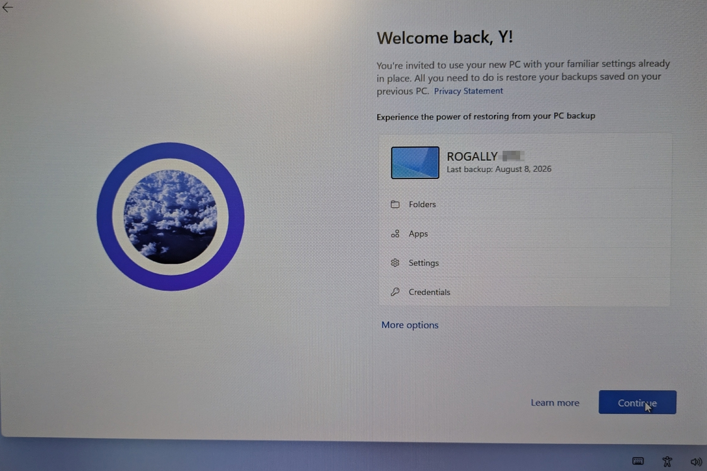

## Step 11: Skip Personalization Prompts

On the "Let's customize your experience" screen, click **Skip** to bypass the personalized tips and recommendations prompt, or select the categories that apply and click **Accept**.

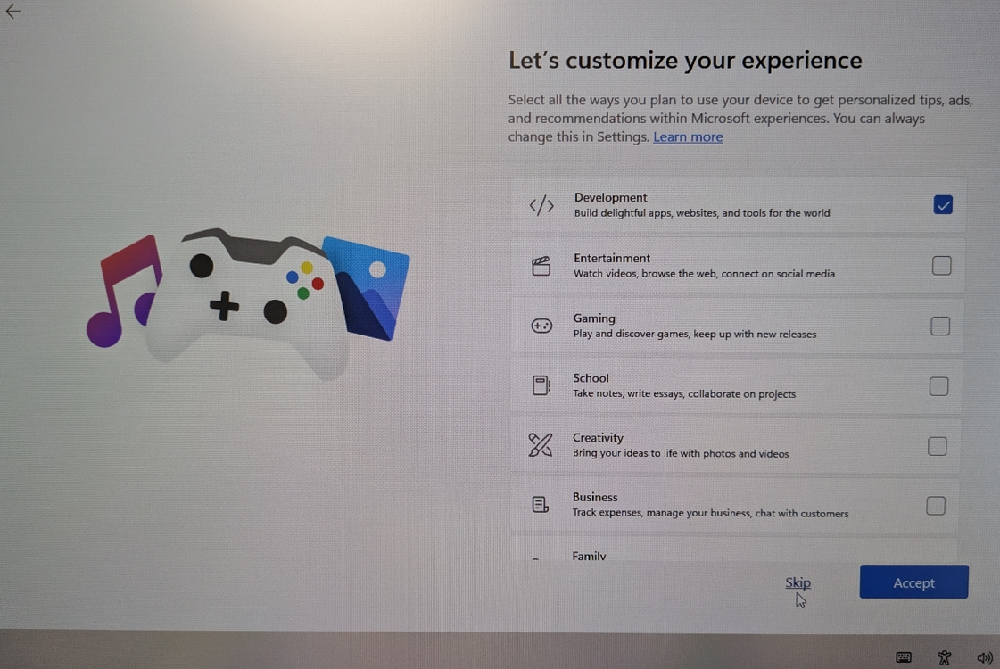

## Result

Windows 11 finishes setup and boots to the desktop with your selected region and keyboard layouts, device name, Microsoft account signed in, and chosen privacy settings applied.
