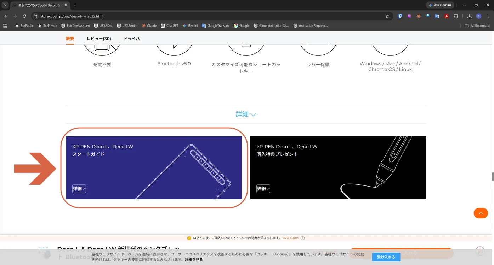
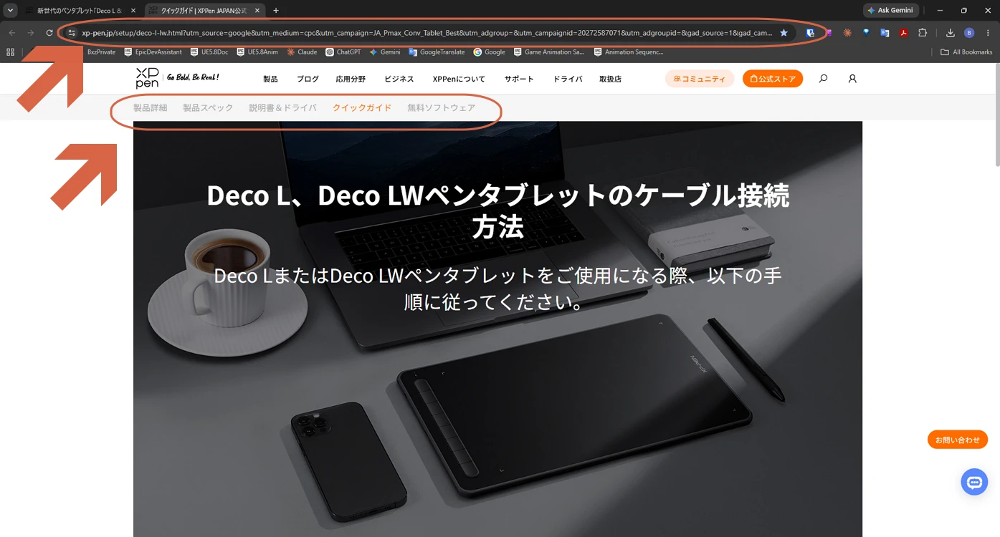
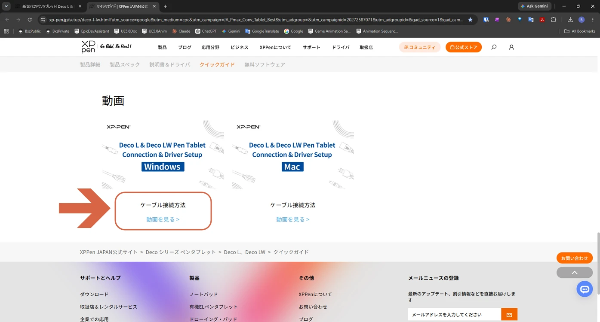
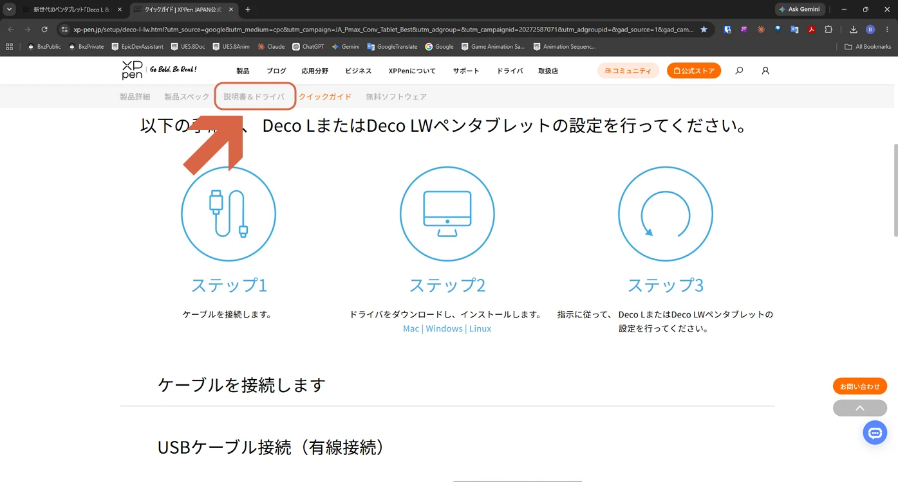
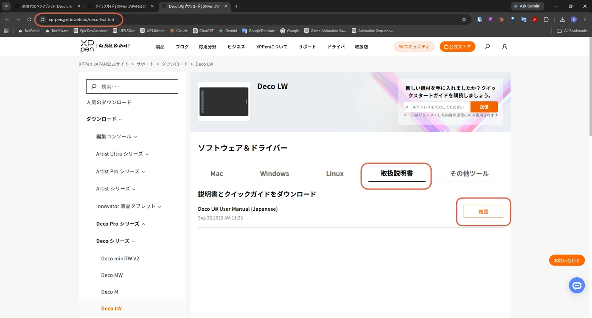
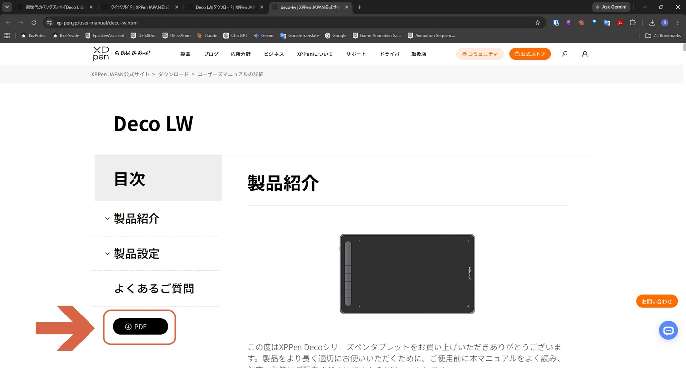

# Accessing the Deco LW Start Guide

> **Note:** This document was generated by Claude Code and has not been reviewed by a human. Please use it as a reference only.

Scrolling down the product page reveals a link to the **Start Guide**, which gathers everything you need for setup.

## Steps

1. Scroll down the product page and click **Details** on the **Start Guide** card.

    

2. The Start Guide page opens. The tabs at the top let you check **Product Details**, **Product Specs**, **Manual & Driver**, **Quick Guide**, and **Free Software**.

    

3. To watch a video on connecting to your PC, go to the **Quick Guide** tab's **Video** section and click **Watch Video** for your OS (Windows or Mac).

    

4. The **Manual & Driver** tab covers three setup steps: connecting the cable, downloading and installing the driver, and configuring the device.

    

5. On the [driver download page](https://www.xp-pen.jp/download/deco-lw.html), open the **User Manual** tab and click **Confirm** next to the manual.

    

6. The [HTML manual](https://www.xp-pen.jp/user-manual/deco-lw.html) opens. You can also download a PDF version from the **PDF** button.

    
