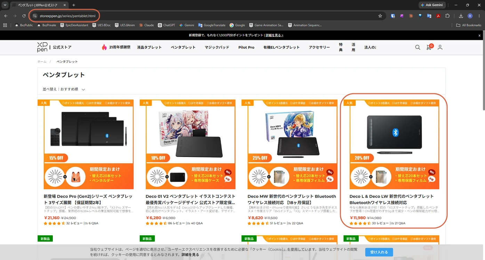
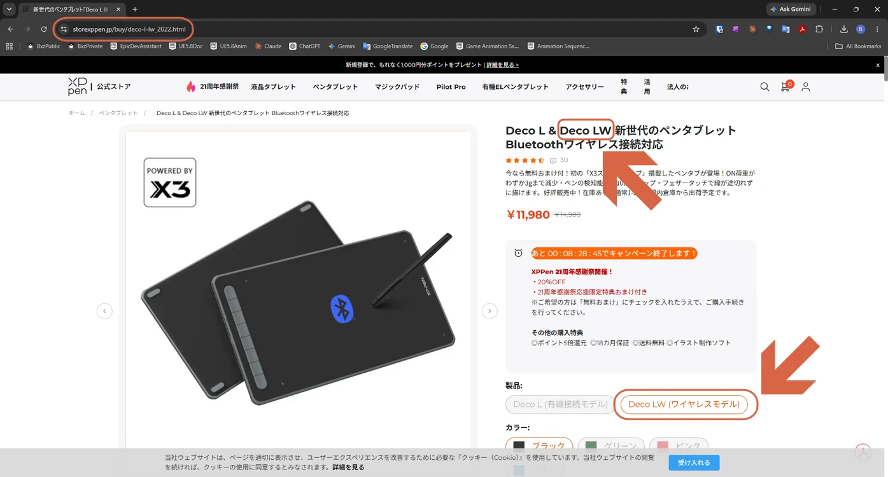
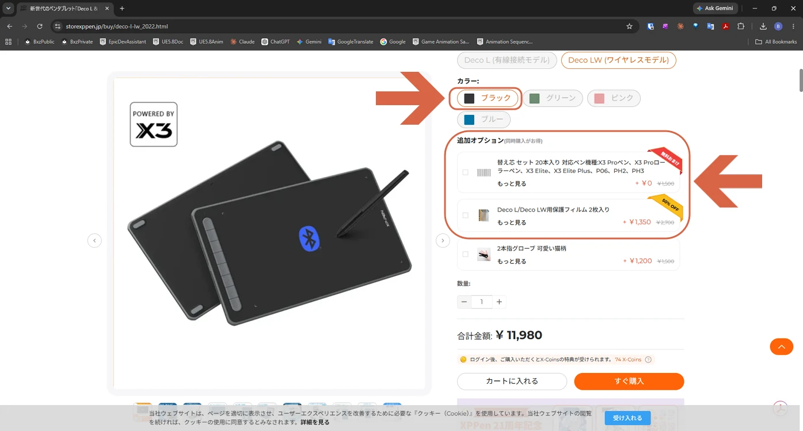

# Purchasing the Deco LW

> **Note:** This document was generated by Claude Code and has not been reviewed by a human. Please use it as a reference only.

XPPen's Deco tablets split into model numbers by size and connection type. **W** means Wireless. **Deco MW** is the Medium (mid-size) wireless model, and **Deco LW** is the Large wireless model. **Deco L** is the same large size, but wired.

## Steps

1. Go to the [XPPen official store](https://storexppen.jp/series/pentablet.html) and select **Deco L & Deco LW**.

    

2. On the [product page](https://www.storexppen.jp/buy/deco-l-lw_2022.html), select **Deco LW (Wireless Model)**.

    

3. Set the color to **Black**, then add any extra options you want (a replacement nib set, a protective film, etc.).

    

> **Note:** For setup after purchase (downloading the driver, checking the manual), see [Accessing the Deco LW Start Guide](access-deco-lw-start-guide.md).
