# Fixing a Missing Model in a Template

> **Note:** This document was generated by Claude Code and has not been reviewed by a human. Please use it as a reference only.

ComfyUI templates list the model files they need, and some aren't bundled with the app. This downloads the missing file and runs the template, using the **Anima Base v1: Text to Image** template and its missing LoRA file as an example.

## Step 1: Open Templates

Click **Templates** in the left sidebar.

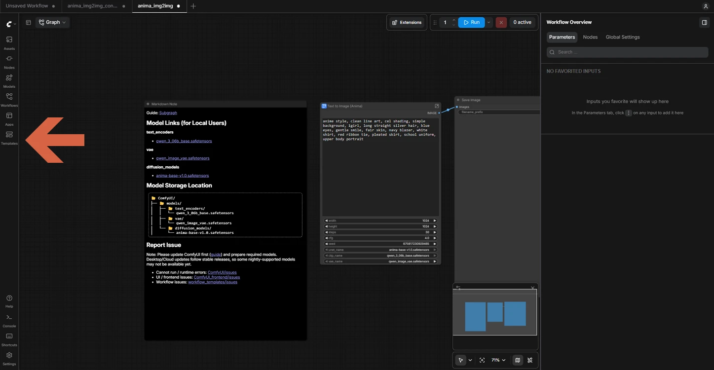

## Step 2: Search for the Template

Type `anima base` in the search box.

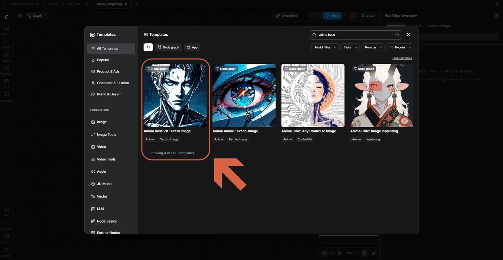

## Step 3: Select the Template

Click **Anima Base v1: Text to Image**.

## Step 4: Read the Missing Model Message

A red message says that a model file is missing:

```
anima-turbo-lora-v0.2.safetensors is missing
```

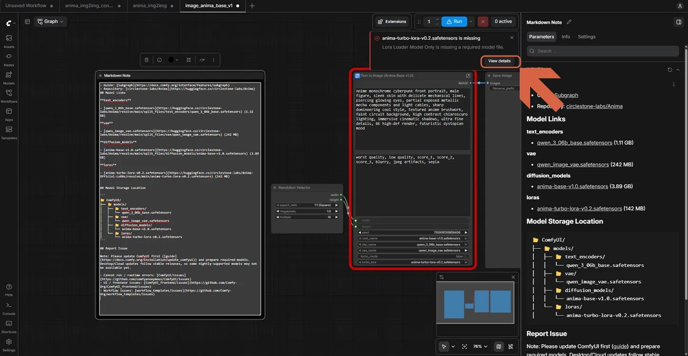

> **Note:** ComfyUI checks that every model file listed in a template exists each time the template loads — that's what triggers this message.

## Step 5: Open the Details

Click **View details**. The **Missing Models** panel opens in **Workflow Overview**, listing the file and its folder (`loras`, 142 MB).

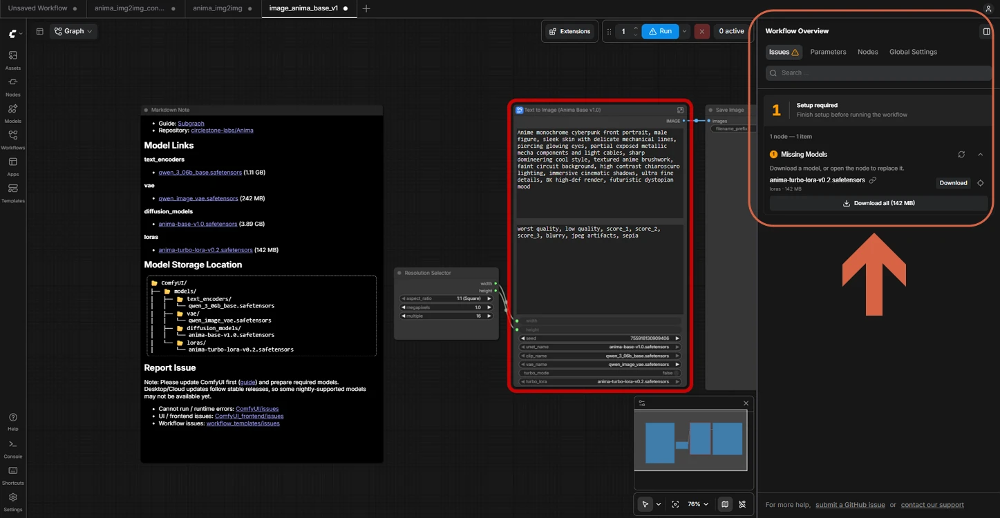

## Step 6: Start the Download

Click **Download all (142 MB)**.

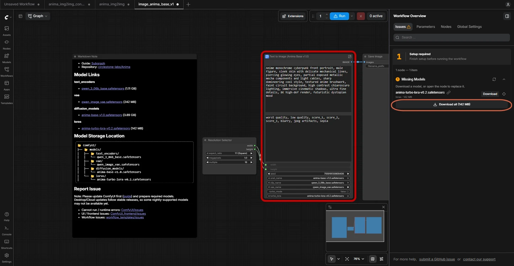

## Step 7: Open the Downloads List

Click the download icon at the top right.

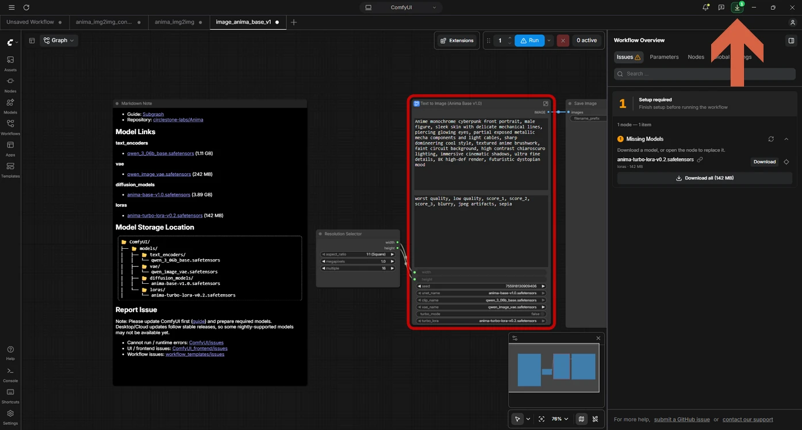

## Step 8: Check the Downloaded File

Wait until the list shows `loras / anima-turbo-lora-v0.2.safetensors` with a check mark.

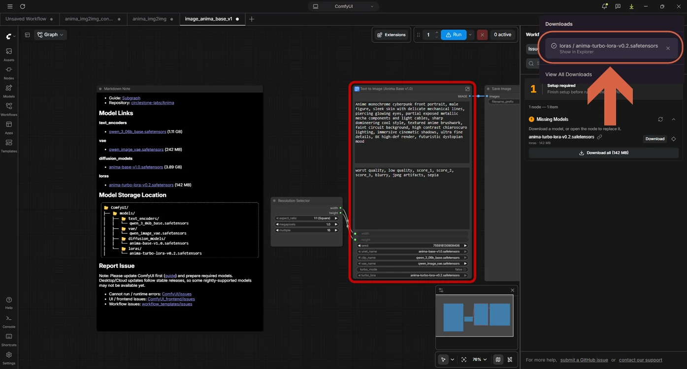

> **Note:** The download is saved straight into the shared model library, and ComfyUI finds it there automatically — no manual copying needed.

## Step 9: Check the File Location (Optional)

Click **Show in Explorer**. The file is saved in `models\loras` inside the `ComfyUI-Shared` folder.

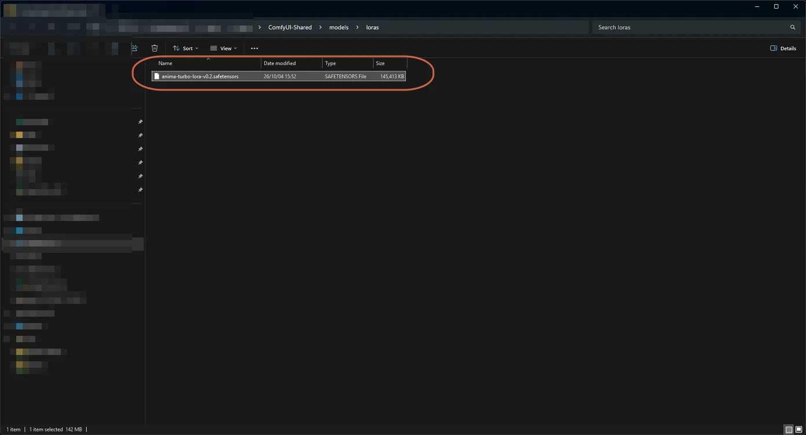

## Step 10: Refresh the Missing Models List

Click the **Refresh** icon in the **Missing Models** panel.

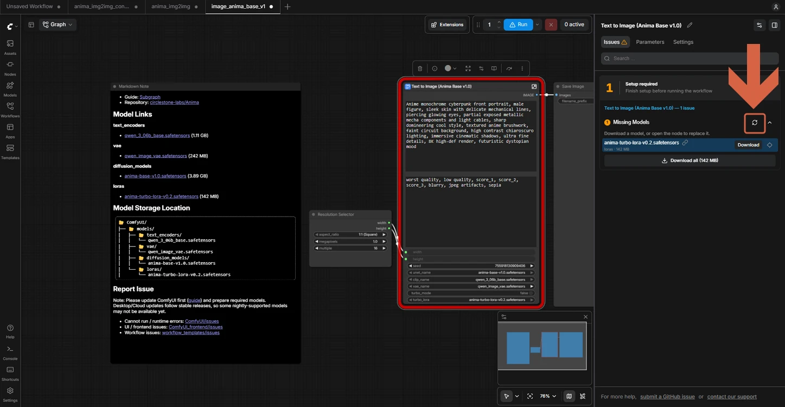

## Step 11: Run the Workflow

Click **Run**. The warning icon on the button is gone.

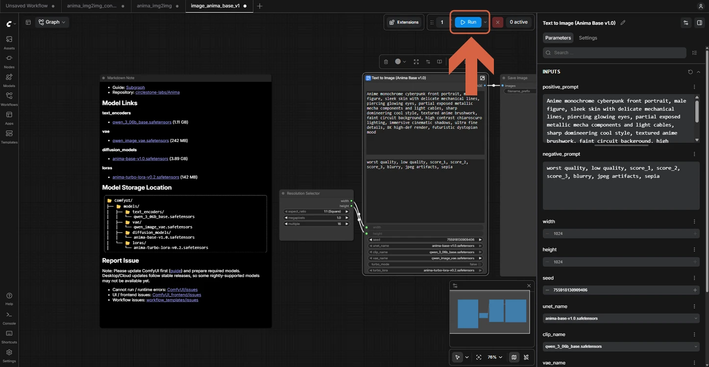

## Step 12: Check the Result

Wait for **Job completed**. The image appears in the **Save Image** node.

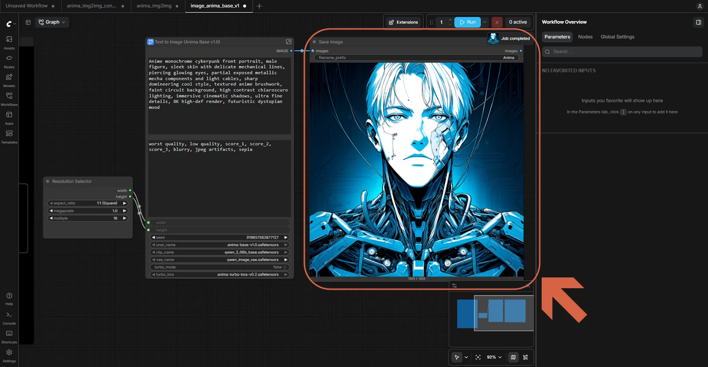

## Step 13: Rename the Workflow via Save As

Right-click the workflow tab and click **Save As**.

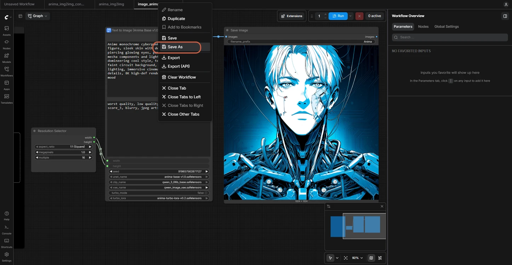

## Step 14: Save a Copy with a New Name

Enter a file name, for example `image_anima_base_v1_original`, then click **Confirm**. This keeps an untouched copy of the template to return to later.

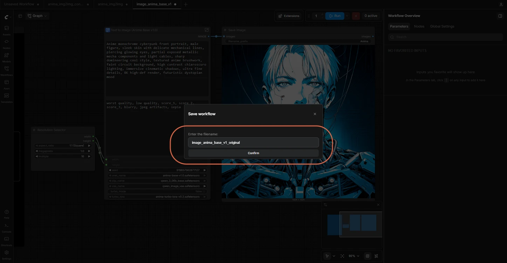

## Step 15: Enter Your Prompt and Run

Replace the text in the positive prompt box with your own prompt, then click **Run**. The new image appears in the **Save Image** node.

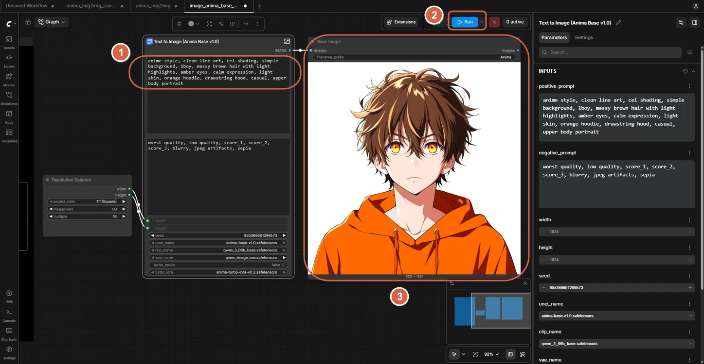

## References

- [ComfyUI Templates](https://docs.comfy.org/interface/features/template) — official docs.
- [ComfyUI Desktop on Windows](https://docs.comfy.org/installation/desktop/windows) — official docs.
