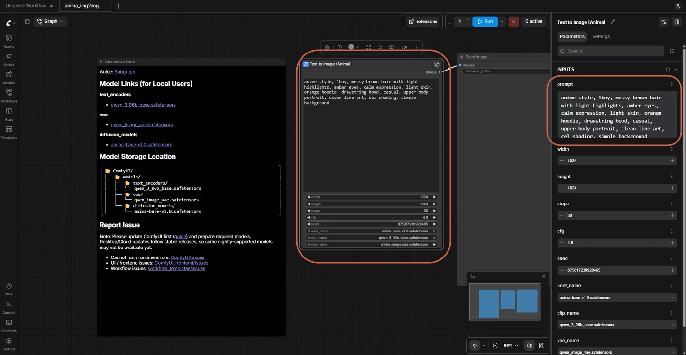
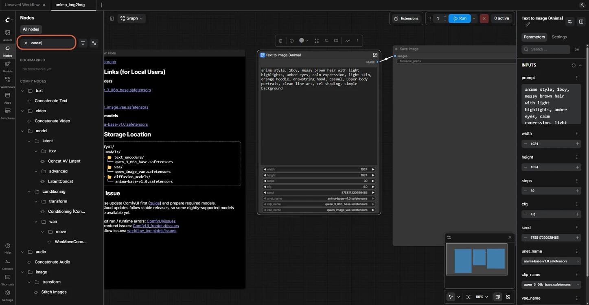
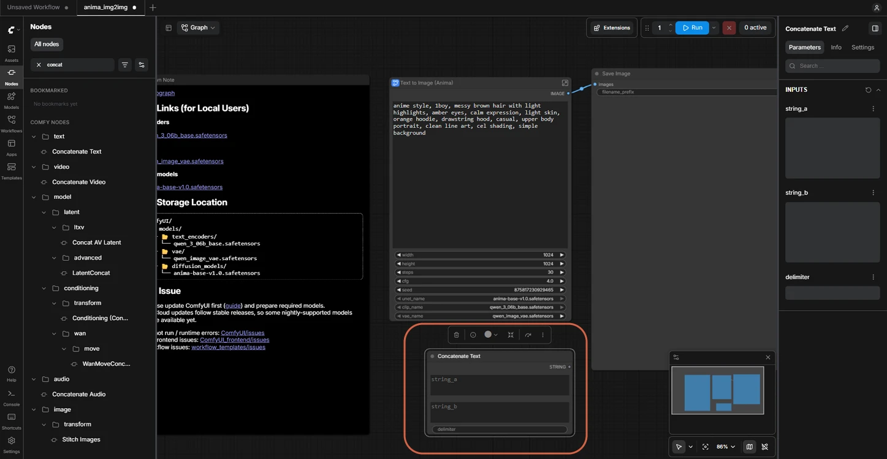
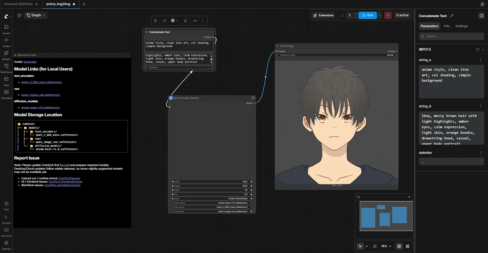
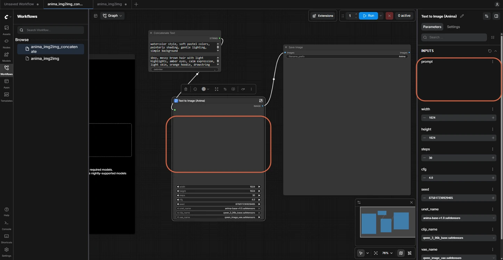
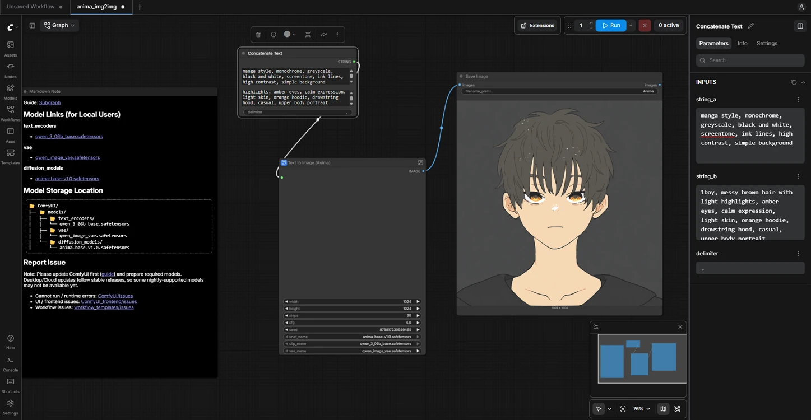
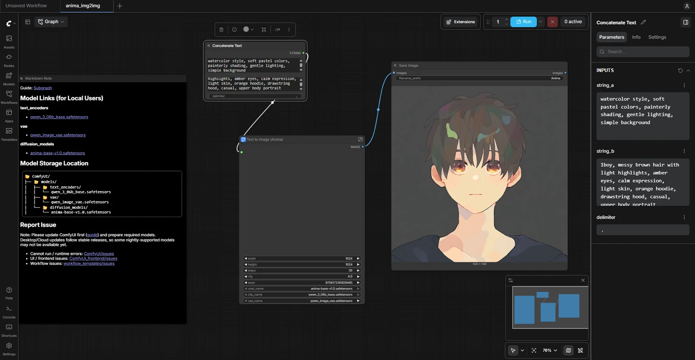

# Reusing a Style Prompt with Concatenate Text

> **Note:** This document was generated by Claude Code and has not been reviewed by a human. Please use it as a reference only.

Split a prompt into a style part and a character part so the style text stays fixed while only the character text changes between images. This uses the **Concatenate Text** node with the Anima base V1.0 text-to-image workflow.

## Step 1: Select the Text to Image (Anima) Node

The prompt appears in the node and in the **Parameters** panel. By default it mixes style words with the character description in one box.



## Step 2: Open the Nodes Library

Click **Nodes** in the left sidebar.

## Step 3: Search for Concat

Type `concat` in the search box.



## Step 4: Add the Concatenate Text Node

Click **Concatenate Text** in the `text` category. The node is added to the canvas with the inputs `string_a`, `string_b`, and `delimiter`.



## Step 5: Enter the Style Words

Type the style words in `string_a`:

```
anime style, clean line art, cel shading, simple background
```

## Step 6: Enter the Character Description

Type the character description in `string_b`:

```
1boy, messy brown hair with light highlights, amber eyes, calm expression, light skin, orange hoodie, drawstring hood, casual, upper body portrait
```

## Step 7: Set the Delimiter

Enter a comma and a space in `delimiter`. Without a delimiter, the two texts run together.

## Step 8: Connect the Output

Drag the **STRING** output of **Concatenate Text** to the prompt box of the **Text to Image (Anima)** node.

## Step 9: Run the Workflow

Click **Run**.



> **Note:** When **Concatenate Text** is connected, the prompt box in the **Text to Image (Anima)** node is locked and empty. Edit the text in **Concatenate Text** instead — disconnect the link to edit the prompt box directly again.
>
> 

## Step 10: Try a Manga Style

Replace the text in `string_a`, then click **Run**:

```
manga style, monochrome, greyscale, black and white, screentone, ink lines, high contrast, simple background
```



> **Warning:** Style words change the look but don't fully control color — this manga prompt produced a muted image, not true black and white.

## Step 11: Try a Watercolor Style

Replace the text in `string_a`, then click **Run**:

```
watercolor style, soft pastel colors, painterly shading, gentle lighting, simple background
```



> **Note:** Keep the same seed across runs to compare styles fairly. In this example the seed is `875817230929465`.
