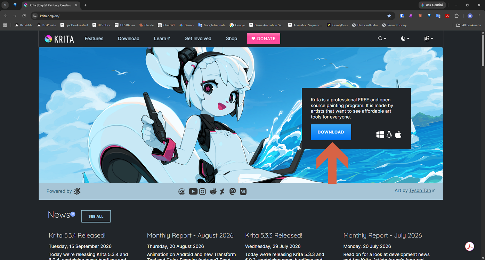
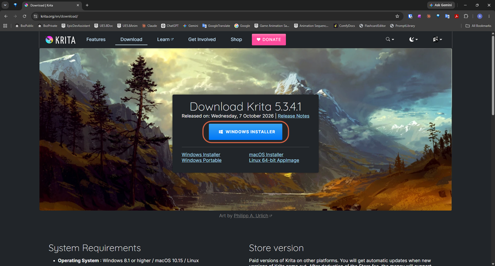
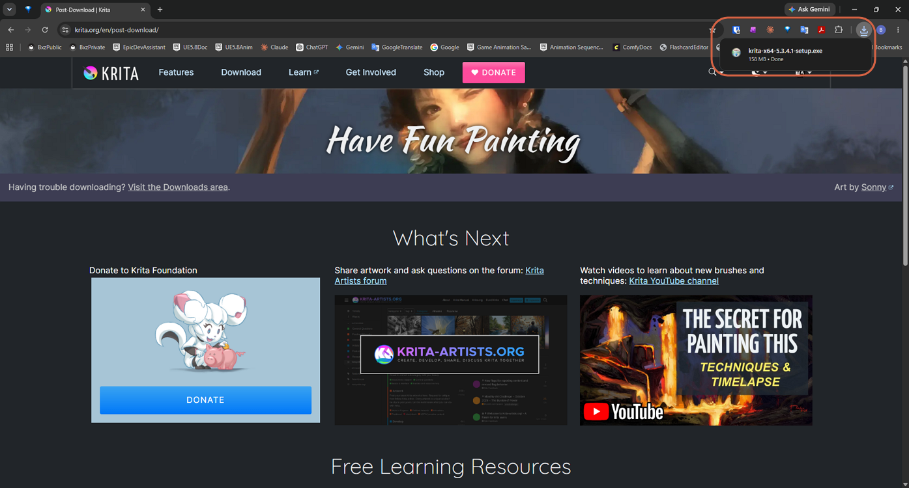
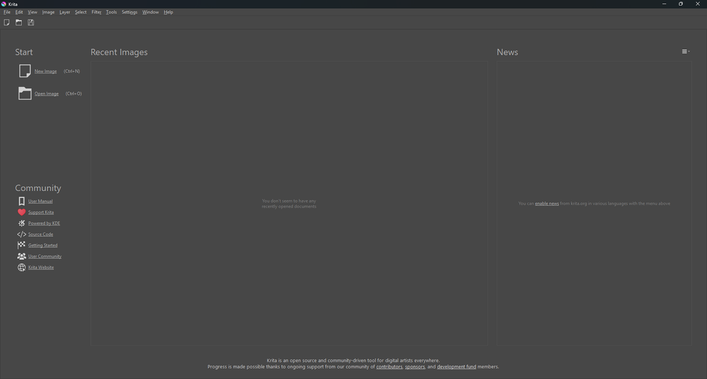

# Installing Krita on Windows

> **Note:** This document was generated by Claude Code and has not been reviewed by a human. Please use it as a reference only.

Krita is a free, open source painting program. This downloads the Windows installer from krita.org, runs it, and opens Krita for the first time.

## Step 1: Open krita.org and Click Download

Go to [krita.org](https://krita.org/en/), then click the blue **DOWNLOAD** button.

## Step 2: Click Windows Installer

The download page shows the current version (Krita 5.3.4.1 at the time of writing). Click the big **WINDOWS INSTALLER** button.

> **Note:** The same page lists Windows 8.1 or higher as the operating system requirement.

## Step 3: Wait for the Download to Finish

The browser opens a "Have Fun Painting" page and downloads `krita-x64-5.3.4.1-setup.exe` (158 MB). The file is ready once the download list shows **Done**.

> **Note:** The download page also offers a Windows Portable zip, and paid Microsoft Store and Steam versions that update automatically — see [krita.org/en/download](https://krita.org/en/download/).

## Step 4: Open the Downloaded Installer

Open `krita-x64-5.3.4.1-setup.exe` from your browser's download list or your Downloads folder, and follow the installer.

## Step 5: Open Krita for the First Time

Krita opens on its welcome screen. **New Image** (`Ctrl+N`) starts a blank image and **Open Image** (`Ctrl+O`) opens an existing file. The menu bar is at the top: File, Edit, View, Image, Layer, Select, Filter, Tools, Settings, Window, Help.

## References

- [Krita Download Page](https://krita.org/en/download/) — official site.
