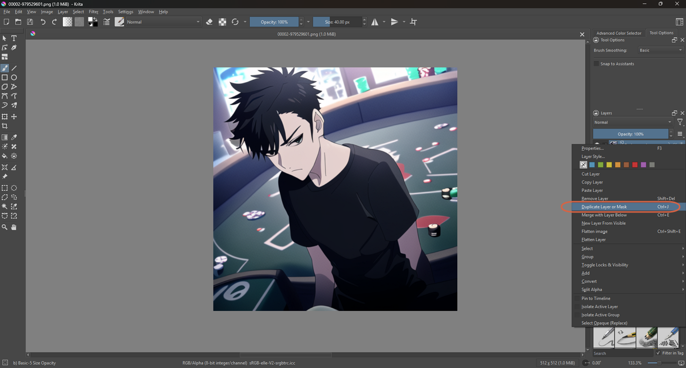
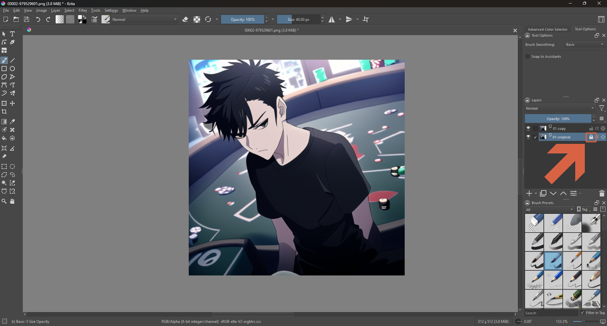
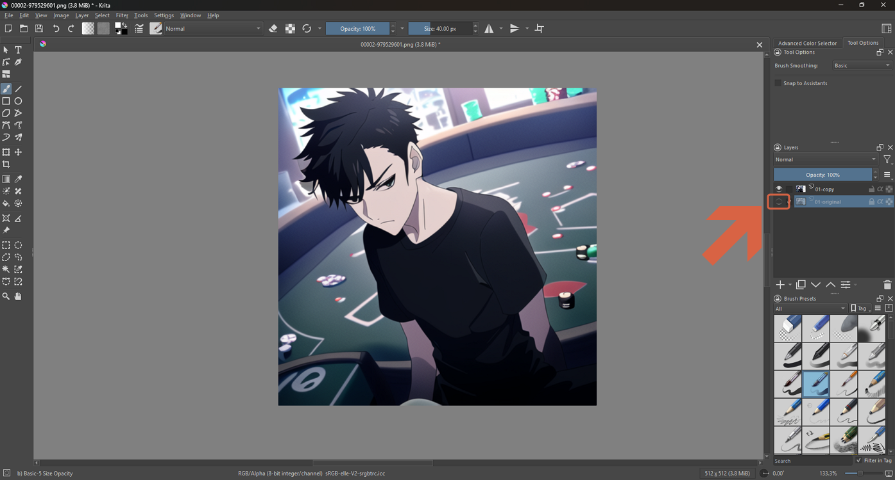
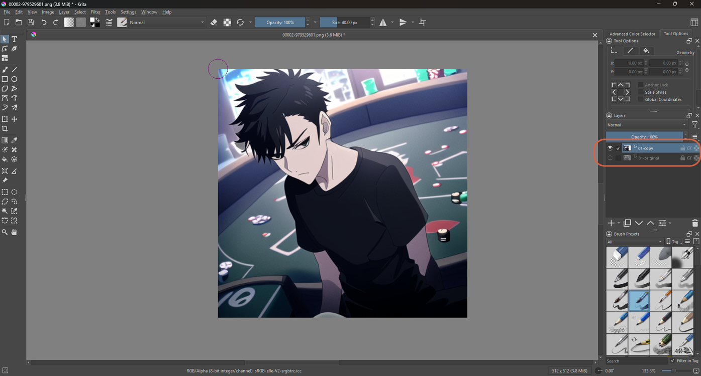
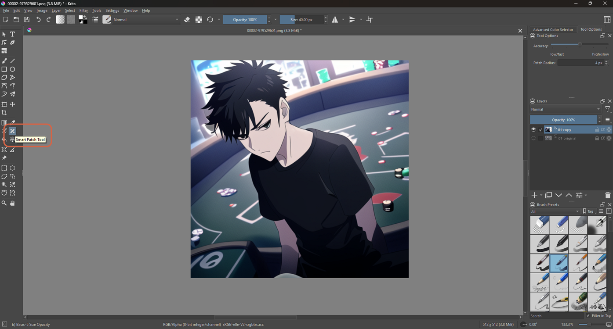
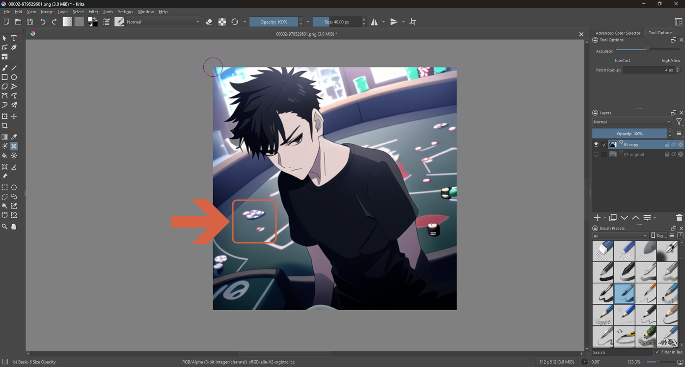
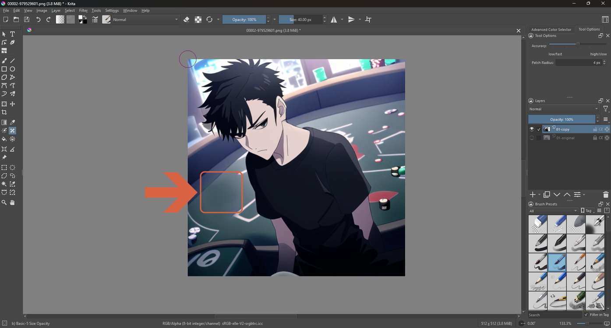

# Removing Objects with the Smart Patch Tool

> **Note:** This document was generated by Claude Code and has not been reviewed by a human. Please use it as a reference only.

The Smart Patch tool paints directly into the layer you're on, so protect your original image on a locked layer first, then paint over small objects and let Krita fill the gap using patterns already in the picture.

## Step 1: Open Your Image

Open the image in Krita (`Ctrl+O`). A new image has one layer, called **Background**. This guide uses a 512 × 512 image where the small poker chips on the table are the objects to remove.

## Step 2: Duplicate the Layer

Right-click the layer in the Layers panel and choose **Duplicate Layer or Mask** (`Ctrl+J`).

## Step 3: Name the Two Layers

There are now two layers. Give them names you can tell apart — here the bottom one is **01-original** and the top one is **01-copy**.

## Step 4: Lock the Original

Select **01-original** and click the **lock** icon on its row. A locked layer can't be painted on by mistake.

## Step 5: Hide the Original

Click the **eye** icon on the left of **01-original** to hide it. The copy above it is now the only layer you see.

## Step 6: Select the Copy

Click **01-copy** in the Layers panel so it's the active layer. Everything you do next happens on this layer.

## Step 7: Choose the Smart Patch Tool

In the toolbox on the left, click the **Smart Patch Tool**. Its Tool Options panel shows two settings:

| Setting | What It Does (Krita Manual) |
|---|---|
| Accuracy | How many samples the tool takes and how often it runs. Low is faster but less precise; high is more precise but slower. |
| Patch Radius | The size of the pattern the tool copies. Small suits small details; large suits big elements that should be reused whole. Shown as 4 px in the screenshot. |

## Step 8: Paint Over the Object

With the tool selected, draw over the object you want to remove. Krita fills the area using patterns that already exist in the image. Here the small chips on the table (boxed) are the target.

## Step 9: Check the Result

The boxed chips are gone and the table surface continues where they were. Zoom in and look at the edges of the patched area.

> **Note:** Because the work was done on 01-copy, you can show 01-original again at any time with the eye icon to compare.

## Good to Know

> **Warning:** Smart Patch fills the gap using patterns already in the image, so results depend on what surrounds the object. On a different image, removing small items from a background left smudges on light-blue patches and bits at the edge.

## References

- [Krita Manual: Smart Patch Tool](https://docs.krita.org/en/reference_manual/tools/smart_patch.html) — official docs.
